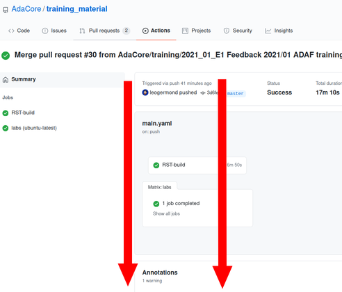

# Overview

This repository is a collection of courses for teaching Ada (or SPARK) plus some
support files to convert the courses into various presentation formats. The
courses are written in ReStructured Text (RST) format, making them easy to
convert into word processing documents, slides, or any other formats as needed.
The most common conversion tool is Pandoc, and there is a folder that contains
some artifacts that can be used with the tool. (Artifacts for other tools
may be added in the future) Each of the folders at this level are described
below.

# Download

You can download the material PDFs by going to [the actions page](http://github.com/adacore/training_material/actions).

**NB: You need to be logged in to GitHub.**

Click on the build you want. You probably want to take one from the **master** branch.


Scroll at the bottom




# Content

## Courses

Each folder contains a collection of RST files that make up modules within
the course. The filenames for the modules should use a numbering scheme so
users can quickly understand the typical order of presentation. 

### Module Labs

If the course is designed with laboratory exercises / examples, these RST
files should be in a subfolder, where the name of the file is the same as the
course name with ".lab" at the end. The benefit of keeping labs separate from
their enclosing courses is to be able to generate "Lab Manuals" as separate
course materials. You can also create subfolders here to store lab answers
and supporting files.

## Images

All images used in any of the courses should be stored here. This allows
sharing of images across courses without duplication. The filename should be
as descriptive as possible.

## Pandoc

This folder contains artifacts useful in running Pandoc to generate any output
format.

## Support Files

This folder contains files that may be useful for multiple presentation formats.

## Contrib

This folder contains scripts that are used for generating the docs or packages.

# Testing

This folder contains some automated test for the various tools that we use, you can run them by typing

```
pytest
```

# CI-Specific

## Building a given course only

You can specify a single course (or course directory) to build by adding the following
file to your directory:

`DO_NOT_MERGE.SINGLE_COURSE`

This should contain the path to the course directory or txt file to build.

This should **not** be merged back to master.

## Mirrored (Protected) branches

Branch that have names that follow the globs

- `training/*`
- `experimental/*`
- `slides/*`
- `build/*`

Will be **protected** and **mirrored**, so they will be built by the CI if you manually create a Pull Request for the GitHub branch.

# Building Locally

PDFs of the course material can be generated locally (on your machine). To do this, you'll need to configure your environment appropriately, then execute the build command.

## Windows Setup

**Note:** Use **Command Prompt** (as opposed to PowerShell), as paths will be configured correctly by default with the following installers.

1. Install latest version of Pandoc (https://pandoc.org/)

2. Install latest version of Miktext (https://miktex.org/)
    * Set “Preferred Paper” size as “Letter”

3. Install latest version of Python (available thru Microsoft Store)
    * Verified to work with: 3.12

4. Install pandocfilters for python:
    * `pip install pandocfilters`

## Building Slide Content

The following command will generate a PDF for a specific slide:

```
python [LOCAL_PATH]\training_material\pandoc\pandoc_fe.py --source ./[RST_FILE] --output [OUTPUT_FILE] --extension pdf --directories [LOCAL_PATH]\images,[LOCAL_PATH]\training_material\support_files  --theme adacore --color adacore  --filter [LOCAL_PATH]\training_material\pandoc\beamer_filter.py
```

In the above command:

* **[LOCAL_PATH]** should be replaced with the full path containing the “training_material” source folder

* **[RST_FILE]** should be replaced with the full name of the .rst file containing the source that will be generated as slide content (name should include file extension)

* **[OUTPUT_FILE]** should be replaced with the desired name of the generated PDF (minus the file extension)

### First Time Run

Upon running the script for the first time, a **Package Installation** window may appear, prompting for installation of various packages for specific files. Don't be alarmed...just click through to **Install** each one, as they are required to generate the slide content.

The below table lists what files/packages may trigger such prompts:

| File               | Package        |
| ------------------ | -------------- |
| amsthm.sty         | amscls         |
| auxhook.sty        | auxhook        |
| beamer.cls         | beamer         |
| bigintcalc.sty     | bigintcalc     |
| bitset.sty         | bitset         |
| bookmark.sty       | bookmark       |
| fancyvrb.sty       | fancyvrb.sty   |
| geometry.sty       | geometry       |
| gettitlestring.sty | gettitlestring |
| hycolor.sty        | hycolor        |
| infwarerr.sty      | infwarerr      |
| intcalc.sty        | intcalc        |
| kvdefinekeys.sty   | kvdefinekeys   |
| kvoptions.sty      | kvoptions      |
| kvsetkeys.sty      | kvsetkeys      |
| ltxcmds.sty        | ltxcmds        |
| microtype.sty      | microtype      |
| parskip.sty        | parskip        |
| pdfescape.sty      | pdfescape      |
| rerunfilecheck.sty | rerunfilecheck |
| sansmathaccent.sty | sansmathaccent |
| scrlfile.sty       | koma-script    |
| translator.sty     | translator     |
| uniquecounter.sty  | uniquecounter  |
| upquote.sty        | upquote        |
| xurl.sty           | xurl           |
