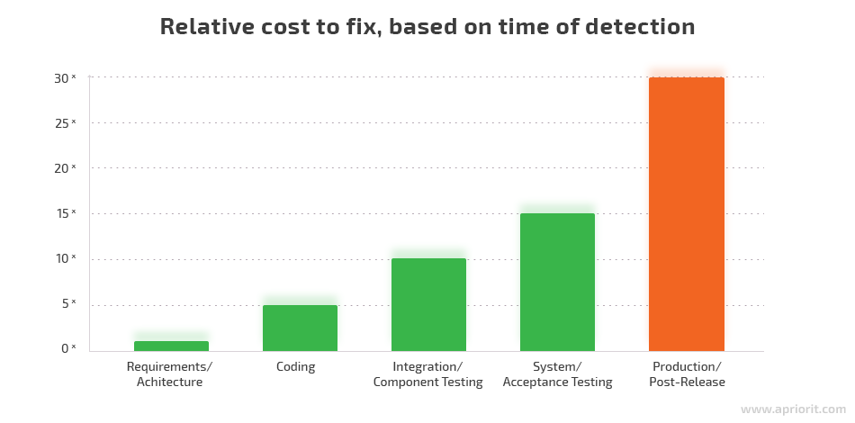
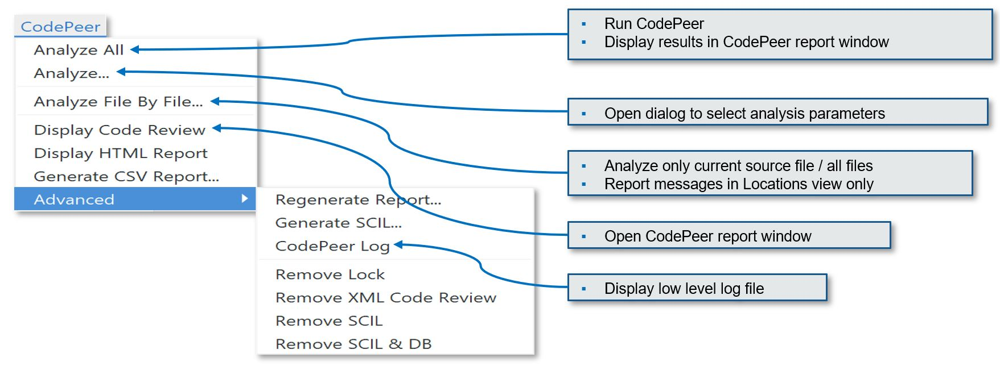

.. role:: ada(code)
    :language: ada

**********
CodePeer
**********

==========================
Advanced Static Analysis
==========================

--------------------------
What is Static Analysis?
--------------------------

+ Symbolic interpretation of source code, to find what could go wrong (and right) without executing it
+ Formally verifying high level or abstract properties on your application, giving strong guarantees
+ May be exhaustive

  + All possible errors are reported
  + No false negatives; there may be false positives
  + If the analyzer does not report a problem, there is no problem

---------------------------------
Why Static Analysis Saves Money
---------------------------------

Shifts costs from later, expensive phases to earlier, cheaper phases

-------------------
Why Use CodePeer?
-------------------

+ An efficient, potentially exhaustive code reviewer

  + Identifies constructs that may lead to run-time errors with a level of certainty

    + E.g. buffer overflows, division by zero

  + Flags legal but suspect code, typical of logic errors

+ Produces a detailed analysis of each subprogram, including preconditions and postconditions

  + Compares implicit, deduced specification (what it really does) to explicit specification (what it is supposed to do) and alerts reviewer if they don't match

+ Can be used retrospectively on existing code, to detect and remove latent bugs

  + Legacy code
  + Code from external sources

===================
CodePeer Overview
===================

------------------------------
CodePeer In A Nutshell (1/2)
------------------------------

+ :toolname:`CodePeer` is a static analysis tool

  + It provides feedback prior to execution and test
  + It provides "as-built" documentation to support source code review

+ It helps to identify and eliminate vulnerabilities and bugs in the application

  + And it does it early in the lifecycle

+ It is modular and scalable

  + Can be used on an entire project or a single file
  + Can be configured to be more or less strict, from very picky to laid back
  + Can be adapted to filter out or emphasize certain issues
  + Can concentrate on differences between baselines / versions

------------------------------
CodePeer In A Nutshell (2/2)
------------------------------

+ Large Ada support

  + Usable with Ada 83, 95, 2005, 2012
  + Usable with other compilers, including Apex, GHS, ObjectAda, VADS

+ It comes bundled with a Coding Standards Checker and a Metrics Tool

  + :toolname:`GNATCheck` and :toolname:`GNATMetric`

+ Detects runtime and logic errors

  + Checks (exhaustive): Initialization errors, run-time errors and assertion failures (16)
  + Warnings: dead code and suspicious code (17)
  + Race condition errors (exhaustive): unprotected access to global variables (3)

----------------------
CodePeer Integration
----------------------

+ Output: textual, XML, CSV, HTML
+ Command-line tool (uses GNAT project files)
+ Interactive use in :toolname:`GNAT Studio` and :toolname:`GNATbench` IDEs
+ Integration with Jenkins (continuous builder)
+ Integration with SonarQube (code quality visualization)

-----------------------------
Typical Users And Use Cases
-----------------------------

Developers
   While writing the code, so as to minimize introduction of (local) problems prior to integration of their work

Reviewers
   To annotate code with analysis of potential problems, including analysis of specific CWE issues

Project managers and quality engineers
   Who can track reported vulnerabilities day after day, and identify quickly newly introduced problems

Software auditors
   Who can run a one-shot analysis to identify overall vulnerabilities, hot spots, or issues with compliance to quality standards

=================
Getting Started
=================

--------------------------------------
Running CodePeer on the Command Line
--------------------------------------

:command:`codepeer -P <project> [-level <level>] [-output-msg[-only]] [-html[-only]]`

-P ``<project-file>``
   Specify the project file name.
   All files from the specified project tree (projects and subprojects) will be analyzed.

-level ``0|1|2|3|4|min|max``
   Specify the level of analysis performed: 0 for fast and light checkers,
   1 for fast and per subprogram analysis, 2 for slightly more
   accurate/slower (per small set of units), 3 for more accurate and much
   slower, and 4 for global analysis with no automatic partitioning (may
   exceed memory capacity and take a very long time).
   Default is level 0; min is equivalent to 0; max is equivalent to 4.

-output-msg[-only] [-output-msg switches]
   If specified, :toolname:`CodePeer` will output its results, in various formats.
   If -output-msg is given, :toolname:`CodePeer` will perform a new analysis, and output
   its results. Conversely, if -output-msg-only is specified, no new
   analysis is performed, and the results from the previous run (of the same
   level) will be emitted. You can control this output by adding switches
   (e.g. "-output-msg -csv -out report.csv" to generate a CSV file). See
   the following section for all relevant switches.

-html, -html-only
   Generate HTML output. If -html-only, do not run any analysis.

---------------------------------
Running CodePeer in GNAT Studio
---------------------------------

---------------------
Project File Set Up
---------------------

Let's explore sections 1.4, 1.5 and 1.6 of the User's Guide

   * `Link: Basic Project File Setup<http://docs.adacore.com/codepeer-docs/users_guide/_build/html/introduction.html#basic-project-file-setup>`_

   * `Link: Project File Setup<http://docs.adacore.com/codepeer-docs/users_guide/_build/html/introduction.html#project-file-setup>`_

   * `Link: Advanced Project File Setup<http://docs.adacore.com/codepeer-docs/users_guide/_build/html/introduction.html#advanced-project-file-setup>`_

-------------------
CodePeer Tutorial
-------------------

+ Live Demo
+ If you want to reproduce on your side:

  + Get a fresh copy of the :toolname:`GNAT Studio` tutorial directory

    + From :filename:`GNATPRO/xxx/share/examples/gnatstudio/tutorial`
    + Contains the :filename:`sdc` project
    + Be sure to do this, the :toolname:`CodePeer` tutorial requires it

  + Put this copy in the :filename:`sources/codepeer` directory

    + Thus :filename:`sources/codepeer/tutorial` as a result

  + Open :toolname:`GNAT Studio` on this copy of the :filename:`sdc` project file
  + Open the :toolname:`CodePeer` Tutorial from :toolname:`GNAT Studio`

     + :menu:`Help` :math:`\rightarrow` :menu:`CodePeer` :math:`\rightarrow` :menu:`CodePeer Tutorial`

  + Walk through the steps of the :toolname:`CodePeer` tutorial

-----------------
CodePeer Levels
-----------------

.. container:: latex_environment tiny

   .. list-table::

      * - *Level 0*

        - Default level

      * -

        - Light and fast analysis performed via the Libadalang Light Checkers Integration

      * -

        - Very few false alarms

      * - *Level 1*

        - Run :toolname:`CodePeer`'s core engine subprogram by subprogram

      * -

        - Few false alarms

      * - *Level 2*

        - Analyze by groups of units

      * -

        - Slower analysis, more precise

      * -

        - Few false alarms

      * - *Level 3*

        - Semi-global analysis

      * -

        - Automatic partitioning to complete the analysis within the memory constraints of the machine

      * - *Level 4*

        - Global and exhaustive analysis

      * -

        - Analyze all units together with no partitioning and with all potential issues flagged (potentially high false alarms)

      * -

        -  May require large amounts of memory and time

--------------------------
CodePeer Levels Use Case
--------------------------

.. container:: latex_environment tiny

   .. list-table::

      * - *Level 0*

        - Get initial static analysis results.

      * -

        - At each developer's desk or after each commit.

      * -

        - Can enable *--simple-project* switch to avoid a full setup of your project.

      * - *Level 1*

        - After setting up the project file.

      * -

        - Includes light checkers from level 0.

      * -

        - At each developer's desk or after each commit.

      * - *Level 2*

        - After having clean results at level 1.

      * -

        - More detailed analysis with some level of interprocedural analysis.

      * -

        - At each developer's desk for small to medium code bases (e.g. less than 100K SLOC).

      * -

        - On servers automatically for larger code bases.

      * - *Level 3*

        - Semi-global analysis, to be used for code bases no larger than 1 million lines of code.

      * -

        - More detailed interprocedural analysis.

      * -

        - Suitable for automatic runs on servers.

      * - *Level 4*

        - Suitable for small to medium code bases (typically less than 200K SLOC).

      * -

        - Exhaustive analysis (all possible errors are reported).

      * -

        - When systematic review of all potential run-time checks is required.

------------------------------
"No False Positive" Mode
------------------------------

+ Enabled via :command:`-level 0` or :command:`messages min`
+ Suppresses output of messages more likely to be false positives
+ Allows programmers to focus initial work on likely problems
+ Can be combined with any level of analysis
+ :command:`-messages min` is default for levels 0, 1, and 2

--------------------------------
Running CodePeer regularly
--------------------------------

+ Historical database (SQLite) stores all past results per level
+ Can be stored in CM
+ Notion of baseline run:

  + Each run compared to some previous baseline run (default: first run)
  + Differences of messages shown in :toolname:`CodePeer` report window
  + :command:`-cutoff` to override baseline for a given run
  + :command:`-baseline` to set the reference baseline for future runs
  + Typical use: nightly run with :command:`-baseline`, daily development without

+ Can compare between two runs
+ Combine :command:`-cutoff` and :command:`-current` switches

=================
Run-Time Checks
=================

---------------------------
Run-Time Check Messages
---------------------------

array index check	
   Index value could be outside the array bounds. This is also known as buffer overflow.

divide by zero
   The second operand of a divide, mod or rem operation could be zero

access check
   Attempting to dereference a reference that could be null

range check
   A calculation may generate a value outside the bounds of an Ada type or subtype and generate an invalid value

overflow check
   A calculation may overflow the bounds of a numeric type and wrap around. The likelihood this will affect operation of the program depends on how narrow is the range of the numeric value

aliasing check
   A parameter that can be passed by reference is aliased with another parameter or a global object and a subprogram call might violate the associated precondition by writing to one of the aliased objects and reading the other aliased object, possibly resulting in undesired behavior. Aliasing checks are generally expressed as a requirement that a parameter not be the same as some other parameter, or not match the address of some global object and will be flagged as a precondition check in the caller.

tag check
   A tag check (incorrect tag value on a tagged object) may fail

validity
    Code may be reading an uninitialized or invalid value

discriminant check
   A field for the wrong variant/discriminant is accessed

precondition
   Subprogram call may violate the subprogram's generated precondition

-------------------
Array Index Check
-------------------

Index value could be outside the array bounds. This is also known as buffer overflow.

..
   codepeer example (4.1.1 - array index check)

.. code:: Ada
   :number-lines: 1

   procedure Buffer_Overflow is
      type Int_Array is array (0 .. 2) of Integer;
      X, Y : Int_Array;
   begin
      for I in X'Range loop
         X (I) := I + 1;
      end loop;
   
      for I in X'Range loop
         Y (X (I)) := I;  -- Bad when I = 2, since X (I) = 3
      end loop;
   end Buffer_Overflow;

| ``buffer_overflow.adb:10:7: high: array index check fails here: requires (X (I)) in 0..2``

-----------------
Divide By Zero
-----------------

The second operand of a divide, mod or rem operation could be zero

..
   codepeer example (4.1.1 - divide by zero)

.. code:: Ada
   :number-lines: 1

   procedure Div is
      type Int is range 0 .. 2**32 - 1;
      A : Int := Int'Last;
      X : Integer;
   begin
      for I in Int range 0 .. 2 loop
         X := Integer (A / I); -- division by zero when I=0
      end loop;
   end Div;

| ``div.adb:7:23: high: divide by zero fails here: requires I /= 0``

--------------
Access Check
--------------

Attempting to dereference a reference that could be null

..
   codepeer example (4.1.1 - access check)

.. code:: Ada
   :number-lines: 1

   procedure Null_Deref is
      type Int_Access is access Integer;
      X : Int_Access;
   begin
      if X = null then
         X.all := 1;  -- null dereference
      end if;
   end Null_Deref;

| ``null_deref.adb:6:7: high: access check fails here``

-------------
Range Check
-------------

A calculation may generate a value outside the bounds of an Ada type or subtype and generate an invalid value

..
   codepeer example (4.1.1 - range check)

.. code:: Ada
   :number-lines: 1

   procedure Out_Of_Range is
      subtype Constrained_Integer is Integer range 1 .. 2;
      A : Integer;
   
      procedure Proc_1 (I : in Constrained_Integer) is
      begin
         A := I + 1;
      end Proc_1;
   
   begin
      A := 0;
      Proc_1 (I => A);  --  A is out-of-range of parameter I
   end Out_Of_Range;

| ``out_of_range.adb:12:17: high: range check fails here: requires A in 1..2``

----------------
Overflow Check
----------------

A calculation may overflow the bounds of a numeric type and wrap around. The likelihood this will affect operation of the program depends on how narrow is the range of the numeric value

..
   codepeer example (4.1.1 - overflow check)

.. code:: Ada
   :number-lines: 1

   with Ada.Integer_Text_IO; use Ada.Integer_Text_IO;
   with Ada.Text_IO;         use Ada.Text_IO;
   
   procedure Overflow is
      Attempt_Count : Integer := Integer'Last;
      --  Gets reset to zero before attempting password read
      Pw : Natural;
   begin
      --  Oops forgot to reset Attempt_Count
      loop
         Put ("Enter password to delete system disk");
         Get (Pw);
         if Pw = 42 then
            Put_Line ("system disk deleted");
            exit;
         else
            Attempt_Count := Attempt_Count + 1;
   
            if Attempt_Count > 3 then
               Put_Line ("max password count reached");
               raise Program_Error;
            end if;
         end if;
      end loop;
   end Overflow;

| ``overflow.adb:17:41: high: overflow check fails here: requires Attempt_Count /= Integer_32'Last``
| ``overflow.adb:17:24: high: overflow check fails here: requires Attempt_Count in Integer_32'First-1..Integer_32'Last-1``

-----------------
Aliasing Check
-----------------

A parameter that can be passed by reference is aliased with another parameter or a global object and a subprogram call might violate the associated precondition by writing to one of the aliased objects and reading the other aliased object, possibly resulting in undesired behavior. Aliasing checks are generally expressed as a requirement that a parameter not be the same as some other parameter, or not match the address of some global object and will be flagged as a precondition check in the caller.

..
   codepeer example (4.1.1 - aliasing check)

.. code:: Ada
   :number-lines: 1

   procedure Alias is
      type Int_Array is array (1 .. 10) of Integer;
      A, B : Int_Array := (others => 1);
   
      procedure In_Out (A : Int_Array; B : Int_Array; C : out Int_Array) is
      begin
         --  Read A multiple times, and write C multiple times:
         --  if A and C alias and are passed by reference, we are in trouble!
         C (1) := A (1) + B (1);
         C (1) := A (1) + B (1);
      end In_Out;
   
   begin
      --  We pass A as both an 'in' and 'out' parameter: danger!
      In_Out (A, B, A);
   end Alias;

| ``alias.adb:15:4: high: precondition (aliasing check) failure on call to alias.in_out: requires C /= A``

-----------
Tag Check
-----------

A tag check (incorrect tag value on a tagged object) may fail

..
   codepeer example (4.1.1 - tag check)

.. code:: Ada
   :number-lines: 1

   procedure Tag is
      type T1 is tagged null record;
   
      package Pkg is
         type T2 is new T1 with null record;
         procedure Op (X : T2) is null;
      end Pkg;
      use Pkg;
   
      type T3 is new T2 with null record;
   
      procedure Call (X1 : T1'Class) is
      begin
         Op (T2'Class (X1));
      end Call;
   
      X1 : T1;
      X2 : T2;
      X3 : T3;
   begin
      Call (X1); -- not OK, Call requires T2'Class
      Call (X2); -- OK
      Call (X3); -- OK
   end Tag;

| ``tag.adb:21:4: high: precondition (tag check) failure on call to tag.call: requires X1'Tag in {tag.pkg.t2, tag.t3}``

--------------------
Discriminant Check
--------------------

A field for the wrong variant/discriminant is accessed

..
   codepeer example (4.1.1 - discriminant check)

.. code:: Ada
   :number-lines: 1

   procedure Discr is
   
      subtype Length is Natural range 0 .. 10;
      type T (B : Boolean := True; L : Length := 1) is record
         I : Integer;
         case B is
            when True =>
               S : String (1 .. L);
               J : Integer;
            when False =>
               F : Float := 5.0;
         end case;
      end record;
   
      X : T (B => True, L => 3);
   
      function Create (L : Length; I : Integer; F : Float) return T is
      begin
         return (False, L, I, F);
      end Create;
   
   begin
      X := Create (3, 2, 6.0);  -- discriminant check failure
   end Discr;

| ``discr.adb:23:9: high: discriminant check fails here: requires not (Create (3, 2, 6.0).b /= True or else Create (3, 2, 6.0).l /= 3)``

--------------
Precondition
--------------

Subprogram call may violate the subprogram's generated precondition

Checks are reported in 2 possible places:

  + Where the error may occur, or
  + Where a caller passes in a value causing the error in a call

+ Understanding case 2 above:

  + Look at generated preconditions
  + Precondition check: look at associated checks and backtrace (in :toolname:`GNAT Studio` or via *-show-backtraces*)

..
   codepeer example (4.1.1 - precondition)

.. code:: Ada
   :number-lines: 1

   procedure Precondition is
      X : Integer := 0;

      function Call (X : Integer) return Integer is
      begin
         if X < 0 then
            return -1;
         elsif X > 0 then
            return 1;
         end if;
      end Call;

   begin
      for I in -5 .. 5 loop
         X := X + Call (I);
      end loop;
   end Precondition;

| ``precondition.adb:15:16: high: precondition (conditional check) failure on call to precondition.call: requires X /= 0``

=============
User Checks
=============

---------------------
User Check Messages
---------------------

assertion
   A user assertion (using e.g. :ada:`pragma Assert`) could fail

conditional check
   An exception could be raised depending on the outcome of a conditional test in user code

raise exception
   An exception is being raised on a reachable path. This is similar to *conditional check*, but the exception is raised systematically instead of conditionally.

user precondition
   A call might violate a subprogram's specified precondition. This specification may be written as a :ada:`pragma Precondition`, or as a :ada:`Pre` aspect in Ada 2012 syntax

postcondition
   The subprogram's body may violate its specified postcondition. This specification may be written as a :ada:`pragma Postcondition`, or as a :ada:`Post` aspect in Ada 2012 syntax

-----------
Assertion
-----------

A user assertion (using e.g. :ada:`pragma Assert`) could fail

..
   codepeer example (4.1.2 - assertion)

.. code:: Ada
   :number-lines: 1

   procedure Assert is
   
      function And_Or (A, B : Boolean) return Boolean is
      begin
         return False;
      end And_Or;
   
   begin
      pragma Assert (And_Or (True, True));
   end Assert;

| ``assert.adb:9:19: high: assertion fails here: requires (and_or'Result) /= false``

-------------------
Conditional Check
-------------------

An exception could be raised depending on the outcome of a conditional test in user code

..
   codepeer example (4.1.2 - conditional check)

.. code:: Ada
   :number-lines: 1

   with Ada.Integer_Text_IO; use Ada.Integer_Text_IO;
   with Ada.Text_IO;         use Ada.Text_IO;
   
   procedure Overflow is
      Attempt_Count : Integer := Integer'Last;
      --  Gets reset to zero before attempting password read
      Pw : Natural;
   begin
      --  Oops forgot to reset Attempt_Count
      loop
         Put ("Enter password to delete system disk");
         Get (Pw);
         if Pw = 42 then
            Put_Line ("system disk deleted");
            exit;
         else
            Attempt_Count := Attempt_Count + 1;
   
            if Attempt_Count > 3 then
               Put_Line ("max password count reached");
               raise Program_Error;
            end if;
         end if;
      end loop;
   end Overflow;

| ``overflow.adb:21:13: high: conditional check raises exception here: requires Attempt_Count <= 3``

-----------------
Raise Exception
-----------------

An exception is being raised on a reachable path. This is similar to *conditional check*, but the exception is raised systematically instead of conditionally.

..
   codepeer example (4.1.2 - raise exception)

.. code:: Ada
   :number-lines: 1

   procedure Raise_Exc is
      X : Integer := raise Program_Error;
   begin
      null;
   end Raise_Exc;

| ``raise_exc.adb:2:19: low: raise exception unconditional raise``

-------------------
User Precondition
-------------------

A call might violate a subprogram's specified precondition. This specification may be written as a :ada:`pragma Precondition`, or as a :ada:`Pre` aspect in Ada 2012 syntax

..
   codepeer example (4.1.2 - user precondition)

.. code:: Ada
   :number-lines: 1

   procedure Pre is
      function "**" (Left, Right : Float) return Float with
         Import,
         Pre => Left /= 0.0;
   
      A : Float := 1.0;
   begin
      A := (A - 1.0)**2.0;
   end Pre;

| ``pre.adb:8:18: high: precondition (user precondition) failure on call to pre."**": requires Left /= 0.0``

---------------
Postcondition
---------------

The subprogram's body may violate its specified postcondition. This specification may be written as a :ada:`pragma Postcondition`, or as a :ada:`Post` aspect in Ada 2012 syntax

..
   codepeer example (4.1.2 - postcondition)

.. code:: Ada
   :number-lines: 1

   procedure Post is
   
      type States is (Normal_Condition, Under_Stress, Bad_Vibration);
      State : States;
   
      function Stress_Is_Minimal return Boolean is (State = Normal_Condition);
      function Stress_Is_Maximal return Boolean is (State = Bad_Vibration);
   
      procedure Decrement with
         Pre  => not Stress_Is_Minimal,
         Post => not Stress_Is_Maximal;
   
      procedure Decrement is
      begin
         State := States'Val (States'Pos (State) + 1);
      end Decrement;
   
   begin
      Decrement;
   end Post;

| ``post.adb:16:8: high: postcondition failure on call to post.decrement: requires State /= Bad_Vibration``

=====================================
Uninitialized and Invalid Variables
=====================================

----------------------------------------------
Uninitialized and Invalid Variables Messages
----------------------------------------------

validity check
   The code may be reading an uninitialized or invalid value

----------------
Validity Check
----------------

The code may be reading an uninitialized or invalid value

..
   codepeer example (4.1.3 - validity check)

.. code:: Ada
   :number-lines: 1

   procedure Uninit is
      A : Integer;
      B : Integer;
   begin
      A := B;  --  we are reading B which is uninitialized!
   end Uninit;

| ``uninit.adb:5:9: high: validity check: B is uninitialized here``

==========
Warnings
==========

------------------------
Warning Messages (1/2)
------------------------

dead code
   Also called *unreachable code*. Indicates logical errors as the programmer assumed the unreachable code could be executed 

test always false
   Indicates redundant conditionals, which could flag logical errors where the test always evaluates to false

test always true
   Indicates redundant conditionals, which could flag logical errors where the test always evaluates to true

test predetermined
   Indicates redundant conditionals, which could flag logical errors. This is similar to *test always true* and *test always false* and is only emitted when there is no real polarity associated with the test such as in a case statement

condition predetermined
   Indicates redundant condition inside a conditional, like the left or right operand of a boolean operator which is always true or false

loop does not complete normally
   Indicates loops that either run forever or fail to terminate normally

unused assignment
   Indicates redundant assignment. This may be an indication of unintentional loss of result or unexpected flow of control. Note that CodePeer recognizes special variable patterns as temporary variables that will be ignored by this check: :ada:`ignore`, :ada:`unused`, :ada:`discard`, :ada:`dummy`, :ada:`tmp`, :ada:`temp`. This can be tuned via the :filename:`MessagePatterns.xml` file if needed. An object marked as unreferenced via :ada:`pragma Unreferenced` is similarly ignored

unused assignment to global
   Indicates that a subprogram call modifies a global variable, which is then overwritten following the call without any uses between the assignments. Note that the redundant assignment may occur inside another subprogram call invoked by the current subprogram

unused out parameter
   Indicates that an actual parameter of a call is ignored (either never used or overwritten)

------------------------
Warning Messages (2/2)
------------------------

useless reassignment
   Indicates when an assignment does not modify the value stored in the variable being assigned

suspicious precondition
   The precondition has a form that indicates there might be a problem with the algorithm. If the allowable value set of a given input expression is not contiguous (certain values of the expression that might cause a run-time problem inside the subprogram in between values that are safe), then this might be an indication that certain cases are not being properly handled by the code. In other situations, this might simply reflect the inherent nature of the algorithm involved

suspicious input
   Inputs mention a value reachable through an out-parameter of the suprogram before this parameter is assigned. Although the value may sometimes be initialized as the Ada standard allows, it generally uncovers a bug where the subprogram reads an uninitialized value or a value that the programmer did not mean to pass to the subprogram as an input value

unread parameter
   A parameter of an elementary type of mode in out is assigned on all paths through the subprogram before any reads, and so could be declared with mode :ada:`out`.

unassigned parameter
   A parameter of a scalar type of mode in out is never assigned, and so could be declared with mode :ada:`in`

suspicious constant operation
   An operation computes a constant value from non-constant operands. This is characteristic of a typographical mistake, where a variable is used instead of another one, or a missing part in the operation, like the lack of conversion to a floating-point or fixed-point type before division

subp never returns
   The subprogram will never return, presumably because of an infinite loop. There will typically be an additional message in the subprogram body (e.g. test always false) explaining why the subprogram never returns

subp always fails
   Indicates that a run-time problem is likely to occur on every execution of the subprogram. There will typically be an additional message in the subprogram body explaining why the subprogram always fails

-----------
Dead Code
-----------
Also called *unreachable code*. Indicates logical errors as the programmer assumed the unreachable code could be executed 

..
   codepeer example (4.1.4 - dead code)

.. code:: Ada
   :number-lines: 1

   procedure Dead_Code (X : out Integer) is
      I : Integer := 10;
   begin
      if I < 4 then
         X := 0;
      elsif I >= 10 then
         X := 0;
      else
         X := 0;
      end if;
   end Dead_Code;

| ``dead_code.adb:5:9: medium warning: dead code because I = 10``
| ``dead_code.adb:9:9: medium warning: dead code because I = 10``

-------------------
Test Always False
-------------------
Indicates redundant conditionals, which could flag logical errors where the test always evaluates to false

..
   codepeer example (4.1.4 - test always false)

.. code:: Ada
   :number-lines: 1

   procedure Dead_Code (X : out Integer) is
      I : Integer := 10;
   begin
      if I < 4 then
         X := 0;
      elsif I >= 10 then
         X := 0;
      else
         X := 0;
      end if;
   end Dead_Code;

| ``dead_code.adb:4:9: low warning: test always false because I = 10``

------------------
Test Always True
------------------
Indicates redundant conditionals, which could flag logical errors where the test always evaluates to true

..
   codepeer example (4.1.4 - test always true)

.. code:: Ada
   :number-lines: 1

   procedure Dead_Code (X : out Integer) is
      I : Integer := 10;
   begin
      if I < 4 then
         X := 0;
      elsif I >= 10 then
         X := 0;
      else
         X := 0;
      end if;
   end Dead_Code;

| ``dead_code.adb:6:4: medium warning: test always true because I = 10``

--------------------
Test Predetermined
--------------------
Indicates redundant conditionals, which could flag logical errors. This is similar to *test always true* and *test always false* and is only emitted when there is no real polarity associated with the test such as in a case statement

..
   codepeer example (4.1.4 - test predetermined)

.. code:: Ada
   :number-lines: 1

   procedure Predetermined is
      I : Integer := 0;
   begin
      case I is
         when 0 =>
            null;
         when 1 =>
            null;
         when others =>
            null;
      end case;
   end Predetermined;

| ``predetermined.adb:4:4: low warning: test predetermined because I = 0``

-------------------------
Condition Predetermined
-------------------------
Indicates redundant condition inside a conditional, like the left or right operand of a boolean operator which is always true or false

..
   codepeer example (4.1.4 - condition predetermined)

.. code:: Ada
   :number-lines: 1

   procedure Condition is
      type L is (A, B, C);
   
      procedure Or_Else (V : L) is
      begin
         if V /= A or else V /= B then
            return;
         else
            raise Program_Error;
         end if;
      end Or_Else;
   begin
      Or_Else (A);
   end Condition;

| ``condition.adb:6:27: medium warning: condition predetermined because (V /= B) is always true``

---------------------------------
Loop Does Not Complete Normally
---------------------------------
Indicates loops that either run forever or fail to terminate normally

..
   codepeer example (4.1.4 - loop does not complete normally)

.. code:: Ada
   :number-lines: 1

   procedure Loops is
      Buf : String := "The" & ASCII.NUL;
      Bp  : Natural;
   begin
      Buf (4) := 'a';   -- Eliminates null terminator
      Bp      := Buf'First;
   
      while True loop
         Bp := Bp + 1;
         exit when Buf(Bp-1) = ASCII.NUL; -- Condition never reached
      end loop;
   end Loops;

| ``loops.adb:8:10: medium warning: loop does not complete normally``

-------------------
Unused Assignment
-------------------
Indicates redundant assignment. This may be an indication of unintentional loss of result or unexpected flow of control. Note that CodePeer recognizes special variable patterns as temporary variables that will be ignored by this check: :ada:`ignore`, :ada:`unused`, :ada:`discard`, :ada:`dummy`, :ada:`tmp`, :ada:`temp`. This can be tuned via the :filename:`MessagePatterns.xml` file if needed. An object marked as unreferenced via :ada:`pragma Unreferenced` is similarly ignored

..
   codepeer example (4.1.4 - unused assignment)

.. code:: Ada
   :number-lines: 1

   with Ada.Text_IO; use Ada.Text_IO;
   procedure Unused_Assignment (I : out Integer) is
   begin
      I := Integer'Value (Get_Line);
      I := Integer'Value (Get_Line);
   end Unused_Assignment;

| ``unused_assignment.adb:4:6: medium warning: unused assignment into I``

-----------------------------
Unused Assignment To Global
-----------------------------
Indicates that a subprogram call modifies a global variable, which is then overwritten following the call without any uses between the assignments. Note that the redundant assignment may occur inside another subprogram call invoked by the current subprogram

..
   codepeer example (4.1.4 - unused assignment to global)

.. code:: Ada
   :number-lines: 1

   procedure Unused_Global is

      package P is
         G : Integer;
         procedure Proc;
      end P;
      package body P is
         procedure Proc0 is
         begin
            G := 123;
         end Proc0;

         procedure Proc1 is
         begin
            Proc0;
         end Proc1;

         procedure Proc is
         begin
            Proc1;
            G := 456;  -- override effect of calling Proc1
         end Proc;
      end P;
   begin
      null;
   end Unused_Global;

| ``unused_global.adb:20:10: low warning: unused assignment to global G in unused_global.p.proc1``

----------------------
Unused Out Parameter
----------------------
Indicates that an actual parameter of a call is ignored (either never used or overwritten)

..
   codepeer example (4.1.4 - unused out parameter)

.. code:: Ada
   :number-lines: 1

   procedure Unused_Out (Flag : Integer) is
      Table   : array (1 .. 10) of Integer := (others => 0);
      Ret_Val : Boolean;
      procedure Search (Success : out Boolean) is
      begin
         Success := False;
         for I in Table'Range loop
            Success := Success or Table (I) = Flag;
         end loop;
      end Search;
   begin
      Search (Ret_Val);
   end Unused_Out;

| ``unused_out.adb:12:4: medium warning: unused out parameter Ret_Val``

----------------------
Useless Reassignment
----------------------
Indicates when an assignment does not modify the value stored in the variable being assigned

..
   codepeer example (4.1.4 - useless reassignment)

.. code:: Ada
   :number-lines: 1

   procedure Self_Assign (A : in out Integer) is
      B : Integer;
   begin
      B := A;
      A := B;
   end Self_Assign;

| ``self_assign.adb:5:6: medium warning: useless reassignment of A``

-------------------------
Suspicious Precondition
-------------------------
The precondition has a form that indicates there might be a problem with the algorithm. If the allowable value set of a given input expression is not contiguous (certain values of the expression that might cause a run-time problem inside the subprogram in between values that are safe), then this might be an indication that certain cases are not being properly handled by the code. In other situations, this might simply reflect the inherent nature of the algorithm involved

..
   codepeer example (4.1.4 - suspicious precondition)

.. code:: Ada
   :number-lines: 1

   package Stack is
      Overflow : exception;
      type Stack_Type is record
         Last : Integer;
         Tab  : String (1 .. 20);
      end record;
      procedure Push (S : in out Stack_Type; V : Character);
   end Stack;

   package body Stack is
      procedure Push (S : in out Stack_Type; V : Character) is
      begin
         if S.Last = S.Tab'Last then
            raise Overflow;
         end if;
         S.Last         := S.Last - 1;  --  Should be S.Last + 1
         S.Tab (S.Last) := V;
      end Push;
   end Stack;

| ``stack.adb:2:4: medium warning: suspicious precondition for S.Last: not a contiguous range of values``

------------------
Suspicious Input
------------------
Inputs mention a value reachable through an out-parameter of the suprogram before this parameter is assigned. Although the value may sometimes be initialized as the Ada standard allows, it generally uncovers a bug where the subprogram reads an uninitialized value or a value that the programmer did not mean to pass to the subprogram as an input value

..
   codepeer example (4.1.4 - suspicious input)

.. code:: Ada
   :number-lines: 1

   procedure In_Out is
      type T is record
         I : Integer;
      end record;
   
      procedure Take_In_Out (R : in out T) is
      begin
         R.I := R.I + 1;
      end Take_In_Out;
   
      procedure Take_Out (R : out T; B : Boolean) is
      begin
         Take_In_Out (R);  -- R is 'out' but used as 'in out'
      end Take_Out;
   
   begin
      null;
   end In_Out;

| ``in_out.adb:13:7: medium warning: suspicious input R.I: depends on input value of out-parameter``

------------------
Unread Parameter
------------------
A parameter of an elementary type of mode in out is assigned on all paths through the subprogram before any reads, and so could be declared with mode :ada:`out`.

..
   codepeer example (4.1.4 - unread parameter)

.. code:: Ada
   :number-lines: 1

   procedure Unread (X : in out Integer) is
   begin
      X := 0;  -- X is assigned but never read
   end Unread;

| ``unread.adb:1:1: medium warning: unread parameter X: could have mode out``

----------------------
Unassigned Parameter
----------------------
A parameter of a scalar type of mode in out is never assigned, and so could be declared with mode :ada:`in`

..
   codepeer example (4.1.4 - unassigned parameter)

.. code:: Ada
   :number-lines: 1

   procedure Unassigned (X : in out Integer; Y : out Integer) is
   begin
      Y := X;  -- X is read but never assigned
   end Unassigned;

| ``unassigned.adb:1:1: medium warning: unassigned parameter X: could have mode in``

-------------------------------
Suspicious Constant Operation
-------------------------------
An operation computes a constant value from non-constant operands. This is characteristic of a typographical mistake, where a variable is used instead of another one, or a missing part in the operation, like the lack of conversion to a floating-point or fixed-point type before division

..
   codepeer example (4.1.4 - suspicious constant operation)

.. code:: Ada
   :number-lines: 1

   procedure Constant_Op is
      type T is new Natural range 0 .. 14;
   
      function Incorrect (X : T) return T is
      begin
         return X / (T'Last + 1);
      end Incorrect;
   begin
      null;
   end Constant_Op;

| ``constant_op.adb:6:16: medium warning: suspicious constant operation X/15 always evaluates to 0``

--------------------
Subp Never Returns
--------------------
The subprogram will never return, presumably because of an infinite loop. There will typically be an additional message in the subprogram body (e.g. test always false) explaining why the subprogram never returns

..
   codepeer example (4.1.4 - subp never returns)

.. code:: Ada
   :number-lines: 1

   procedure Infinite_Loop is
      X : Integer := 33;
   begin
      loop
         X := X + 1;
      end loop;
   end Infinite_Loop;

| ``infinite_loop.adb:1:1: medium warning: subp never returns: infinite_loop``

-------------------
Subp Always Fails
-------------------
Indicates that a run-time problem is likely to occur on every execution of the subprogram. There will typically be an additional message in the subprogram body explaining why the subprogram always fails

..
   codepeer example (4.1.4 - subp always fails)

.. code:: Ada
   :number-lines: 1

   procedure P is
      X : Integer := raise Program_Error;
   begin
      null;
   end P;

| ``p.adb:1:1: high warning: subp always fails: p fails for all possible inputs``

=================
Race Conditions
=================

-------------------------
Race Condition Messages
-------------------------

unprotected access
  A reentrant task (e.g. task type) reads or writes a potentially shared object without holding a lock. The message is associated with places where the object is accessed in the absence of any lock, or with non-overlapping lock configuration

unprotected shared access
  A task accesses a potentially shared object without holding a lock and this object is also referenced by some other task. The message is associated with places where the object is referenced in the absence of any lock, or with non-overlapping lock configuration

mismatch protected access
  A task references a potentially shared object while holding a lock, and this object is also referenced by another task without holding the same lock. Messages are associated with the second task's references

-------------------------
Race Condition Examples
-------------------------

..
   codepeer example (4.1.5 - race conditions)

.. code:: Ada
   :number-lines: 1

   package Race is
      procedure Increment;
      pragma Annotate (Codepeer, Multiple_Thread_Entry_Point, "Race.Increment");
      procedure Decrement;
      pragma Annotate (Codepeer, Multiple_Thread_Entry_Point, "Race.Decrement");
   end Race;

   package body Race is
      Counter : Natural := 0;

      procedure Acquire;
      pragma Import (C, Acquire);

      procedure Release;
      pragma Import (C, Release);
      pragma Annotate (Codepeer, Mutex, "Race.Acquire", "Race.Release");

      procedure Increment is
      begin
         Acquire;
         if Counter = Natural'Last then
            Counter := Natural'First;
         else
            Counter := Counter + 1;
         end if;
         Release;
      end Increment;
   
      procedure Decrement is
      begin
         if Counter = Natural'First then  --  reading Counter without any lock
            Counter := Natural'Last;      --  writing without any lock
         else
            Counter := Counter - 1;       --  reading and writing without any lock
         end if;
      end Decrement;
   
   end Race;

| ``race.adb:24:10: medium warning: mismatched protected access of shared object Counter via race.increment``
| ``race.adb:24:10: medium warning: unprotected access of Counter via race.decrement``
| ``race.adb:25:18: medium warning: mismatched protected access of shared object Counter via race.increment``
| ``race.adb:25:18: medium warning: unprotected access of Counter via race.decrement``
| ``race.adb:27:18: medium warning: mismatched protected access of shared object Counter via race.increment``
| ``race.adb:27:21: medium warning: mismatched protected access of shared object Counter via race.increment``
| ``race.adb:27:18: medium warning: unprotected access of Counter via race.decrement``
| ``race.adb:27:21: medium warning: unprotected access of Counter via race.decrement``

=====================================
Automatically Generated Annotations
=====================================

------------------------
Annotations Categories
------------------------

precondition
   Specify requirements that the subprogram imposes on its inputs. For example, a subprogram might require a certain parameter to be non-null for proper operation of the subprogram. These preconditions are checked at every call site. A message is given for any precondition that a caller might violate. Precondition messages include in parenthesis a list of the checks involved in the requirements.

presumption
   Display what :toolname:`CodePeer` presumes about the results of an external subprogram whose code is unavailable, or are in a separate partition. There are separate presumptions for each call site, with a string in the form ``@<line-number-of-the-call>`` appended to the name of the subprogram. Presumptions are not generally used to determine preconditions of the calling routine, but they might influence postconditions of the calling routine.

postcondition
   Characterize the behavior of the subprogram in terms of its outputs and the presumptions made.

unanalyzed call
   Display the external calls to subprograms that the :toolname:`CodePeer` has not analyzed, and so participate in the determination of presumptions. Note that these annotations include all directly unanalyzed calls as well as the unanalyzed calls in the call graph subtree that have an influence on the current subprograms.

global inputs
   List of all global variables referenced by each subprogram. Note that this only includes enclosing objects and not e.g. specific components. In the case of pointers, only the pointer is listed. Dereference to pointers may be implied by the pointer listed.

global outputs
   List of all global variables (objects and components) modified by each subprogram

new objects
   list of heap-allocated objects, created by a subprogram, that are not reclaimed during the execution of the subprogram itself; these are new objects that are accessible after return from the subprogram

--------------
Precondition
--------------

TBD

-------------
Presumption
-------------

TBD

---------------
Postcondition
---------------

TBD

-----------------
Unanalyzed Call
-----------------

TBD

-----------------------
Global Inputs/Outputs
-----------------------

TBD

-------------
New Objects
-------------

TBD

============================
External Tools Integration
============================

---------------
GNAT Warnings
---------------

+ GNAT warnings can be generated by :toolname:`CodePeer`

  :command:`--gnat-warnings= xxx` *(uses -gnatwxxx)*

+ Messages are stored in the database, displayed and filtered as any other message
+ Manual justification can be stored in the database
+ Manual justification in the source is achieved via pragma Warnings instead of :ada:`pragma Annotate`

------------------------
GNATcheck messages
------------------------

+ :toolname:`GNATcheck` messages can be generated by :toolname:`CodePeer`

  :command:`--gnatcheck`

+ Uses the :toolname:`GNATcheck` rules file as defined in your project file in package :ada:`Check`
+ Messages are stored in the database, displayed and filtered as any other message
+ Manual justification can be stored in the database
+ Manual justification in the source is achieved via :ada:`pragma Annotate (GNATcheck, ...)`

============================
Finding the Right Settings
============================

---------------------
System Requirements
---------------------

+ Fast 64bits machine with multiple cores and memory
+ **Server** :math:`\rightarrow` 24 to 48 cores with at least 2GB per core (48 to 96GB)
+ **Local desktop** :math:`\rightarrow` 4 to 8 cores, with at least 8 to 16GB
+ **Avoid slow filesystems** :math:`\rightarrow` networks drives (NFS, SMB), configuration management filesystems (e.g. ClearCase dynamic views).

  + If not possible, at least generate output file in a local disk via the *Output_Directory* and *Database_Directory* project attributes.

+ **Global analysis (-level max)** :math:`\rightarrow` At least 12GB + 1GB per 10K SLOC, e.g. At least 32GB for 200K SLOC.

------------------------
Analyze Messages (1/4)
------------------------

+ Start with default (level 0)
+ If the run is mostly clean/contains mostly interesting messages, run at next level (e.g. level 1) and iterate until number of false alarms/timing is too high for your needs

.. code:: Ada

   project My_Project is
      for Source_Dirs use ...
      package CodePeer is
         for Switches use ( "-level", "1" );
      end CodePeer;
   end My_Project;

:command:`codepeer -Pmy_project -level 1 ...`

------------------------
Analyze Messages (2/4)
------------------------

+ If a run contains many messages, analyze some and identify groups of uninteresting messages
+ Exclude categories of uninteresting messages via e.g. :command:`--be-messages` (starting with level 1).

------------------------
Analyze Messages (3/4)
------------------------

+ Filtering of messages

  + :command:`-output-msg` :command:`-hide-low` on the command line
  + Check boxes to filter on message category / rank in :toolname:`GNAT Studio` and HTML
  + :command:`--be-messages` :command:`--gnat-warnings` :command:`--lal-checkers` switches
  + :command:`-messages min/normal/max`
  + Pattern-based automatic filtering (:filename:`MessagePatterns.xml`)

+ For example, to disable messages related to access check:

   :command:`--be-messages=-access_check`

+ If many uninteresting messages in the same file, you can exclude this file from analysis (see next slides)

------------------------
Analyze Messages (4/4)
------------------------

+ Choose relevant messages based on ranking

  + Rank = severity + certainty
  + **High** :math:`\rightarrow` certain problem
  + **Medium** :math:`\rightarrow` possible problem, or certain with low severity
  + **Low** :math:`\rightarrow` less likely problem (yet useful for exhaustivity)

+ When analysing existing code, start looking at *High* messages first, then *Medium*, and finally if it makes sense, *Low* messages.
+ A recommended setting is to consider High and Medium messages (default in :toolname:`GNAT Studio` and HTML interfaces).

---------------------
Run CodePeer faster
---------------------

+ Use a 64-bit machine with a lot of memory and cores
+ Lower analysis level (:command:`-level <num>`), use :command:`-j0` (default)
+ Identify files taking too long to analyze and disable analysis of selected subprograms or files

| ``analyzed main.scil in 0.05 seconds``
| ``analyzed main__body.scil in 620.31 seconds``
| ``analyzed pack1__body.scil in 20.02 seconds``
| ``analyzed pack2__body.scil in 5.13 seconds``

-----------------------------
Code-Based Partial Analysis
-----------------------------

+ Excluding Subprograms or Packages From Analysis

.. code:: Ada

   procedure Complex_Subprogram (...) is
      pragma Annotate (CodePeer, Skip_Analysis);
   begin
      ...
   end Complex_Subprogram;

   package Complex_Package is
      pragma Annotate (CodePeer, Skip_Analysis);
      ...
   end Complex_Package;

--------------------------------
Project-Based Partial Analysis
--------------------------------

+ Excluding Files From Analysis

   .. code:: Ada

      package CodePeer is
         for Excluded_Source_Files use ( "xxx.adb" );
         -- Analysis generates lots of timeouts, skip for now
      end CodePeer;

+ Excluding Directories From Analysis

   .. code:: Ada

      package CodePeer is
         for Excluded_Source_Dirs use ("directory1",
                                       "directory2");
      end CodePeer;

+ Excluding Projects From Analysis

   .. code:: Ada

      for Externally_Built use "True";

====================
CodePeer Workflows
====================

--------------------
CodePeer Use Cases
--------------------

+ Analyzing code locally prior to commit
+ Nightly runs on a server
+ Continuous runs on a server after each change
+ Combined desktop/nightly run
+ Combined continuous/nightly run
+ Combined desktop/continuous/nightly run
+ Software customization per project
+ Compare local changes with master
+ Multiple teams analyzing multiple subsystems
+ Use :toolname:`CodePeer` to generate a security report

----------------------------------------------
Analyzing Code Locally Prior To Commit (1/2)
----------------------------------------------

Fast analysis done at each developer's desk

+ Solution #1

  + Use :toolname:`GNAT Studio` menu :menu:`CodePeer` :math:`\rightarrow` :menu:`Analyze File` (or :menu:`Analyze File by File`) after each compilation, before testing.
  + Incremental, fast analysis

+ Solution #2

  + run :toolname:`CodePeer` with :command:`-level 1/2 -baseline`
  + Local :toolname:`CodePeer` database used for comparison
  + Look at Added messages only

----------------------------------------------
Analyzing Code Locally Prior To Commit (2/2)
----------------------------------------------

+ For each new message:

   Fix the code
      if a real issue is found

   Justify false positives
      via :ada:`pragma Annotate`

   Refine the settings
      e.g. to exclude some message kinds or subprograms/files from analysis

--------------------------
Nightly Runs On A Server
--------------------------

+ :toolname:`CodePeer` run daily on a dedicated server (highest suitable level) allowing users to justify messages manually via :toolname:`CodePeer` web server.
+ Messages already justified through :ada:`pragma Annotate` do not need to be justified again.
+ These runs will typically be run nightly to take into account commits of the day, and *provide results to users the next morning*
+ Developers can analyze the results via the web interface or from :toolname:`GNAT Studio` by accessing the database remotely.
+ Developers then *fix the code*, or *justify the relevant messages* using either :ada:`pragma Annotate` or via :toolname:`GNAT Studio` or the web interface.
+ *Optionally* for each release, results are committed under CM for traceability purposes.

-----------------------------------------------
Continuous Runs On A Server After Each Change
-----------------------------------------------

+ :toolname:`CodePeer` is run on a dedicated server with lots of resources at a level suitable for performing runs rapidly (e.g. level 0 or 1)
+ These runs do not need to be exhaustive: *focus is on differences from previous run*
+ Continuous runs *trigger on new repository changes* (e.g. via Jenkins)
+ A *summary is sent to developers* via email or a web interface:

.. container:: latex_environment tiny

    :command:`codepeer -Pprj -output-msg -only -show-added | grep "[added]"`

+ Developers then *fix the code*, or *justify the relevant messages*

  + via :ada:`pragma Annotate` in source code or via web interface.
  + or wait for the next nightly run to post a manual analysis via the HTML Output.

------------------------------
Combined Desktop/Nightly Run
------------------------------

+ *Fast analysis* of code changes done at each *developer's desk*
+ A longer and *more complete analysis* is performed nightly on a *powerful server*
+ Combination of *Analyzing code locally prior to commit* and *Nightly runs on a server*

---------------------------------
Combined Continuous/Nightly Run
---------------------------------

+ *Fast analysis* of code changes done after each commit *on a server*
+ A longer and more *complete analysis* is performed nightly on a *powerful server*
+ Or alternatively: a baseline run is performed nightly at same level as continuous runs (:command:`-baseline`).
+ Combination of *Analyzing code locally prior to commit* and *Continuous runs on a server after each change*

-----------------------------------------
Combined Desktop/Continuous/Nightly Run
-----------------------------------------

+ *Fast analysis* of code changes done at each *developer's desk*
+ An *analysis* (fast but potentially longer than the one performed by developers) is done after each commit *on a server*
+ A *more exhaustive analysis* performed nightly on a *powerful server*
+ Combination of *Analyzing code locally prior to commit*, *Nightly runs on a server* and *Continuous runs on a server after each change* .

--------------------------------------------
Software Customization Per Project/Mission
--------------------------------------------

+ A *core version* of your software gets branched out or instantiated and *modified on a per-project/mission* basis.
+ **Continuous solution**

  + Share message justifications via :ada:`pragma Annotate`
  + Merge of justifications handled via standard CM
  + Separate :toolname:`CodePeer` runs on all active branches, database used to compare runs on a given branch

+ **One shot solution**

  + Copy the justifications from the DB at branch point
  + Maintain it separately from there (*fork*)
  + Separate :toolname:`CodePeer` runs on all active branches, database used to compare runs on a given branch

-----------------------------------------
Compare Local Changes With Master (1/3)
-----------------------------------------

+ Analysis running on server with latest source version
+ The ("gold") database gets updated when sources are updated

   + :command:`-baseline` switch

+ Developers pre-validate changes locally with :toolname:`CodePeer` prior to commit, in a separate sandbox and using the same analysis settings.
+ **Continuous integration** :math:`\rightarrow` local user creates a separate branch and commit his change on this branch

-----------------------------------------
Compare local changes with master (2/3)
-----------------------------------------

A continuous builder (e.g. Jenkins) is monitoring user branches and triggers an analysis that will:

   + Copy in a separate sandbox the database from the reference (nightly) run.
   + Perform a run with the same settings as the reference run
   + Send results to the user either via its web server and the :toolname:`CodePeer` HTML interface, or by generating a textual report (-output-msg).
   + Can be combined with -show-added so that the user can concentrate on the new messages found:

      .. container:: latex_environment tiny

         :command:`codepeer -Pprj -output-msg -show-added | grep "[added]"`

   + Throw out this separate sandbox

-----------------------------------------
Compare local changes with master (3/3)
-----------------------------------------

+ Once the user receives the report he can *address the findings* by

   + Modifying the code
   + Using :ada:`pragma Annotate`
   + Posting an analysis on the gold database after his change is merged on the master branch and a new baseline run is available for review.

+ Another, more *manual alternative* involves

   + Make a local copy of the gold database in the user space
   + Run :toolname:`CodePeer` there
   + Look at differences then throw out this local environment.

----------------------------------------------
Multiple teams analyzing multiple subsystems
----------------------------------------------

+ Large software system composed of *multiple subsystems* maintained by *different teams*
+ Perform a *separate analysis for each subsystem*, using a separate workspace and database
+ Create *one project file (.gpr) per subsystem*
+ To resolve dependencies between subsystems, use :ada:`limited with`

   .. code:: Ada

      limited with "subsystem1";
      limited with "subsystem2";
      project Subsystem3 is
         ...
      end Subsystem3;

+ Run :toolname:`CodePeer` with:

   :command:`codepeer -Psubsystem1 --no-subprojects`

==============================
Justifying CodePeer Messages
==============================

------------------------------------
Justifying CodePeer messages (1/2)
------------------------------------

+ Add review status in database

  + :toolname:`GNAT Studio`: select review icon on message(s)
  + HTML web server: click on :menu:`Add Review` button above messages
  + Displayed with :command:`-output-msg-only -show-reviews (-only)`

+ Add message review pragma in code

  + :ada:`pragma Annotate` added next to code with message
  + 2 modalities: *False_Positive* or *Intentional*
  + Also added in the database

.. code:: Ada

   ...
   return (X + Y) / (X - Y); 
   pragma Annotate (CodePeer, 
                    False_Positive, 
                    "Divide By Zero", 
                    "reviewed by John Smith"); 

----------------------------------------
Justifying CodePeer messages (2/2)
----------------------------------------

+ Use spreadsheet tool

  + Export messages in CSV format

     :command:`codepeer -Pprj -output-msg-only -csv`

  + Review them via the spreadsheet tool (e.g. Excel)
  + Import back reviews into the :toolname:`CodePeer` database

     :command:`codepeer_bridge --import-reviews`

+ Use external justification connected to output

  + Textual output: compiler-like messages or CSV format

========================
CodePeer Customization
========================

------------------------------------------
CodePeer Specific Project Attributes
------------------------------------------

.. code:: Ada

  project Prj1 is
     ...

     package CodePeer is
        for Excluded_Source_Files use ("file1.ads", "file2.adb");
        --  similar to project-level attribute for compilation

        for Output_Directory use "project1.output";

        for Database_Directory use "/work/project1.db";
        --  can be local or on shared drive

        for Switches use ("-level", "1");
        --  typically -level -jobs

        for Additional_Patterns use "ExtraMessagePatterns.xml";
        --  also Message_Patterns to replace default one

        for Include_CWE use "true";
     end CodePeer;
   end Prj1;

-----------------------------------------
Project Specialization For CodePeer
-----------------------------------------

.. code:: Ada

   type Build_Type is ("Debug", "Production", "CodePeer");
   Build : Build_Type := External ("Build", "Debug");

   package Builder is
      case Build is
         when "CodePeer" =>
            for Global_Compilation_Switches ("Ada") use 
            ("-gnatI",
             -- ignore representation clauses confusing analysis
             "-gnateT=" & My_Project'Project_Dir & "/target.atp",
             -- specify target platform for integer sizes, alignment, ...
             "--RTS=kernel");
             -- specify runtime library

         when others =>
            for Global_Compilation_Switches ("Ada") use ("-O", "-g");
            -- switches only relevant when building
      end case;
   end Builder;

+ Compile with :command:`gprbuild -P my_project.gpr -XBuild=Production`
+ Analyze with :command:`codepeer -P my_project.gpr -XBuild=CodePeer`

--------------------------------
Custom API For Race Conditions
--------------------------------

+ :ada:`pragma Annotate` can identify entry points and locks other than Ada tasks and protected objects

.. code:: Ada

   package Pkg is
      procedure Single;
      pragma Annotate (CodePeer,
                       Single_Thread_Entry_Point,
                       "Pkg.Single");
      procedure Multiple;
      pragma Annotate (CodePeer,
                       Multiple_Thread_Entry_Point,
                       "Pkg.Multiple");
   end Pkg;

.. code:: Ada

   package Locking is
      procedure Lock;
      procedure Unlock;
      pragma Annotate (CodePeer, Mutex,
                       "Locking.Lock",
                       "Locking.Unlock");
   end Locking;

-------------
Report File
-------------

.. columns::

   .. column::

      + You can combine some or all of the following switches to generate a report file
      + Mandatory switches:

        + :command:`-output-msg`
        + :command:`-out <report file>`

      + Optional switches

        + :command:`-show-header`
        + :command:`-show-info`
        + :command:`-show-removed`
        + :command:`-show-reviews`
        + :command:`-show-added`

   .. column::

    .. container:: latex_environment tiny

      .. code:: Ada

         package CodePeer is
            for Switches use ("-level", "max", "-output-msg",
                              "-out", "report_file.out",
                              "-show-header", "-show-info");
         end CodePeer;

      |
      | ``date : YYYY-MM-DD HH:MM:SS``
      | ``codepeer version : 18.2 (yyyymmdd)``
      | ``host : Windows 64 bits``
      | ``command line : codepeer -P my_project.gpr``
      | ``codepeer switches : -level max -output-msg -out report_file.out -show-header -show-info``
      | ``current run number: 4``
      | ``base run number : 1``
      | ``excluded file : /path/to/unit3.adb``
      | ``unit1.ads:1:1: info: module analyzed: unit1``
      | ``unit1.adb:3:1: info: module analyzed: unit1__body``
      | ``unit2.adb:12:25: medium: divide by zero might fail: requires X /= 0``
      | ``[...]``

============================
CodePeer for Certification
============================

----------------------
CodePeer and CWE
----------------------

+ MITRE's Common Weakness Enumeration (CWE) is a set of common vulnerabilities in software applications
+ It is referenced in many government contracts and cyber-security requirements
+ :toolname:`CodePeer` is officially CWE-compatible

  https://cwe.mitre.org/compatible/questionnaires/43.html

+ Mapping is provided between :toolname:`CodePeer` findings and CWE identifiers

---------------------------
CodePeer and DO178B/C
---------------------------

+ :toolname:`CodePeer` supports DO-178B/C Avionics Standard
+ DO-178C Objective A-5.6 (activity 6.3.4.f):

  **Code Accuracy and Consistency** The objective is to determine the correctness and consistency of the Source Code, including stack usage, memory usage, *fixed point arithmetic overflow and resolution*, *floating-point arithmetic*, resource contention and limitations, worst-case execution timing, exception handling, *use of uninitialized variables*, cache management, *unused variables*, and *data corruption due to task or interrupt conflicts*. The compiler (including its options), the linker (including its options), and some hardware features may have an impact on the worst-case execution timing and this impact should be assessed.

+ :toolname:`CodePeer` helps *reduce* the scope of manual review
+ See Booklet: *AdaCore Technologies for DO-178C/ED-12C*

  + Authored by Frederic Pothon & Quentin Ochem

------------------------------------
CodePeer and CENELEC - EN50128
------------------------------------

+ :toolname:`CodePeer` Qualified as a T2 tool for this CENELEC Rail Standard
+ :toolname:`CodePeer` Supports:

  + D.4 Boundary Value Analysis
  + D.8 Control Flow Analysis
  + D.10 Data Flow Analysis
  + D.14 Defensive Programming
  + D.18 Equivalence Classes and Input Partition Testing
  + D.24 Failure Assertion Programming
  + D.32 Impact Analysis

+ :toolname:`CodePeer` is uniquely supportive of Walkthroughs and Design Reviews via its as-built documentation
+ See Booklet: *AdaCore Technologies for CENELEC EN 50128:2011*

  + Authored by Jean-Louis Boulanger & Quentin Ochem

=========================
How Does CodePeer Work?
=========================

-------------------------
How Does CodePeer Work?
-------------------------

+ :toolname:`CodePeer` computes the possible value of every variable and every expression at each program point.
+ It starts with leaf subprograms and propagates information up in the call-graph, iterating to handle recursion.
+ For each subprogram:

  + It computes a precondition that guards against check failures.
  + It issues check/warning messages for the subprogram.
  + It computes a postcondition ensured by the subprogram.
  + It uses the generated subprogram contract (precondition + postcondition) to analyze calls.

-----------------------------
How Does CodePeer Work?
-----------------------------

See *CodePeer By Example* for more details

   From :toolname:`GNAT Studio` go to :menu:`Help` :math:`\rightarrow` :menu:`Codepeer` :math:`\rightarrow` :menu:`Examples` :math:`\rightarrow` :menu:`Codepeer By Example`

-----------------------------------------
CodePeer Limitations and Heuristics
-----------------------------------------

+ Let's explore section 7.13 of the User's Guide
+ http://docs.adacore.com/codepeer-docs/users_guide/_build/html/appendix.html#codepeer-limitations-and-heuristics

-------------------------
CodePeer References
-------------------------

+ :toolname:`CodePeer` User's Guide and Tutorial

  + Online: https://www.adacore.com/documentation#CodePeer
  + In local install at share/doc/codepeer/users_guide (or tutorial)
  + From :toolname:`GNAT Studio` go to :menu:`Help` :math:`\rightarrow` :menu:`Codepeer` :math:`\rightarrow` :menu:`Codepeer User's Guide` (or :menu:`Codepeer Tutorial`)

+ :toolname:`CodePeer` website

  + http://www.adacore.com/codepeer
  + Videos, product pages, articles, challenges

+ Book chapter on :toolname:`CodePeer`

  + In Static Analysis of Software: The Abstract Interpretation, published by Wiley (2012)
