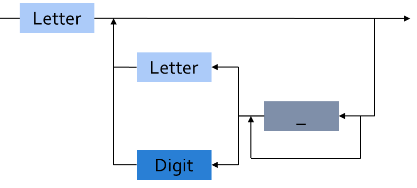

**************
Declarations
**************

==============
Introduction
==============

----------------------------------------
Some New or Possibly Different Symbols
----------------------------------------

 .. list-table::
   :header-rows: 1

  * - This Symbol

    - Means This

  * - `<>`

    - 'box' - not specified here

  * - :=

    - Assignment

  * - `=>`

    - 'arrow' - association

  * - =

    - Equality

  * - /=

    - Inequality

  * - `..`

    - 'through' - range of values (e.g. 1 .. 10)

------------------
Backus-Naur Form
------------------

* Called "BNF" for short
* A notation for defining the syntax of a language

.. list-table::
   :header-rows: 1

   * - Symbol

     - *Meaning*

   * - ``::=``

     - *is defined as*

   * - ``[item]``

     - *0 or 1 items*

   * - :math:`\{` ``item`` :math:`\}`

     - *0 or more items*

   * - ``item | item``

     - *alternative items*

* Simplified and modified syntax presented here

   - As new facilities are introduced more details are provided
   - See RM Annex P for full productions

---------------------
BNF for Identifiers
---------------------

.. code:: Ada

  identifier ::= letter {[underline] letter_or_digit}

.. container:: columns

 .. container:: column

   * Legal identifiers

      .. code:: Ada

         Phase2
         A
         Space_Person
 
 .. container:: column

   * Not legal identifiers

      .. code:: Ada

         Phase2__1
         A_
         _space_person

-------------------------
BNF for String Literals
-------------------------
.. |rightarrow| replace:: :math:`\rightarrow`

.. code:: Ada
    
   string_literal ::= "{string_element}"
   string_element ::=
      "" | non_quotation_mark_graphic_character
   graphic_character ::= identifier_letter | 
                         digit | 
                         special_character |
                         space_character

.. code:: Ada

   A_Null_String : constant string := "";
      -- two double quotes with nothing inside
   String_Of_Length_One : constant string := "A";
   Embedded_Single_Quotes : constant string :=
                            "Embedded 'single' quotes";
   Embedded_Double_Quotes : constant string :=
                            "Embedded ""double"" quotes";

.. container:: speakernote

   Note that the last example literal (that has embedded double quotes) is not an example of concatenation!

-----------------------
BNF Shows Only Syntax
-----------------------

* Not all details and no semantics

.. code:: Ada

  case_statement ::= case expression is
     case_statement_alternative
     { case_statement_alternative }
     end case;
      
  case_statement_alternative ::=
     when choice { | choice  } =>
 
====================================
Identifiers, Comments, and Pragmas
====================================

----------
Examples
----------

.. include:: examples/020_declarations/identifiers_comments_and_pragmas.rst

-------------
Identifiers
-------------

* Syntax

   .. code:: Ada

      identifier ::= letter {[underline] letter_or_digit}
 
* Character set essentially Unicode 4.0

   - Has 8-, 16-, and 32-bit characters and strings

* Rules

   - Case is not significant

      + `SpacePerson` is the same as `SPACEPERSON`

   - Underline is significant

      + But not the same as `Space_Person`

   - May not be one of the reserved words (see RM 2.9)

----------------
Reserved Words
----------------

.. code:: Ada

   abort          else              null               select
   abs            elsif             of                 separate
   abstract (95)  end               or                 some (2012)
   accept         entry             others             subtype
   access         exception         out                synchronized (2005)
   aliased (95)   exit              overriding (2005)  tagged (95)
   all            for               package            task
   and            function          pragma             terminate
   array          generic           private            then
   at             goto              procedure          type
   begin          if                protected (95)     until (95)
   body           in                raise              use
   case           interface (2005)  range              when
   constant       is                record             while
   declare        limited           rem                with
   delay          loop              renames            xor
   delta          mod               requeue (95)
   digits         new               return
   do             not               reverse

----------
Comments
----------

* Syntax

   .. code:: Ada

      comment ::= --{non_end_of_line_character}
 
* Terminate at end of line (i.e., no comment terminator sequence)

   .. code:: Ada

      -- This is a multi-
      -- line comment
      A : B; -- this is an end-of-line comment
 
---------
Pragmas
---------

* Compiler directives (pragma is "action" in Greek)

   - Tell compiler to do something special
   - Suggestions only, since compiler may not be able to comply

* Some are predefined
* Some are implementation-defined

   - But portability becomes an issue
   - But if that is what it takes...

* Unrecognized pragmas have no effect on semantics

   - Must cause a warning (in standard mode)
   - Malformed pragmas are illegal (predefined or not)

.. code:: Ada

   pragma Page;
   pragma Optimize ( Off );

==================
Numeric Literals
==================

----------
Examples
----------

.. include:: examples/020_declarations/numeric_literals.rst

--------------------------
Decimal Numeric Literals
--------------------------

* Syntax

   .. code:: Ada

      decimal_literal ::= numeral [.numeral] [exponent]
      numeral ::= digit {[underline] digit}
      exponent ::= E [+] numeral | E - numeral
 
* Examples

   .. code:: Ada

      12      0       1E6      123_456
      12.0    0.0     0.456    3.14159_26
 
* Underscore is not significant

------------------------
Based Numeric Literals
------------------------

.. code:: Ada

   based_literal ::= base # based_number [.based_number] # [exp]
   base ::= numeral
   based_number ::= extended_digit {[underline] extended_digit}
   extended_digit ::= digit | A | B | C | D | E | F
 
* Base can be 2 .. 16
* Exponent is always a decimal number

   .. code:: Ada

      16#FFF#           => 4095
      2#1111_1111_1111# => 4095
      16#F.FF#E+2       => 4095.0
      8#10#E+3          => 4096 (8 * 8**3)
 
--------------------------------------------
Designed In Reaction To C's Based Literals
--------------------------------------------

* C didn't support all the typical bases

   - Only bases 8, 10, 16 

   - Why not base 2?! (It does now)

* C's octal literals started with zero

   - Not human friendly |rightarrow| unproductive
   - Easy to misinterpret
   - Easy to change without realizing

=====================
Object Declarations
=====================

----------
Examples
----------

.. include:: examples/020_declarations/object_declarations.rst

--------------
Declarations
--------------

* Most declarations associate a name with an entity

   - Objects
   - Types
   - Subprograms
   - et cetera

* All names must be declared before use

   - Most names must be explicitly declared

      + User-defined objects!

   - Some names are implicitly declared for you

      + Types and operations

* Predefined items are of course already declared

---------------------
Object Declarations
---------------------

* Variables and constants
* Basic Syntax

   .. code:: Ada

      object_declaration ::= defining_identifier_list :
          [constant] subtype_indication [:= expression];
      defining_identifier_list ::= defining_identifier
                                   {, defining_identifier}
      subtype_indication ::= name [constraint]
 
* Examples

   .. code:: Ada

      Z, Phase : Analog;
      Max : constant Integer := 200;
      -- variable with a constraint
      Count : Integer range 0 .. Max := 0;
      -- dynamic initial value via function call
      Root : Tree := F(X);
 
------------------------------
Multiple Object Declarations
------------------------------

* Allowed for convenience

   .. code:: Ada

      A, B : Integer := F(X);
 
* Semantically same as series of single declarations

   .. code:: Ada

      A : Integer := F(X);
      B : Integer := F(X);
 
* Thus they could receive different values!

   .. code:: Ada

      T1, T2 : Time := Clock;
 
-------------------------
Predefined Declarations
-------------------------

* Many items are already declared for users

   - Defined by language standard
   - Defined by the implementation

* See Annex A for details of predefined declarations

   - Package named `Standard`
   - Numeric types and operators
   - Character types and string types
   - Input/Output facilities
   - String handling facilities
   - Access to command line arguments
   - Many, many others

* Half the RM describes the Standard Libraries

   - Some in the optional Specialized Needs Annexes too

------------------------------------
Implicit vs. Explicit Declarations
------------------------------------

* Explicit declarations actually appear in the source

   .. code:: Ada

      type Counter is range 0 .. 1000;
 
* Implicit declarations are declared automatically by the compiler

   .. code:: Ada

      function "+" ( Left, Right : Counter ) return Counter;
      function "-" ( Left, Right : Counter ) return Counter;
      function "*" ( Left, Right : Counter ) return Counter;
      function "/" ( Left, Right : Counter ) return Counter;
      ...
 
-------------
Elaboration
-------------

* Means by which declarations achieve their effects
* Essentially the execution of the declaration

   - Happens at run-time, if at all

* Objects

   - Memory logically allocated
   - Initial values assigned

* Elaboration is linear, based on the program text

   .. code:: Ada

      declare
        First_One : Integer := 10;
        Next_One : Integer := First_One;
        Another_One : Integer := Next_One;
      begin
        ...
 
=================
Universal Types
=================

-----------------
Universal Types
-----------------

* Implicitly defined 

* Represent entire classes of numeric types

   - `universal_integer`
   - `universal_real`
   - `universal_fixed`

* Values match any integer or real type, respectively

   - Values are implicitly converted to required type

      .. code:: Ada

         X : Integer64 := 2;
         Y : Integer8 := 2;
 
----------------------------------------
Numeric Literals Are Universally Typed
----------------------------------------

* No need to specify the "size" or "class"

   - No need for suffixes indicating unsigned, long, etc
   - e.g ``0UL`` in C

* Compiler keeps everything straight

   - No bugs due to loading insufficient number of bytes

      .. code:: Ada

         X : Unsigned_Long := 0;
         Y : Unsigned_Short := 0;
 
----------------------------------------
Literals Must Match "Class" of Context
----------------------------------------

* `universal_integer` literals match the integer types
* `universal_real` literals match the fixed and floating point types
* Legal

   .. code:: Ada

      X : Integer := 2;
      Y : Float := 2.0;
 
* Not legal

   .. code:: Ada

      X : Integer := 2.0;
      Y : Float := 2;
 
===============
Named Numbers
===============

----------
Examples
----------

.. include:: examples/020_declarations/named_numbers.rst

---------------
Named Numbers
---------------

* Associate a name with a literal expression

   - Presumably to be used in place of the expression

* Syntax

   .. code:: Ada

      number_declaration ::=
         defining_identifier_list : constant
                                  := static_expression;
 
* Expression must be static
* Are of universal types

   - `universal_integer` and `universal_real`
   - Thus compatible with any integer or real type, respectively

   .. code:: Ada

      Pi : constant := 3.141592654;
      One_Third : constant := 1.0 / 3.0;
 
--------------------------------------
A Sample Collection of Named Numbers
--------------------------------------

.. code:: Ada

   package Physical_Constants is
     Polar_Radius : constant := 20_856_010.51;
     Equatorial_Radius : constant := 20_926_469.20;
     Earth_Diameter : constant :=
       2.0 * ((Polar_Radius + Equatorial_Radius)/2.0);
     Gravity : constant := 32.1740_4855_6430_4;
     Sea_Level_Air_Density : constant :=
       0.002378;
     Altitude_Of_Tropopause : constant := 36089.0;
     Tropopause_Temperature : constant := -56.5;
   end Physical_Constants;
 
----------------------
Named Number Benefit
----------------------

.. container:: columns

 .. container:: column
  
    * Evaluated exactly at compile time

       - Just as if expression was used directly in the code

    * Thus no loss of accuracy in different type contexts
    
    .. code:: Ada
    
      NN : constant := 1.0 / 3.0;   
      C  : constant float :=
           1.0 / 3.0;

 .. container:: column
  
    * NN as ...

       - Float value |rightarrow| 3.33333E-01
       - Long Float value |rightarrow| 3.33333333333333E-01
       - Long Long Float value |rightarrow| 3.33333333333333333E-01

    * C as ...

       - Float value |rightarrow| 3.33333E-01
       - Long Float value |rightarrow| 3.33333343267441E-01
       - Long Long Float value |rightarrow| 3.33333343267440796E-01

======================
Scope and Visibility
======================

----------
Examples
----------

.. include:: examples/020_declarations/scope_and_visibility.rst

----------------------
Scope and Visibility
----------------------

* Determine those places in which a given name can be used to reference a given entity
* Scope of a name

   - Region of text where potentially available for reference
   - No longer exists when no longer "in scope"
   - Scopes can be nested

* Visibility of a name

   - Region of text where actually available for reference
   - Visibility rules determine which names are visible
   - When hidden, a name is "in scope" but not visible

------------------------------
Introducing Block Statements
------------------------------

* Statements with an optional declarative part

   - Must occur within sequence of statements (between begin-end reserved word pairs)
   - Can be nested since they are themselves statements

* Form a semi-complete context for visibility examples
* Syntax

   .. code:: Ada

      [block-name :] declare
      {declarative part}
      begin
      statement-sequence
      end [block-name];
 
* Example

   .. code:: Ada

      Swap:  declare
        Temp : Integer;
      begin
        Temp := U;
        U := V;
        V := Temp;
      end Swap;

----------------------
Scope and "Lifetime"
----------------------

.. container:: columns

 .. container:: column
  
    .. image:: ../../images/block_scope_example.jpg
    
 .. container:: column
  
    * Declared objects exist as long as they are in scope
    * Not controlled by keywords such as ``static`` etc.

-------------
Name Hiding
-------------

* Results from "homographs"

   - Homographs are indistinguishable names

   .. code:: Ada

      declare
        M : Integer;
      begin
        ... -- M here is an INTEGER
        declare
          M : Float;
        begin
          ... -- M here is a FLOAT
        end;
        ... -- M here is an INTEGER
      end;
 
-------------------
Overcoming Hiding
-------------------

.. container:: columns

 .. container:: column
  
    * Based on providing additional name qualifiers

       - Works for any named scope

    * But should question use of object homographs

       - These are just example names - not necessarily good ones!

 .. container:: column
  
    .. code:: Ada
    
       Outer : declare
         M : Integer;
       begin
         ...
         declare
           M : Float;
         begin
           Outer.M := Integer(M);
         end;
         ...
       end Outer;
     
================
Aspect Clauses
================

----------
Examples
----------

.. include:: examples/020_declarations/aspect_clauses.rst

----------------
Aspect Clauses
----------------

.. admonition:: Language Variant

   Ada 2012

* Define characteristics of a declared entity
* Applicable to objects, types, program units, etc.
* Syntax

   .. code:: Ada

      aspect_specification ::= with aspect_mark [ => expression]
                               {, aspect_mark [ => expression] }
 
   - Note this is always part of a larger construct, i.e., never stand-alone

* Many `aspect_mark`s defined by the language
* Vendors can define `aspect_mark`s too

--------------------------------
Aspect Clause Example: Objects
--------------------------------

.. admonition:: Language Variant

   Ada 2012

* Updated object syntax

   .. code:: Ada

      object_declaration ::= defining_identifier_list :
                             [constant] subtype_indication
                             [:= expression]
                             with aspect_mark [ => expression]
                             {, aspect_mark [ => expression] };
 
* Usage

   .. code:: Ada

      CR : Control_Register
         with Size => 8,
         Address => To_Address (16#DEAD_BEEF#);
 
------------------------
Boolean Aspect Clauses
------------------------

.. admonition:: Language Variant

   Ada 2012

* Support shorthand when "True" is the value to be specified

   - Longhand

      .. code:: Ada

         procedure Foo with inline => true;
 
   - Shorthand

      .. code:: Ada

         procedure Foo with inline;
 
* If aspect is omitted entirely, the value is "False"

   - Longhand

      .. code:: Ada

         procedure Foo with inline => false;
 
   - Shorthand

      .. code:: Ada

         procedure Foo;
 
      + Original form!

=========
Summary
=========

---------
Summary
---------

* BNF provides a detailed syntax definition

   - See Annex P, including index at end

* All declarations are permanently of a single type

   - But recall flexibility of OOP from Overview

* Elaboration concept is not really new

   - Applies to other entities as well as objects

* Scope and visibility rules are fairly traditional

   - New language constructs deal with problems

* More detail will be introduced as need arises

   - How and when scopes come into existence
   - Additional declarations
   - Aspect clauses for other entities
