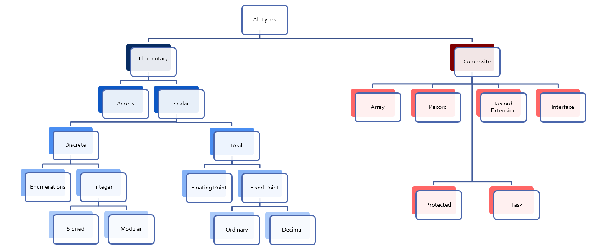

*************
Basic Types
*************

.. |rightarrow| replace:: :math:`\rightarrow`

.. role:: ada(code)
   :language: ada

.. role:: C(code)
   :language: C

.. role:: cpp(code)
   :language: C++

================
Introduction
================

----------------
Ada Type Model
----------------

* **Static** Typing

   - Object type **cannot change**

* **Strong** Typing

   - By **name**
   - **Compiler-enforced** operations and values
   - **Explicit** conversion for "related" types
   - **Unchecked** conversions possible

---------------
Strong Typing
---------------

* Definition of **type**

   - Applicable **values**
   - Applicable **operations**

* Compiler-enforced

   - **Check** of values and operations
   - Easy for a computer
   - Developer can focus on **earlier** phase: requirement

----------------------
A Little Terminology
----------------------

* **Declaration** creates a **type name**

   .. code:: Ada

      type <name> is <type definition>;
 
* **Type-definition** defines its structure

   - Characteristics, and operations
   - Base "class" of the type

   .. code:: Ada

      type Type_1 is digits 12; -- floating-point
      type Type_2 is range -200 .. 200; -- signed integer
      type Type_3 is mod 256; -- unsigned integer

-------------------------
Ada "Named Typing"
-------------------------

* **Name** differentiate types
* Structure does **not**
* Identical structures may **not** be interoperable

   .. code:: Ada

      type Yen is range 0 .. 100_000_000;
      type Ruble is range 0 .. 100_000_000;
      Mine : Yen;
      Yours : Ruble;
      ...
      Mine := Yours; -- not legal
 
---------------------
Categories of Types
---------------------

--------------
Scalar Types
--------------

* Indivisible: No components
* **Relational** operators defined (``<``,  ``=``, ...)

    - **Ordered**

* Have common **attributes**
* **Discrete** Types

  - Integer
  - Enumeration

* **Real** Types

  - Floating-point
  - Fixed-point

----------------
Discrete Types
----------------

* **Individual** ("discrete") values

   - 1, 2, 3, 4 ...
   - Red, Yellow, Green

* Integer types

   - Signed integer types
   - Modular integer types

      * Unsigned
      * **Wrap-around** semantics
      * Bitwise operations

* Enumeration types

   - Ordered list of **logical** values

-----------
Attributes
-----------

* Functions *associated* with a type

   - May take input parameters

* Some are language-defined

    - *May* be implementation-defined
    - **Built-in**
    - Cannot be user-defined
    - Cannot be modified

* See RM K.2 *Language-Defined Attributes*
* Syntax

  .. code:: Ada

    Type_Name'Attribute_Name;
    Type_Name'Attribute_With_Param (Param);

* **'** often named *tick*

========================
Discrete Numeric Types
========================

-----------
Examples
-----------

.. include:: examples/030_basic_types/discrete_numeric_types.rst

----------------------
Signed Integer Types
----------------------

* Range of signed **whole** numbers

   - Symmetric about zero (-0 = +0)

* Syntax

   .. code:: Ada

      type <identifier> is range  <lower> .. <upper>;
 
* Implicit numeric operators

   .. code:: Ada

      -- 12-bit device
      type Analog_Conversions is range 0 .. 4095;
      Count : Analog_Conversions;
      ...
      begin
         ...
         Count := Count + 1;
         ...
      end;
 
--------------------------------
Specifying Integer Type Bounds
--------------------------------

* Must be **static**

   - Compiler selects **base type**
   - Hardware-supported integer type
   - Compilation **error** if not possible

--------------------------
Predefined Integer Types
--------------------------

* :ada:`Integer` **>= 16 bits** wide

* Other **probably** available

   - :ada:`Long_Integer`, :ada:`Short_Integer`, etc.
   - Guaranteed ranges: :ada:`Short_Integer` ``<=`` :ada:`Integer` ``<=`` :ada:`Long_Integer`
   - Ranges are all **implementation-defined**

* Portability not guaranteed

   - But may be difficult to avoid

--------------------------------
Operators for Any Integer Type
--------------------------------

* By increasing precedence

   :relational operator: :ada:`= | /= | < | <= | > | >=`
   :binary adding operator: :ada:`+ | -`
   :unary adding operator: :ada:`+ | -`
   :multiplying operator: :ada:`* | / | mod | rem`
   :highest precedence operator: :ada:`** | abs`

* *Note*: for exponentiation :ada:`**`

   - Result will be :ada:`Integer`
   - So power **must** be :ada:`Integer` ``>= 0``

* Division by zero |rightarrow| :ada:`Constraint_Error`

-------------
Base Ranges
-------------

* Actual **hardware-supported** numeric type used
* **Predefined** operators

   - Work on full-range
        
        + **No range checks** on inputs or result
        + Best performance

   - Implementation may use wider registers

        + Intermediate values

* Can be accessed with :ada:`'Base` attribute

   .. code:: Ada

      type Foo is range -30_000 .. 30_000;
      function "+" (Left, Right : Foo'Base) return Foo'Base;
 
* Base range

    - Signed
    - 8 bits |rightarrow| `-128 .. 127`
    - 16 bits |rightarrow| `-32_768 .. 32767`

---------------------------------
Compile-Time Constraint Violation
---------------------------------

* *May* produce **warnings**
    
    - And compile successfuly

* *May* produce **errors**
    
    - And fail at compilation

* Requirements for rejection

   - Static value
   - Value not in range of **base** type
   - Compilation is **impossible**

.. code:: Ada

   procedure Test is
      type Some_Integer is range -200 .. 200;
      Object : Some_Integer;
   begin
      Object := 50_000; -- probable error
   end;

-------------------
Range Check Failure
-------------------

* Compile-time rejection

   - Depends on **base** type
   - Selected by the compiler
   - Depends on underlying **hardware**
   - Early error |rightarrow| "Best" case

* Else run-time **exception**

    - Most cases
    - Be happy when compilation failed instead

-----------------
Integer Overflows
-----------------

* Finite binary representation
* Common source of bugs

.. code:: Ada

   K : Short_Integer := Short_Integer'Last;
   ...
   K := K + 1;
      
    2#0111_1111_1111_1111#  = (2**16)-1

   +                    1

   =======================
    2#1000_0000_0000_0000#  = -32,768
 
-------------------------------
Integer Overflow: Ada vs others
-------------------------------

* Ada

   - :ada:`Constraint_Error` standard exception
   - Incorrect numerical analysis

* Java

   - Silently **wraps** around (as the hardware does)

* C/C++

   - **Undefined** behavior (typically silent wrap-around)
 
---------------
Modular Types
---------------

* Integer type
* **Unsigned** values
* Adds operations and attributes

    * Typically **bit-wise** manipulation

* Syntax

   .. code:: Ada

      type <identifier> is mod <modulus>;
 
* Modulus must be **static**
* Resulting range is  0 .. modulus-1

   .. code:: Ada

      type Unsigned_Word is mod 2**16; -- 16 bits,  0 .. 65_535
      type Byte is mod 256;            -- 8 bits, 0 .. 255
 
------------------------
Modular Type Semantics
------------------------

* Standard :ada:`Integer` operators
* **Wraps-around** in overflow

   - Like other languages' unsigned types
   - Attributes :ada:`'Pred` and :ada:`'Succ`

* Additional bit-oriented operations are defined

   - :ada:`and`, :ada:`or`, :ada:`xor`, :ada:`not`
   - **Bit shifts**
   - Values as **bit-sequences**

------------------------------------------
Bit Pattern Values and Range Constraints
------------------------------------------

* Binary based assignments possible
* No :ada:`Constraint_Error` when in range
* **Even if** they would be ``<= 0`` as a **signed** integer type

.. code:: Ada

   procedure Demo is
     type Byte is mod 256;  -- 0 .. 255
     B : Byte;
   begin
     B := 2#1000_0000#; -- not a negative value
   end Demo;
 
---------------------------------
Modular Range Must Be Respected
---------------------------------

.. code:: Ada

   procedure Unsigned is
     type Byte is mod 2**8;  -- 0 .. 255  
     B : Byte;
     type Signed_Byte is range -128 .. 127;
     SB : Signed_Byte;
   begin
     ...
     B := -256;       -- compile error
     SB := -1;
     B := Byte (SB);  -- runtime error
     ...   
   end Unsigned;
 
--------------------------------------
Safely Converting Signed To Unsigned
--------------------------------------

* Conversion may raise :ada:`Constraint_Error`
* Use :ada:`T'Mod` to return :ada:`argument mod T'Modulus`

   - :ada:`Universal_Integer` argument
   - So **any** integer type allowed

  .. code:: Ada

     procedure Test is
       type Byte is mod 2**8;  -- 0 .. 255  
       B : Byte;
       type Signed_Byte is range -128 .. 127;
       SB : Signed_Byte;
     begin
       SB := -1;
       B := Byte'Mod (SB);  -- OK (255)
 
--------------------------
Predefined Modular Types
--------------------------

* In :ada:`Interfaces` package

   - Need **explicit** import

* **Fixed-size** numeric types
* Common name **format**

   - `Unsigned_n`
   - `Integer_n`

.. code:: Ada

   type Integer_8 is range -2 ** 7 .. 2 ** 7 - 1;
   type Integer_16 is range -2 ** 15 .. 2 ** 15 - 1;
   ...
   type Unsigned_8 is mod 2 ** 8;
   type Unsigned_16 is mod 2 ** 16;
 
------------------------
Shift/Rotate Functions
------------------------

* In :ada:`Interfaces` package

   - `Shift_Left`
   - `Shift_Right`
   - `Shift_Right_Arithmetic`
   - `Rotate_Left`
   - etc.

* See RM B.2 - *The Package Interfaces*

---------------------------------
Bit-Oriented Operations Example
---------------------------------

* Assuming :ada:`Unsigned_16` is used
    
    - 16-bits modular

.. code:: Ada

   with Interfaces;
   use Interfaces;
   ... 
   procedure Swap( X : in out Unsigned_16 ) is
   begin
     X := ( Shift_Left(X,8) and 16#FF00# ) or
          ( Shift_Right(X,8) and 16#00FF# );
   end Swap;
 
---------------------------------
Why No Implicit Shift and Rotate?
---------------------------------

* Arithmetic, logical operators available **implicity**
* **Why not** :ada:`Shift`, :ada:`Rotate`, etc. ?
* By **excluding** other solutions

   - As functions in **standard** |rightarrow| May **hide** user-defined declarations
   - As new **operators** |rightarrow| New operators for a **single type**
   - As **reserved words** |rightarrow| Not **upward compatible**

-------------------------------------
Shift/Rotate for User-Defined Types
-------------------------------------

* **Must** be modular types
* Approach 1: use :ada:`Interfaces`'s types

    - `Unsigned_8`, `Unsigned_16` ...

* Approach 2: derive from :ada:`Interfaces`'s types

   - Operations are **inherited**
   - More on that later

   .. code:: Ada

      type Byte is new Interfaces.Unsigned_8;
      type Half_Word is new Interfaces.Unsigned_16;
      type Word is new Interfaces.Unsigned_32;

 
---------------------------------------------
Integer Type (Signed and Modular) Literals 
---------------------------------------------

* **Must not** contain a **fractional** part
* **No promotion** or demotion is done silently
* **Conversion** can be used

.. code:: Ada

   type Event_Counter is range 0 .. 40_000; -- integer type
   OK : Event_Counter := 0; -- Right type, legal
   Bad : Event_Counter := 0.0 ; -- Promotion, compile error
   Converted : Event_Counter := Event_Counter (0.0); -- Conversion, legal

 
-----------------------------------
String Attributes For All Scalars
-----------------------------------

* `T'Image( input )`

   - Converts :ada:`T` |rightarrow| :ada:`String`

* `T'Value( input )`

   - Converts :ada:`String` |rightarrow| :ada:`T`

.. code:: Ada

   Number : Integer := 12345;
   Input  : String( 1 .. N );
   ...
   Put_Line( Integer'Image(Number) );
   ...
   Get( Input );
   Number := Integer'Value( Input );
 
----------------------------------
Range Attributes For All Scalars
----------------------------------

* `T'First`

  - First (**smallest**) value of type :ada:`T`

* `T'Last`

  - Last (**greatest**) value of type :ada:`T`

* `T'Range`

  - Shorthand for :ada:`T'First .. T'Last`

.. code:: Ada
   
   type Signed_T is range -99 .. 100;
   Smallest : Signed_T := Signed_T'First; -- -99
   Largest  : Signed_T := Signed_T'Last;  -- 100
 
-------------------------------------
Neighbor Attributes For All Scalars
-------------------------------------

* `T'Pred (Input)`

   - Predecessor of specified value
   - :ada:`Input` type must be :ada:`T`

* `T'Succ (Input)`

   - Successor of specified value
   - :ada:`Input` type must be :ada:`T`

.. code:: Ada

   type Signed_T is range -128 .. 127;
   type Unsigned_T is mod 256;
   Signed   : Signed_T := -1;
   Unsigned : Unsigned_T := 0;
   ...a
   Signed := Signed'Succ( Signed ); -- Signed = -2
   ...
   Unsigned := Unsigned'Pred( Unsigned ); -- Signed = 1
 
------------------------------------
Min/Max Attributes For All Scalars
------------------------------------

* `T'Min (Value_A, Value_B)`

  - **Lesser** of two :ada:`T`

* `T'Max (Value_A, Value_B)`

  - **Greater** of two :ada:`T`

.. code:: Ada
   
   Safe_Lower : constant := 10;
   Safe_Upper : constant := 30;
   C : Integer := 15;
   ...
   C := Integer'Max (Safe_Lower, C - 1);
   ...
   C := Integer'Min (Safe_Upper, C + 1);
 
============================
Discrete Enumeration Types
============================
 
-----------
Examples
-----------

.. include:: examples/030_basic_types/discrete_enumeration_types.rst

-------------------
Enumeration Types
-------------------

* Enumeration of **logical** values

    - Integer value is an implementation detail

* Syntax

   .. code:: Ada

      type <identifier> is ( <identifier-list> ) ;
 
* Literals

   - Distinct, ordered
   - Can be in **multiple** enumerations

   .. code:: Ada

      type Colors is (Red, Orange, Yellow, Green, Blue, Violet);
      type Stop_Light is (Red, Yellow, Green);
      ...
      -- Red both a member of Colors and Stop_Light
      Shade : Colors := Red;
      Light : Stop_Light := Red;
 
-----------------------------
Enumeration Type Operations
-----------------------------

* Assignment, relationals
* **Not** numeric quantities

   - *Possible* with attributes
   - Not recommended

.. code:: Ada

   type Directions is ( North, South, East, West );
   type Days is ( Mon, Tue, Wed, Thu, Fri, Sat, Sun );
   Heading : Directions;
   Today, Tomorrow : Days;
   ...
   Today := Mon;
   Today := North; -- compile error
   Heading := South;
   Heading := East + 1; -- compile error
   if Today < Tomorrow then ...
 
---------------
Character Types
---------------

* Literals

   - Enclosed in single quotes
   - Case-sensitive

* **Special-case** of enumerated type

   - At least one character enumeral

* Can be user-defined

   .. code:: Ada

      type EBCDIC is ( nul, ..., 'a' , ..., 'A', ..., del );
      Control : EBCDIC := 'A';
      Nullo : EBCDIC := nul;
 
----------------------------------
Language-Defined Character Types
----------------------------------

* :ada:`Character`

   - 8-bit Latin-1
   - Base element of :ada:`String`

* :ada:`Wide_Character`

   - 16-bit Unicode
   - Base element of :ada:`Wide_Strings`

* :ada:`Wide_Wide_Character`

   - 32-bit Unicode
   - Base element of :ada:`Wide_Wide_Strings`

-----------------------------
Character Oriented Packages
-----------------------------

* Language-defined
* `Ada.Characters.Handling`

   - Classification
   - Conversion

* `Ada.Characters.Latin_1`

   - Characters as constants

* See RM Annex A for details

-----------------------------------------
`Ada.Characters.Latin_1` Sample Content
-----------------------------------------

.. code:: Ada

   package Ada.Characters.Latin_1 is
     NUL : constant Character := Character'Val (0);
     ...
     LF  : constant Character := Character'Val (10);
     VT  : constant Character := Character'Val (11);
     FF  : constant Character := Character'Val (12);
     CR  : constant Character := Character'Val (13);
     ...
     Commercial_At  : constant Character := '@';  -- Character'Val(64)
     ...
     LC_A : constant Character := 'a';  -- Character'Val (97)
     LC_B : constant Character := 'b';  -- Character'Val (98)
     ...
     Inverted_Exclamation : constant Character := Character'Val (161);
     Cent_Sign            : constant Character := Character'Val (162);
   ...
     LC_Y_Diaeresis       : constant Character := Character'Val (255);
   end Ada.Characters.Latin_1;
 
----------------------------------------
Ada.Characters.Handling Sample Content
----------------------------------------

.. code:: Ada

   package Ada.Characters.Handling is
     function Is_Control           (Item : Character) return Boolean;
     function Is_Graphic           (Item : Character) return Boolean;
     function Is_Letter            (Item : Character) return Boolean;
     function Is_Lower             (Item : Character) return Boolean;
     function Is_Upper             (Item : Character) return Boolean;
     function Is_Basic             (Item : Character) return Boolean;
     function Is_Digit             (Item : Character) return Boolean;
     function Is_Decimal_Digit     (Item : Character) return Boolean renames Is_Digit;
     function Is_Hexadecimal_Digit (Item : Character) return Boolean;
     function Is_Alphanumeric      (Item : Character) return Boolean;
     function Is_Special           (Item : Character) return Boolean;
     function To_Lower (Item : Character) return Character;
     function To_Upper (Item : Character) return Character;
     function To_Basic (Item : Character) return Character;
     function To_Lower (Item : String) return String;
     function To_Upper (Item : String) return String;
     function To_Basic (Item : String) return String;
   ...
   end Ada.Characters.Handling;
 
-------------------------------
Language-Defined Type Boolean
-------------------------------

* Enumeration

   .. code:: Ada

      type Boolean is ( False, True );
 
* Supports assignment, relational operators
* Special attributes

   .. code:: Ada

      A : Boolean;
      Counter : Integer;
      ...
      A := (Counter = 22);
 
* Logical operators :ada:`and`, :ada:`or`, :ada:`xor`, :ada:`not`

   .. code:: Ada

      A := B or ( not C ); -- For A, B, C boolean
 
------------------------------------
Why Boolean Isn't Just An Integer?
------------------------------------

.. container:: columns

 .. container:: column
  
    * Example: Real-life error

       - HETE-2 satellite **attitude control** system software (ACS)
       - Written in **C**

    * Controls four "solar paddles"

        - Deployed after launch

 .. container:: column
  
    .. image:: ../../images/hete-2_satellite.jpeg
    
------------------------------------
Why Boolean Isn't Just An Integer!
------------------------------------

* **Initially** variable with paddles' state

    - Either **all** deployed, or **none** deployed

* Used :C:`int` as a boolean

   .. code:: C

      if (rom->paddles_deployed == 1) 
        use_deployed_inertia_matrix();
      else
        use_stowed_inertia_matrix();
 
* Later :C:`paddles_deployed` became a **4-bits** value

    - One bit per paddle
    - :C:`0` |rightarrow| none deployed, :C:`0xF` |rightarrow| all deployed

* Then, :C:`use_deployed_inertia_matrix()` if only first paddle is deployed!
* Better: boolean function :C:`paddles_deployed()`

    - Single line to modify

---------------------------------------
Boolean Operators' Operand Evaluation
---------------------------------------

* Evaluation order **not specified**
* May be needed

  - Checking value **before** operation
  - Dereferencing null pointers
  - Division by zero

 .. code:: Ada

    if Divisor /= 0 and K / Divisor = Max then ... -- Problem!
 
-----------------------------
Short-Circuit Control Forms
-----------------------------

* **Short-circuit** |rightarrow| **fixed** evaluation order
* Left-to-right
* Right only evaluated **if necessary**

   - :ada:`and then`: if left is :ada:`False`, skip right

     .. code:: Ada

        Divisor /= 0 and then K / Divisor = Max
 
   - :ada:`or else`: if left is :ada:`True`, skip right

     .. code:: Ada

        Divisor = 0 or else K / Divisor = Max
 
-----------------------------------
Enumeration Representation Values
-----------------------------------

* Numeric **representation** of enumerals

    - Position, unless redefined
    - Redefinition syntax

      .. code:: Ada

         type Enum_T is (Able, Baker, Charlie, Dog, Easy, Fox);
         for Enum_T use (1, 2, 4, 8, Easy => 16, Fox => 32);
 
* No manipulation *in language standard*

   - Standard is **logical** ordering
   - Ignores **representation** value

* Still accessible

   - **Unchecked** conversion
   - **Implementation**-defined facility

      + GNAT attribute :ada:`T'Enum_Rep`

-----------------------------------------
Order Attributes For All Discrete Types
-----------------------------------------

* **All discrete** types, mostly useful for enumerated types

* `T'Pos (Input)`

   - "Logical position number" of :ada:`Input`

* `T'Val (Input)`

   - Converts "logical position number" to :ada:`T`

.. code:: Ada

   type Days is ( Sun, Mon, Tue, Wed, Thu, Fri, Sat ); -- 0 .. 6
   Today    : Days := Some_Value;
   Position : Integer;
   ...
   Position := Days'Pos( Today );
   ...
   Get( Position );
   Today := Days'Val( Position );
 
.. container:: speakernote

   Val/pos compared to value/image - same number of characters

============
Real Types
============

-----------
Examples
-----------

.. include:: examples/030_basic_types/real_types.rst

------------
Real Types
------------

* Approximations to **continuous** values

  - 1.0, 1.1, 1.11, 1.111 ... 2.0, ...
  - Finite hardware |rightarrow| approximations

* Floating-point

  - **Variable** exponent
  - **Large** range
  - Constant **relative** precision

* Fixed-point

  - **Constant** exponent
  - **Limited** range
  - Constant **absolute** precision
  - Subdivided into Binary and Decimal

* Class focuses on floating-point

------------------------------------------
Real Type (Floating and Fixed) Literals 
------------------------------------------

* **Must** contain a fractional part
* No silent promotion

.. code:: Ada

   type Phase is digits 8; -- floating-point
   OK : Phase := 0.0;
   Bad : Phase := 0 ; -- compile error
 
--------------------------------
Declaring Floating Point Types
--------------------------------

* Syntax

    .. code:: Ada

       type <identifier> is
           digits <expression> [range constraint];
 
  - *digits* |rightarrow| **minimum** number of significant digits
  - **Decimal** digits, not bits

* Complier choses representation

  - From **available** floating point types
  - May be **more** accurate, but not less
  - If none available |rightarrow| declaration is **rejected**

---------------------------------
Predefined Floating Point Types
---------------------------------

* Type :ada:`Float` ``>= 6`` digits

* Additional implementation-defined types

   - :ada:`Long_Float` ``>= 11`` digits

* General-purpose
* Best to **avoid** predefined types

   - Loss of **portability**
   - Easy to avoid

------------------------
Base Decimal Precision
------------------------

* **Actual** hardware implementation precision

   - Based on **type declaration**
   - May be **better** than requested

* Attribute :ada:`'Base`
* Example:

   - Available: 6, 12, or 24 digits of precision
   - Type with **8 digits** of precision

      .. code:: Ada

         type My_Type is digits 8;
 
   - :ada:`My_Type` will have 12 **or** 24 digits of precision

-------------------------------
Floating Point Type Operators
-------------------------------

* By increasing precedence

   :relational operator: :ada:`= | /= | < | >= | > | >=`
   :binary adding operator: :ada:`+ | -`
   :unary adding operator: :ada:`+ | -`
   :multiplying operator: :ada:`* | /`
   :highest precedence operator: :ada:`** | abs`

* *Note* on floating-point exponentiation ``**``

   - Power must be :ada:`Integer` (``< 0`` or ``>= 0``)

      + Not possible to ask for root
      + `X**0.5` |rightarrow| `sqrt(x)`

---------------------------------
Floating Point Division By Zero
---------------------------------

* Language-defined do as the machine does

   - If :ada:`T'Machine_Overflows` attribute is :ada:`True` raises :ada:`Constraint_Error`
   - Else :math:`+\infty` / :math:`-\infty`

      + Better performance

* User-defined types always raise :ada:`Constraint_Error`

 .. code:: Ada

    subtype MyFloat is Float range Float'First .. Float'Last;
    type MyFloat is new Float range Float'First .. Float'Last;
 
-----------------------------------------
Using Equality for Floating Point Types
-----------------------------------------

* Questionnable: representation issue

   - Equality |rightarrow| identical bits
   - Approximations |rightarrow| hard to **analyze**, and **not portable**
   - Related to floating-point, not Ada

* Perhaps define your own function

   - Comparison within tolerance (:math:`+\varepsilon` / :math:`-\varepsilon`)
 
--------------------------------
Floating Point Type Attributes
--------------------------------

* *Core* attributes

   .. code:: Ada

      type Real is digits N;  -- N static
 
   - `Real'Digits`

      + Number of digits **requested** (N)

   - `Real'Base'Digits`

      + Number of **actual** digits

   - `Real'Rounding (X)`

      + Integral value nearest to `X`
      + *Note* :ada:`Float'Rounding (0.5) = 1`

*  Model-oriented attributes
    
   - Advanced machine representation of the floating-point type
   - Mantissa, strict mode

===============
Miscellaneous
===============

-----------------------------
 Checked Type Conversions
-----------------------------

* Between "closely related" types

   - Numeric types
   - Inherited types
   - Array types

* Illegal conversions **rejected**

   - Unsafe **Unchecked_Conversion** available

* Functional syntax 

   - Function named :ada:`Target_Type`
   - Implicitely defined
   - **Must** be explicitely called

.. code:: Ada

   Target_Float := Float (Source_Integer);

-------------
Default Value
-------------

.. admonition:: Language Variant

   Ada 2012

* Not defined by language for **scalars**
* Can be done with an **aspect clause**

  - Only during type declarations
  - :code:`<value>` must be static

   .. code:: Ada

      type Type_Name is <type_definition>
           with Default_Value => <value>;

* Example

   .. code:: Ada

      type Tertiary_Switch is (Off, On, Neither)
         with Default_Value => Neither;
      Implicit : Tertiary_Switch; -- Implicit = Neither
      Explicit : Tertiary_Switch := Neither;
 
-------
Subtype
-------

* Same type
* Add constraints (eg. :ada:`range`)
* Syntax

   .. code:: Ada

      type identifier is Base_Type <constraints>

-------------------------------
Simple Static Type Derivation
-------------------------------

* New type from an existing type

  - **Limited** form of inheritance: operations
  - **Not** fully OOP

* Strong type benefits

  - Only **explicit** conversion possible
  - eg. :code:`Meters` can't be set from a :code:`Feet` value

* Syntax

   .. code:: Ada

      type identifier is new Base_Type <constraints>

=====
Lab
=====

.. include:: labs/030_basic_types.lab.rst

=========
Summary
=========

--------------------------------------
 Benefits of Strongly Typed Numerics
--------------------------------------

* **Prevent** subtle bugs
* Cannot mix :ada:`Apples` and :ada:`Oranges`
* Force to clarify **representation** needs

    - eg. constant with or with fractional part

   .. code:: Ada

      type Yen is range 0 .. 1_000_000;
      type Ruble is range 0 .. 1_000_000;
      Mine : Yen := 1;
      Yours : Ruble := 1;
      Mine := Yours; -- illegal
 
------------------------------------
User-Defined Numeric Type Benefits
------------------------------------

* Close to **requirements**

   - Types with **explicit** requirements (range, precision, etc.)
   - Best case: Incorrect state **not possible**

* Either implemented/respected or rejected

   - No run-time (bad) suprise

* **Portability** enhanced 

   - Reduced hardware dependencies

---------
Summary
---------

* User-defined types and strong typing is **good**

   - Programs written in application's terms
   - Computer in charge of checking constraints
   - Security, reliability requirements have a price
   - Performance **identical**, given **same requirements**

* User definitions from existing types *can* be good
* Right **trade-off** depends on **use-case**
   
   - More types |rightarrow| more precision |rightarrow| less bugs
   - Storing **both** feet and meters in :ada:`Float` has caused bugs
   - More types |rightarrow| more complexity |rightarrow| more bugs
   - A :ada:`Green_Round_Object_Altitude` type is probably **never needed**

* Default initialization is **possible**

   - Use **sparringly**
