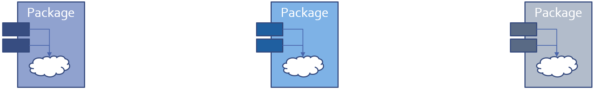

**********
Packages
**********

==============
Introduction
==============

----------
Packages
----------

* Enforce separation of client from implementation

   - In terms of compile-time visibility
   - For data
   - For type representation, when combined with `private` types

      + Abstract Data Types

* Provide basic namespace control
* Directly support software engineering principles

   - Especially in combination with `private` types
   - Modularity
   - Information Hiding (Encapsulation)
   - Abstraction
   - Separation of Concerns

-----------------------------------------
Separating Interface and Implementation
-----------------------------------------

* Implementation and specification are textually distinct from each other

   - Typically in separate files

* Clients can compile their code before body exists

   - All they need is the package specification
   - Full client/interface consistency is guaranteed

.. code:: Ada

   package Float_Stack is
     Max : constant := 100;
     procedure Push (X : in Float);
     procedure Pop (X : out Float);
   end Float_Stack;
 
---------------------------------
Uncontrolled Visibility Problem
---------------------------------

* Clients have too much access to representation

   - Data
   - Type representation

* Changes force clients to recode and retest
* Manual enforcement is not sufficient
* Why fixing bugs introduces new bugs!

-------------------------------
Basic Syntax and Nomenclature
-------------------------------

.. code:: Ada

   package_declaration ::= package_specification;
 
* Spec

      .. code:: Ada

         package_specification ::=	
            package name is 
               {basic_declarative_item}
            end [name];
 
* Body

      .. code:: Ada

         package_body ::=	
            package body name is
               declarative_part
            end [name];
 
==============
Declarations
==============

----------
Examples
----------

.. include:: examples/100_packages/declarations.rst

----------------------
Package Declarations
----------------------

* Required in all cases

   - Cannot have a package without the declaration

* Describe the client's interface

   - Declarations are exported to clients
   - Effectively the "pin-outs" for the black-box

* When changed, requires clients recompilation

   - The "pin-outs" have changed

.. code:: Ada
    
   package Float_Stack is
     Max : constant := 100;
     procedure Push (X : in Float);
     procedure Pop (X : out Float);
   end Float_Stack;

   package Data is
      Object : integer;
   end Data;

---------------------------------
Compile-Time Visibility Control
---------------------------------

* Items in the declaration are visible to users

   .. code:: Ada

      package name  is
        -- exported declarations of
        --   types, variables, subprograms ...
      end name;
 
* Items in the body are never externally visible

   - Compiler prevents external references

   .. code:: Ada

      package body name  is
        -- hidden declarations of
        --   types, variables, subprograms ...
        -- implementations of exported subprograms etc.
      end name;
 
---------------------------------
Example of Exporting To Clients
---------------------------------

* Variables, types, exception, subprograms, etc.

   - The primary reason for separate subprogram declarations

.. code:: Ada
    
   package P is
      procedure This_Is_Exported;
   end P;
       
   package body P is
      procedure Not_Exported is
         ...
      procedure This_Is_Exported is
         ...
   end P;
     
----------------------------
Referencing Exported Items
----------------------------

* Achieved via "dot notation"
* Package Specficiation
    
   .. code:: Ada
          
      package Float_Stack is
        Max : constant := 100;
        procedure Push (X : in Float);
        procedure Pop (X : out Float);
      end Float_Stack;
     
* Package Reference
    
   .. code:: Ada
    
      procedure Test is
         X : Float;
      begin
         ...
         Float_Stack.Push (12.0);
         ...
         Float_Stack.Pop (X);
         ...
         if Count < Float_Stack.Max then
           ...
        end if;

========
Bodies
========

----------
Examples
----------

.. include:: examples/100_packages/bodies.rst

----------------
Package Bodies
----------------

* Dependent on corresponding package specification

   - Obsolete if specification changed

* Clients need only to relink if body changed

   - Any code that would require editing would not have compiled in the first place

* Required when specification contains declarations requiring completions it cannot contain

   - Subprogram bodies
   - Task bodies
   - Incomplete types in `private` part
   - Others...

---------------------------
Bodies Are Never Optional
---------------------------

* Either required for a given spec or not allowed at all

   - Based on declarations in that spec

* A change from Ada 83
* A (nasty) justification example will be shown later

--------------------------------------
Example Spec That Cannot Have A Body
--------------------------------------

.. code:: Ada

   package Graphics_Primitives is
     type Real is digits 12;
     type Device_Coordinates is record
       X, Y : Integer;
     end record;
     type Normalized_Coordinates is record
       X, Y : Real range 0.0 .. 1.0;
     end record;
     type Offset is record
       X, Y : Real range -1.0 .. 1.0;
     end record;
     -- nothing to implement, so no body allowed
   end Graphics_Primitives;
 
---------------------------------------
Example Spec Requiring A Package Body
---------------------------------------

.. code:: Ada

   package VT100 is
     subtype Rows is Integer range 1 .. 24;
     subtype Columns is Integer range 1 .. 80;
     type Position is record
       Row  : Rows := Rows'First;
       Col : Columns := Columns'First;
     end record;
      -- The following need to be defined in the body
     procedure Move_Cursor (To : in Position);
     procedure Home;
     procedure Clear_Screen;
     procedure Cursor_Up (Count : in Positive := 1);
   end VT100;
 
-----------------------
Required Body Example
-----------------------

.. code:: Ada

   package body VT100 is
     -- This function is not visible outside this package
     function Unsigned (Input : Integer) return String is
       Str : constant String := Integer'Image (Input);
     begin
       return Str (2 .. Str'length);
     end Unsigned;
     procedure Move_Cursor (To : in Position) is
     begin
       Text_IO.Put (ASCII.Esc & 'I' &
                    Unsigned(To.Row) & ';' &
                    Unsigned(To.Col) & 'H');
     end Move_Cursor;
     procedure Home is
     begin
       Text_IO.Put (ASCII.Esc & "iH");
     end Home;
     procedure Cursor_Up (Count : in Positive := 1) is ...
       ...
   end VT100;
 
==================
Executable Parts
==================

----------
Examples
----------

.. include:: examples/100_packages/executable_parts.rst

--------------------------
Optional Executable Part
--------------------------

.. code:: Ada

   package_body ::=
       package body name is
          declarative_part
       [ begin
          handled_sequence_of_statements ]
       end [ name ];
 
.. container:: speakernote

   Executable part is optional

---------------------------
Executable Part Semantics
---------------------------

* Executed only once, when package is elaborated
* Ideal when statements are required for initialization

   - Otherwise initial values in variable declarations would suffice

.. code:: Ada

   package body Random is
     Seed1, Seed2 : Integer;
     Call_Count : Natural := 0;
     procedure Initialize (Seed1 : out Integer;
                           Seed2 : out Integer) is ...
     function Number return Real is ...
   begin -- Random
     Initialize (Seed1, Seed2);
   end Random;

.. container:: speakernote

   Maybe initialization requires both values at once, hence two separate initializations (e.g., function calls) won't suffice, unlike CallCount.

------------------------------------------
Requiring/Rejecting Bodies Justification
------------------------------------------

.. container:: columns

 .. container:: column
  
    * Consider the alternative: an optional package body that becomes obsolete prior to building
    * Builder could silently choose not to include the package in executable

       - Package executable part might do critical initialization!

 .. container:: column
  
    .. code:: Ada
    
       package P is
         Data : array (L .. U) of
             Integer;
       end P;
       
       package body P is
         ...
       begin
         for K in Data'Range loop
           Data(K) := ...
         end loop;
       end P;
     
---------------------------------------
Forcing A Package Body To be Required
---------------------------------------

.. container:: columns

 .. container:: column
  
    * Use `pragma Elaborate_Body`

       - Says to elaborate body immediately after spec
       - Hence there must be a body!

    * Additional pragmas we will examine later

 .. container:: column
  
    .. code:: Ada
    
       package P is
         pragma Elaborate_Body;
         Data : array (L .. U) of
             Integer;
       end P;
       
       package body P is
         ...
       begin
         for K in Data'Range loop
           Data(K) := ...
         end loop;
       end P;
     
========
Idioms
========

----------
Examples
----------

.. include:: examples/100_packages/idioms.rst

----------------------------------
Named Collection of Declarations
----------------------------------

* Exports:

   - Objects (constants and variables)
   - Types
   - Exceptions

* Does not export operations

.. code:: Ada
    
   package Physical_Constants is
     Polar_Radius_in_feet	: constant := 20_856_010.51; 
     Equatorial_Radius_in_feet : constant := 20_926_469.20; 
     Earth_Diameter_in_feet : constant := 2.0 *
          ((Polar_Radius_in_feet + Equatorial_Radius_in_feet)/2.0);
     Sea_Level_Air_Density : constant := 0.002378; --slugs/foot**3
     Altitude_Of_Tropopause_in_feet : constant := 36089.0;
     Tropopause_Temperature_in_celsius : constant := -56.5;
   end Physical_Constants;
     
--------------------------------------
Named Collection of Declarations (2)
--------------------------------------

* Effectively application global data

.. code:: Ada
    
   package Equations_of_Motion is
     Longitudinal_Velocity : Real := 0.0;
     Longitudinal_Acceleration : Real := 0.0;
     Lateral_Velocity  : Real := 0.0;
     Lateral_Acceleration : Real := 0.0;
     Vertical_Velocity : Real:= 0.0;
     Vertical_Acceleration : Real:= 0.0;
     Pitch_Attitude : Real:= 0.0;
     Pitch_Rate : Real:= 0.0;
     Pitch_Acceleration : Real:= 0.0;
   end Equations_of_Motion;
     
--------------------------------
Group of Related Program Units
--------------------------------

* Exports:

   - Objects
   - Types
   - Values
   - Operations

* Users have full access to type representations

   - This visibility may be necessary

.. code:: Ada

   package Linear_Algebra is
     type Vector is array (Positive range <>) of Real;
     function "+" (L,R : Vector) return Vector;
     function "*" (L,R : Vector) return Vector;
     ...
   end Linear_Algebra;
 
--------------------------------------
Uncontrolled Data Visibility Problem
--------------------------------------

.. container:: columns

 .. container:: column
  
    * Effects of changes are potentially pervasive so one must understand everything before changing anything

 .. container:: column
  
    .. image:: ../../images/subprograms_accessing_global.png
    
--------------------------------------------
Controlling Data Visibility Using Packages
--------------------------------------------

* Divides global data into separate package bodies
* Visible only to procedures and functions declared in those same packages

   - Clients can only call these visible routines

* Global change effects are much less likely

   - Direct breakage is impossible

|

------------------------
Abstract Data Machines
------------------------

* Exports:

   - Operations
   - State information queries (optional)

* No direct user access to data

.. code:: Ada
    
   package Float_Stack is
     Max : constant := 100;
     procedure Push (X : in Float);
     procedure Pop (X : out Float);
   end Float_Stack;
       
   package body Float_Stack is
     type Contents is array (1 .. Max) of Float;
     Values : Contents;
     Top : Integer range 0 .. Max := 0;
     procedure Push (X : in Float) is ...
     procedure Pop (X : out Float) is ...
   end Float_Stack;
     
--------------------------------------------
Controlling Type Representation Visibility
--------------------------------------------

* In other words, support for Abstract Data Types

   - No operations visible to clients based on representation

* The fundamental concept for Ada
* Requires `private` types discussed in coming section...

========
Lab
========

.. include:: labs/100_packages.lab.rst
     
=========
Summary
=========

---------
Summary
---------

* Emphasizes separations of concerns
* Solves the global visibility problem

   - Only those items in the specification are exported

* Enforces software engineering principles

   - Information hiding
   - Abstraction

* Implementation can't be corrupted by clients

   - Compiler won't let clients compile references to internals

* Bugs must be in the implementation, not clients

   - Only body implementation code has to be understood
