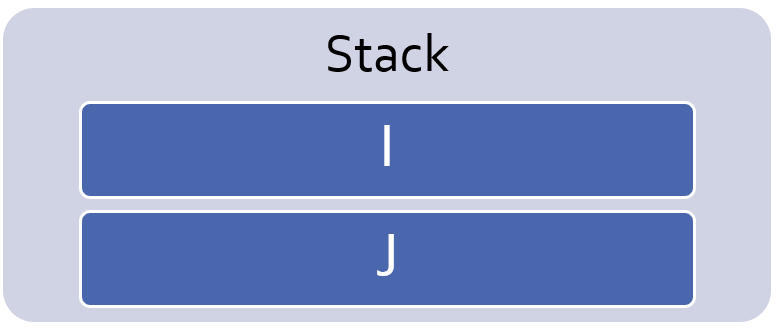
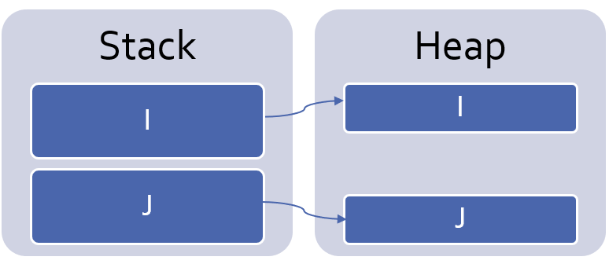

**************
Access Types
**************

.. role:: ada(code)
    :language: Ada

==============
Introduction
==============

---------------------
Access Types Design
---------------------

* :ada:`access` types associate an object to a **memory address** and **pool**
* Pools have specific allocation and deallocation **policies**
* Equivalent to Java references, C/C++ pointers
* But unlike C, access are always **meaningful**

    - Points to an object or is :ada:`null`
    - Unchecked mode is available

    .. code:: Ada

       type Integer_Pool_Access is access Integer;
       P_A : Integer_Pool_Access := new Integer;

       type Integer_General_Access is access all Integer;
       G : aliased Integer
       G_A : Integer_General_Access := G'access;

-----------------
Dangers of Access
-----------------

* More **complex** designs

    - Debug
    - Data structures

* **Performance** impact

   - Allocations
   - Dereferences

* Software **stability**

    - Memory leaks
    - Memory corruption

* By design, need for accesses is **limited**

    - Advanced subject

.. code:: Ada

  I : Integer := 0;
  J : String := "Some Long String";

.. code:: Ada

  I : Access_Int:= new Integer'(0);
  J : Access_Str := new String ("Some Long String");

--------------------------
Pool-Specific Access Types
--------------------------

* An :ada:`access` type is a **scalar type**

   .. code:: Ada

      type T is [...]
      type T_Access is access T;
      V : T_Access := new T;

* Is **pool-specific** by default

    - Can also be **general access** type

* Conversion is **mandatory** between access-types

    - Conversion to pool-specific is **forbidden**

   .. code:: Ada

      type T_Access_2 is access T;
      V2 : T_Access_2 := T_Access_2 (V); -- illegal

-------------
Allocations
-------------

* Objects are allocated with :ada:`new`
* Allocated object must be **constrained** at allocation

   .. code:: Ada

      V : String_Access := new String (1 .. 10);

* Can use qualifier to **copy** an existing object

   .. code:: Ada

      V : String_Access := new String'("This is a String");

---------------
Deallocations
---------------

* Deallocations are **unsafe**

   - Multiple deallocations problems
   - Memory corruptions
   - Access to deallocated objects

* Using them means losing most safety features
* Still **available**

   - **No simple way** of doing it
   - Instanciate the :ada:`generic procedure` called :ada:`Ada.Unchecked_Deallocation`
   - Receives an access it deallocates and sets to :ada:`null`

----------------------
Deallocation Example
----------------------

.. code:: Ada

   -- generic used to deallocate memory
   with Ada.Unchecked_Deallocation;
   procedure P is
      type An_Access is access A_Type;
      -- create instances of deallocation function
      -- (object type, access type)
      procedure Free is new Ada.Unchecked_Deallocation
        (A_Type, An_Access);
      V : An_Access := new A_Type;
   begin
      Free (V);
      -- V is now null
   end P;

==========================
General Access Types
==========================

----------
Examples
----------

.. include:: examples/140_access_types/general_access_types.rst

:url:`https://learn.adacore.com/training_examples/fundamentals_of_ada/140_access_types.html#general-access-types`

----------------------
General Access Types
----------------------

* Use :ada:`access all`
* Can point to **any pool** (including stack)

   .. code:: Ada

      type T is [...]
      type T_Access is access all T;
      V : T_Access := new T;

* Conversion to general access type is **allowed**

   .. code:: Ada

      type T_Access_2 is access all T;
      V2 : T_Access_2 := T_Access_2 (V); -- legal

-----------------------
Referencing The Stack
-----------------------

* Stack-allocated objects **cannot** be referenced **by default**

    - Compiler may optimize it into a register

* :ada:`aliased` declares a stack-allocated object that can be referenced

   .. code:: Ada

      V : aliased Integer;

* :ada:`'Access` attribute returns a reference
* Only :ada:`access all` general access can reference it

   .. code:: Ada

      A : Int_Access := V'Access;

----------------------------
`Aliased` Objects Examples
----------------------------

.. code:: Ada

   type Acc is access all Integer;
      V : Acc;
      I : aliased Integer;
   begin
      V := I'Access;
      V.all := 5; -- Same a I := 5

   ...

   type Acc is access all Integer;
   G : Acc;
   procedure P1 is
      I : aliased Integer;
   begin
      G := I'Unchecked_Access;
      -- Same as 'Access (see later)
   end P1;
   procedure P2 is
   begin
      G.all := 5;
      -- What if P2 is called after P1?
   end P2;

------
Quiz
------

.. code:: Ada

   type One_T is access all Integer;
   type Two_T is access Integer;

   A : aliased Integer;
   B : Integer;

   One : One_T;
   Two : Two_T;

Which assignment is legal?

A. ``One := B'Access;``
B. :answermono:`One := A'Access;`
C. ``Two := B'Access;``
D. ``Two := A'Access;``

.. container:: animate

   :ada:`'Access` is only allowed for general access types
   (:ada:`One_T`). To use :ada:`'Access` on an object, the
   object must be :ada:`aliased`.

==========================
Access Types
==========================

----------
Examples
----------

.. include:: examples/140_access_types/access_types.rst

:url:`https://learn.adacore.com/training_examples/fundamentals_of_ada/140_access_types.html#access-types`

-------------
Null Values
-------------

* An unintialized access has the :ada:`null` value
* :ada:`null` can be used in assignments and comparisons

.. code:: Ada

    type Acc is access all Integer;
       V : Acc;
    begin
       if V = null then
          --  will go here
       end if
       V := new Integer'(0);
       V := null; -- semantically correct, but memory leak

------------------------
Dereferencing Accesses
------------------------

* :ada:`.all` dereferences an access

   - Accesses the referenced object

* :ada:`.all` is **optional** for

   - Access on a component of an **array**
   - Access on a component of a **record**

----------------------
Dereference Examples
----------------------

.. code:: Ada

   type R is record
     F1, F2 : Integer;
   end record;
   type A_Int is access Integer;
   type A_String is access all String;
   type A_R is access R;
   V_Int    : A_Int := new Integer;
   V_String : A_String := new String'("abc");
   V_R      : A_R := new R;

.. code:: Ada

   V_Int.all := 0;
   V_String.all := "cde";
   V_String (1) := 'z'; -- similar to V_String.all (1) := 'z';
   V_R.all := (0, 0);
   V_R.F1 := 1; -- similar to V_R.all.F1 := 1;

======================
Accessibility Checks
======================

----------
Examples
----------

.. include:: examples/140_access_types/accessibility_checks.rst

:url:`https://learn.adacore.com/training_examples/fundamentals_of_ada/140_access_types.html#accessibility-checks`

----------------------
Declaration Location
----------------------

* Can be at library level
* Can be **nested** in any declarative scope
* Nesting adds non-trivial issues

   - Nested pool
   - Accessing an object out of its **lifetime**
   - Safety feature of **accessibility checks**

--------------------------------------------
Introduction to Accessibility Checks (1/2)
--------------------------------------------

* **Depth**: number of **declarative scopes** enclosing a declaration

   .. code:: Ada

      package body P is
         --  Library level, depth 0
         procedure Proc is
            --  Library level subprogram, depth 1
            procedure Nested is
               -- Nested subprogram, enclosing + 1 = depth 2
            begin
            [...]

* Rule: **access** type depth :math:`\ge` **object** depth

    - Checks the access **type**
    - Access cannot outlive the object

* Compiler checks it **statically**

    - Can be disabled (**not** recommended)

--------------------------------------------
Introduction to Accessibility Checks (2/2)
--------------------------------------------

.. code:: Ada

   package body P is
      type T0 is access all Integer;
      A0 : T0;
      V0 : aliased Integer;
      procedure Proc is
         type T1 is access all Integer;
         A1 : T1;
         V1 : aliased Integer;
      begin
         A0 := V0'Access;
         A0 := V1'Access; -- illegal
         A0 := V1'Unchecked_Access;
         A1 := V0'Access;
         A1 := V1'Access;
         A1 := T1 (A0);
         A0 := T0 (A1); -- illegal
         A1 := new Integer;
         A0 := T0 (A1); -- illegal
     end Proc;
   end P;

* Using nested access types brings **complex** issues

-------------------------------------
Getting Around Accessibility Checks
-------------------------------------

* :ada:`'Unchecked_Access` disables the depth check
* Beware of potential problems!

   .. code:: Ada

      type Acc is access all Integer;
      G : Acc;
      procedure P is
         V : aliased Integer;
      begin
         G := V'Unchecked_Access;
         ...
         Do_Something ( G.all ); -- This is "reasonable"
      end P;

.. container:: speakernote

   Not the best way to write code

-----------------------------------------
Using Pointers For Recursive Structures
-----------------------------------------

* Recursive structure **cannot** be declared
* Use :ada:`access` to the enclosing type

    - Need **partial declaration**

.. code:: Ada

   type Cell; -- partial declaration
   type Cell_Access is access all Cell;
   type Cell is record -- full declaration
      Next       : Cell_Access;
      Some_Value : Integer;
   end record;

------
Quiz
------

.. code:: Ada

   type Global_Access_T is access all Integer;
   Global_Pointer : Global_Access_T;
   Global_Object  : aliased Integer;
   procedure Proc_Access is
      type Local_Access_T is access all Integer;
      Local_Pointer : Local_Access_T;
      Local_Object  : aliased Integer;
   begin

Which assignment is illegal?

A. ``Global_Pointer := Global_Object'Access;``
B. :answermono:`Global_Pointer := Local_Object'Access;`
C. ``Local_Pointer  := Global_Object'Access;``
D. ``Local_Pointer  := Local_Object'Access;``

.. container:: animate

   Explanations

   A. Pointer type has same depth as object
   B. Pointer type is not allowed to have higher level than pointed-to object
   C. Pointer type has lower depth than pointed-to object
   D. Pointer type has same depth as object

===================
Memory Management
===================

----------
Examples
----------

.. include:: examples/140_access_types/memory_management.rst

:url:`https://learn.adacore.com/training_examples/fundamentals_of_ada/140_access_types.html#memory-management`

------------------------------
Common Memory Problems (1/3)
------------------------------

* Uninitialized pointers

   .. code:: Ada

      is
         type An_Access is access all Integer;
         V : An_Access;
      begin
         V.all := 5; -- constraint error

* Double deallocation

   .. code:: Ada

      is
         type An_Access is access all Integer;
         procedure Free is new
            Ada.Unchecked_Deallocation (Integer, An_Access);
         V1 : An_Access := new Integer;
         V2 : An_Access := V1;
      begin
         Free (V1);
         ...
         Free (V2);

   - May raise :ada:`Storage_Error` if memory is still protected (unallocated)
   - May deallocate a **different object** if memory has been reallocated

      + Putting that object in an **inconsistent state**

------------------------------
Common Memory Problems (2/3)
------------------------------

* Accessing deallocated memory

   .. code:: Ada

      is
         type An_Access is access all Integer;
         procedure Free is new
            Ada.Unchecked_Deallocation (Integer, An_Access);
         V1 : An_Access := new Integer;
         V2 : An_Access := V1;
      begin
         Free (V1);
         ...
         V2.all := 5;

   - May raise :ada:`Storage_Error` if memory is still protected (unallocated)
   - May modify a **different object** if memory has been reallocated

        + Putting that object in an **inconsistent state**

------------------------------
Common Memory Problems (3/3)
------------------------------

* Memory leaks

   .. code:: Ada

      is
         type An_Access is access all Integer;
         procedure Free is new
            Ada.Unchecked_Deallocation (Integer, An_Access);
         V : An_Access := new Integer;
      begin
         V := null;

   - Silent problem

      + Might raise :ada:`Storage_Error` if too many leaks
      + Might **slow down** the program if too many page faults

-----------------------------
How To Fix Memory Problems?
-----------------------------

* **No** language-defined solution
* Use the **debugger**
* Use additional tools

   - :command:`gnatmem`  monitor memory leaks
   - :command:`valgrind`  monitor all the dynamic memory
   - Memory pool :ada:`GNAT.Debug_Pools` checks for invalid access and raises exceptions

========================
Anonymous Access Types
========================

----------
Examples
----------

.. include:: examples/140_access_types/anonymous_access_types.rst

:url:`https://learn.adacore.com/training_examples/fundamentals_of_ada/140_access_types.html#anonymous-access-types`

-----------------------------
Anonymous Access Parameters
-----------------------------

* **Four** parameter modes exist: :ada:`in`, :ada:`out`, :ada:`in out`, :ada:`access`
* The :ada:`access` mode is called **anonymous access type**

   - Anonymous access is implicitly general (implicit :ada:`all`)

* When used:

   - Any **named** access can be passed as parameter
   - Any **anonymous** access can be passed as parameter

.. code:: Ada

   type Acc is access all Integer;
   G : Acc := new Integer;
   procedure P1 (V : access Integer);
   procedure P2 (V : access Integer) is
   begin
      P1 (G);
      P1 (V);
   end P;

------------------------
Anonymous Access Types
------------------------

* Other places can declare an anonymous access

    - Return, type declarations...

   .. code:: Ada

      function F return access Integer;
      V : access Integer;
      type T (V : access Integer) is record
        C : access Integer;
      end record;
      type A is array (Integer range <>) of access Integer;

* Be careful with **accessibility check** rules

----------------------------------
Anonymous Access Constants
----------------------------------

* :ada:`constant` (instead of :ada:`all`) is an access type to a **constant view**

   .. code:: Ada

      type CAcc is access constant Integer;
      G1 : aliased Integer;
      G2 : aliased constant Integer;
      V1 : CAcc := G1'Access;
      V2 : CAcc := G2'Access;
      V1.all := 0; -- illegal

* Ada 2005: :ada:`not null` is an access type that can not be :ada:`null`

   .. code:: Ada

      type NAcc is not null access Integer;
      V : NAcc := null; -- illegal

* Can be used with anonymous access types

   .. code:: Ada

      procedure Bar ( V1 : access constant integer);
      procedure Foo ( V1 : not null access integer); -- Ada 2005

========
Lab
========

.. include:: labs/140_access_types.lab.rst

=========
Summary
=========

---------
Summary
---------

* Access types are similar to C/C++ pointers
* There are usually **better ways** to manage memory

   - **Large objects** parameters as reference is **automatic**
   - Memory allocation / deallocation **libraries** are provided
   - Data structure **libraries** are provided

* At a minimum, declare allocation / deallocation generics

   - **Minimize** memory leakage and corruption
