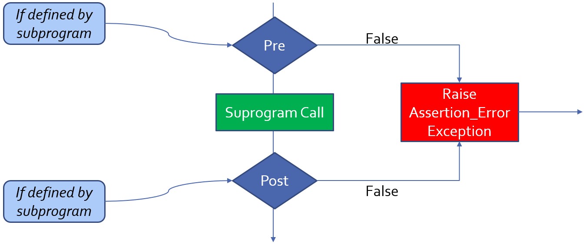
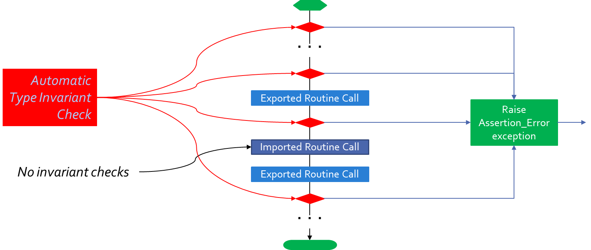

***********
Contracts
***********

==============
Introduction
==============

----------------------------
Contract-Based Programming
----------------------------

* The idea of source code acting in roles of **client** and **supplier** under a binding **contract**
* **Client** and **supplier** software

   - Suppliers provide software elements that clients utilize
   - Example: suppliers provide subprograms, clients call them

* **Contract**

   - "A specification of a software element that affects its use by potential clients." (Bertrand Meyer)

* Includes enforcement

   - At compile-time: specific constructs, features, and rules
   - At run-time: language-defined and user-defined exceptions

------------------
Contracts In Ada
------------------

* Exist implicitly in facilities you may already be using

   - Exceptions
   - Range specifications
   - Subtypes
   - Parameter modes
   - OOP interface types
   - et cetera

* Are explicitly supported

   - Low-level and high-level **assertions**
   - Predicates
   - Including OOP context

-------------
Terminology
-------------

* **Assertion:** a boolean expression expected to be True

   - Said "to hold" when True

* **Precondition:** an assertion expected to hold prior to a call to a given subprogram
* **Postcondition:** an assertion expected to hold after a given subprogram call returns normally
* **Predicate:** an assertion expected to hold for all objects of a given subtype
* **Invariant:** an assertion expected to hold for all objects of a given abstract data type when viewed from outside the defining package

--------------------------------
Low-Level Assertions via Calls
--------------------------------

* Language-defined package with procedures

   - Raise `Assertion_Error` if expression is False
   - Library Unit

.. code:: Ada

   package Ada.Assertions is
     Assertion_Error : exception;
     procedure Assert (Check : in Boolean);
     procedure Assert (Check : in Boolean;
                       Message : in String);
   end Ada.Assertions;

----------------------------------
Low-Level Assertions via Pragmas
----------------------------------

* Language-defined pragma

   - Easier to enable/disable
   - Definition

      .. code:: Ada

         pragma Assert (any_boolean_expression
                        [, [Message =>] string_expression]);
 
.. code:: Ada

   procedure Push (This  : in out Stack;
                   Value : in     Content) is
   begin
     pragma Assert (not Full (This));
     ... code that only works if the stack is not full ...
   end Push;
 
-----------------------
High-Level Assertions
-----------------------

* Pre- and postconditions specify obligations on the subprogram caller and implementer

   .. code:: Ada

      procedure Push (This : in out Stack;  Value : Content)
        with Pre  => not Full (This),       -- requirement
             Post => not Empty (This)       -- guarantee
                     and Top (This) = Value;
 
* Type invariants ensure properties of whole objects over their lifetimes

   .. code:: Ada

      type Table is private with Type_Invariant =>
        Sorted (Table); -- user-defined boolean expression
      -- external usage of Table will always be sorted
      function Sorted (This : Table) return Boolean;
 
===================================
Preconditions and Postconditions 
===================================

----------
Examples
----------

.. include:: examples/210_subprogram_contracts/preconditions_and_postconditions.rst

-----------------------------
Pre/Postcondition Contracts
-----------------------------

* Suppliers provide subprograms, clients call them
* Supplier's role:

   - Guarantee specific functional behavior
   - Specify the conditions required for guarantees to hold

* Client's role:

   - Obligated to ensure supplier's required conditions are met
   - Rely on resulting guarantees

* Obligations and guarantees are enforced

   - At run-time
   - Under user control

-----------------------------
Pre/Postcondition Semantics
-----------------------------

* Calls are inserted automatically by the compiler

|

-----------------------------
Pre/Postcondition Placement
-----------------------------

.. container:: columns

 .. container:: column

   * They're about corresponding subprogram bodies

      - What they require in order to work
      - What they guarantee

   * But used by clients so appear with declarations

      - Typically separate declarations in package specs

   * On the body when no separate declaration is given

 .. container:: column

   * Spec and body

      .. code:: Ada

         procedure Op
           with Pre => ... ;
         procedure Op is
           ...
 
   * Body only

      .. code:: Ada

         procedure Op
           with Pre => ...
         is
           ...

-----------------------------------
Expressions In Pre/Postconditions
-----------------------------------

* Add to expressive power
* Remember the entire value is a Boolean
* Can include quantified expressions
* Can include conditional expressions

   .. code:: Ada

      type List is array (1 .. 10) of Integer;
      procedure Extract_and_Clear (From : in out List;
                                   K : integer;
                                   Value : out Integer) 
        with Post => (if K in List'Range then From(K) = 0);
 
------------------------------
Universal Quantifier Example
------------------------------

.. code:: Ada

   type Status_Flag is ( Power, Locked, Running );
   
   procedure Clear_All_Status (
       Unit : in out Controller)
     -- guarantees no flags remain set after call
     with Post => (for all Flag in Status_Flag =>
       not Status_Indicated (Unit, Flag));
   
   function Status_Indicated (
       Unit : Controller;
       Flag : Status_Flag)
       return Boolean;
 
---------------
Preconditions
---------------

* Define obligations on the caller for successful use

   - Predicates specify required conditions
   - Clients must ensure they are true for body to work properly

* Boolean expressions associated with subprograms

   - Arbitrary complexity
   - Specified via aspect name `Pre`

* Checked prior to corresponding subprogram call

   - `Assertion_Error` raised if false

.. code:: Ada

   procedure Push (This : in out Stack;  Value : Content)
     with Pre => not Full (This);
 
----------------------
Precondition Content
----------------------

* Any visible name in scope

   - Variables, including globals
   - Functions, often expression functions

* Any parameter of the subprogram

   - Any mode

* Can even refer to function names not yet defined

   - As long as they are declared in the same scope
   - Different elaboration rules for sake of expression functions

.. code:: Ada

   function Top (This : Stack) return Content
     with Pre => not Empty (This);
   ...
   function Empty (This : Stack) return Boolean;
 
----------------
Postconditions
----------------

* Define obligations on the supplier

   - They specify guaranteed conditions after execution

* Are boolean expressions as for preconditions

   - Specified via aspect name `Post`

* Content as for preconditions, plus some extras
* Checked after corresponding subprogram call

   - `Assertion_Error` raised if false

.. code:: Ada

   procedure Push (This : in out Stack;  Value : Content)
     with Pre  => not Full (This),
          Post => not Empty (This) and Top (This) = Value;
   ...
   function Top (This : Stack) return Content
     with Pre => not Empty (This);
 
------------------------------------------
Preconditions and Postconditions Example
------------------------------------------

.. code:: Ada

   package Bounded_Stacks is
     type Stack (Capacity : Positive) is tagged private;
   
     procedure Push (This : in out Stack;  Value : Content)
       with Pre  => not Full (This),
            Post => not Empty (This) and Top (This) = Value;
     procedure Pop (This : in out Stack;  Value : out Content)
       with Pre  => not Empty (This),
            Post => not Full (This);
     function Top (This : Stack) return Content
       with Pre => not Empty (This);
   
     function Empty (This : Stack) return Boolean;
     function Full (This : Stack) return Boolean;
   private
      ...
   end Bounded_Stacks;
 
------------------------------------
(Sub)Types Allow Simpler Contracts
------------------------------------

* Pre-condition

   .. code:: Ada

      procedure Compute_Square_Root (Input : Integer;
                                     Result : out Natural) with
        Pre  => Input >= 0,
        Post => (Result * Result) <= Input and
                (Result + 1) * (Result + 1) > Input;
 
* Subtype

   .. code:: Ada

      procedure Compute_Square_Root (Input  : Natural;
                                     Result : out Natural) with
        -- "Pre => Input >= 0" not needed: Input can't be < 0
        Post => (Result * Result) <= Input and
                (Result + 1) * (Result + 1) > Input;
 
--------------------------------------------
Referencing Past Values In Postconditions 
--------------------------------------------

* Values as they were just before the call
* Uses language-defined attribute `'Old`

   - Can be applied to most any object visible
   - Applied to formal parameters, typically

   .. code:: Ada

      procedure Increment (This : in out Integer) with
          Pre  => This < Integer'Last,
          Post => This = This'Old + 1;
 
* Makes a copy so `limited` types not supported
* Could be expensive!

-----------------------------
Examples for Attribute 'Old
-----------------------------

.. code:: Ada
    
   -- Verify balance has been decremented
   -- (uses result of balance call before function call)
   procedure Withdraw  ( This : in out Account;
                         Amount : Currency )
     with Pre  => ...,
          Post => Balance (This) =
                  Balance (This)'Old - Amount;
   
   function Balance (This : Account) return Currency
     with Pre => Open (This);
 
   type T is record
      A : Integer;
      B : Integer
   end record;
   function F (X : T) return Integer;
   -- Verify V.A has changed and F(v) returns a different result
   procedure P (V : in out T)
     with Post => V.A /= V.A'Old and then
                  F(V) /= F(V'Old);
 
.. container:: speakernote

   F (V'Old) might not be the same as F (V)'Old, if F depended on global variables that change between (or as a consequence of) calls.
   Note that F(V)'Old means a call to F with the incoming original value of V, even though V by itself in a postcondition means the altered, outgoing V.

---------------------------------
Remember When 'Old Is Evaluated
---------------------------------

* A copy is made on entrance for use on exit by postconditions
* Thus any "safety" checks in postcondition weren't applied to the entrance copy evaluation
* Example

      .. code:: Ada

          procedure Clear_Character
              (In_String : in out String;
               Look_For  : in     Character;
               Found_At  :    out Integer) with
               Post => Found_At in In_String'Range and
               In_String (Found_At'Old) = Look_For;
               -- on entry, Found_At is not valid!
 
* Solution (required)

      .. code:: Ada

          procedure Clear_Character
              (In_String : in out String;
               Look_For  : in     Character;
               Found_At  :    out Integer) with
               Post => Found_At in In_String'Range and
               In_String'Old(Found_At) = Look_For;
 
.. container:: speakernote

   In Example, no guarantee that K is in From's range

-------------------------------------------
Using Function Results In Postconditions 
-------------------------------------------

* I.e., references to the value returned by a call to the associated function
* Uses language-defined attribute `'Result`

   .. code:: Ada

      function Euclid (A, B : Integer) return Integer with
        Pre  =>  A > 0 and B > 0,
        -- use return value as a parameter for Is_GCD
        Post =>  Is_GCD (A, B, Euclid'Result);
      function Is_GCD (A, B, Candidate : Integer)
        return Boolean is (... );
 
* Only applicable to functions, in postconditions

.. container:: speakernote

   The function Euclid computes the greatest common divisor, whereas the boolean predicate IsGCD checks that it is indeed the right value.

=================
Type Invariants
=================

----------
Examples
----------

include:: examples/210_contracts/type_invariants.rst

-----------------
Type Invariants
-----------------

* There may be conditions that must hold over the entire lifetime of objects

   - Pre/postconditions apply only to subprogram calls

* Sometimes low-level facilities can express it

   .. code:: Ada

      subtype Weekdays is Days range Mon .. Fri;

      -- Guaranteed, absent unchecked conversion
      Workday : Weekdays := Mon;
 
* Type invariants apply across entire lifetime for complex abstract data types
* Part of ADT concept, hence only for private types

------------------------------
Type Invariant Verifications
------------------------------

.. container:: columns

 .. container:: column
  
    * Automatically inserted by compiler
    * Evaluated as postcondition of operation that creates, evaluates or returns the type

       - When objects first created
       - Assignment by clients
       - Type conversions as that creates new instances

    * Not evaluated on internal state changes

       - Internal routine calls 
       - Internal assignments
       - Remember these are abstract data types

 .. container:: column
  
    .. image:: ../../images/black_box_flow.png
       :width: 50%
    
----------------------------------------
Invariant Over Object Lifetime (Calls)
----------------------------------------

.. container:: speakernote

   Note that other actions also invoke the checks!

------------------------
Example Type Invariant
------------------------

* A bank account balance must always be consistent

   - Consistent Balance:  Total Deposits  - Total Withdrawals  =  Balance

.. code:: Ada

   package Bank is
     type Account is private with
       Type_Invariant => Consistent_Balance (Account);   
     type Currency is delta 0.01 digits 12;
     ...
     -- Called automatically for all Account objects
     function Consistent_Balance (This : Account)
       return Boolean;
     ...
   private
     ...
   end Bank;
 
-------------------------------------------
Example Type Invariant Realization (Spec)
-------------------------------------------

.. code:: Ada

   package Bank is
     type Account is private with
       Type_Invariant => Consistent_Balance (Account);   
     type Currency is delta 0.01 digits 12;
     ...
     function Consistent_Balance (This : Account)
       return Boolean;
     ...
   private
     -- initial state MUST satisfy invariant
     type Account is record
       Owner : Unbounded_String;
       Current_Balance : Currency := 0.0;
       Withdrawals : Transaction_List;
       Deposits : Transaction_List;
     end record;
     function Total (This : Transaction_List)
       return Currency;
   end Bank;
 
-------------------------------------------
Example Type Invariant Realization (Body)
-------------------------------------------

.. code:: Ada

   package body Bank is
   ...
     function Total (This : Transaction_List)
         return Currency is
       Result : Currency := 0.0;
     begin
       for Value of This loop -- no iteration if list empty
         Result := Result + Value;
       end loop;
       return Result;
     end Total;
     function Consistent_Balance (This : Account)
         return Boolean is
     begin
       return Total (This.Deposits) - Total (This.Withdrawals)
              = This.Current_Balance;
     end Consistent_Balance;
   end Bank;
 
-----------------------------------
Invariants Don't Apply Internally
-----------------------------------

* Within the package there is no checking

   - Otherwise there would be no way to implement anything!

* Only matters when clients can observe state

.. code:: Ada

   procedure Open (This : in out Account;
                   Name : in String;
                   Initial_Deposit : in Currency) is
   begin
     This.Owner := To_Unbounded_String (Name);
     This.Current_Balance := Initial_Deposit;
     -- invariant would be false here!
     This.Withdrawals := Transactions.Empty_List; 
     This.Deposits := Transactions.Empty_List; 
     This.Deposits.Append (Initial_Deposit);
     -- invariant is now true
   end Open;
 
--------------------------------------------
Default Type Initialization for Invariants
--------------------------------------------

* The initial, whole value must support the invariant
* Some types may need default type initialization to satisfy the requirement

.. code:: Ada

   package P is
     type T is private with Type_Invariant => Zero (T);
     procedure Op (This : in out T);
     function Zero (This : T) return Boolean;
   private
     type T is new Integer with Default_Value => 0; 
     function Zero (This : T) return Boolean is (This = 0);
   end P;
 
.. container:: speakernote

   We want to place the invariant aspect clause in the visible part for the sake of inheritance (were this a tagged type).
   The function is required because the full view is the first place we can refer to the fact that T is an integer type.
   The type derivation is required because we cannot apply DefaultValue to predefined types (because must go on declarations).

---------------------------------
Type Invariant Clause Placement
---------------------------------

* Can move aspect clause to private part

   .. code:: Ada

      package P is
        type T is private;
        procedure Op (This : in out T);
      private
        type T is new Integer with
          Type_Invariant => T = 0,
          Default_Value => 0;
      end P;
 
* It is really an implementation aspect

.. container:: speakernote

   Alternatively, declaring the 'Zero' predicate function and making it visible to clients will allow them to re-state the invariant for subclasses.
   That's useful because new, added primitive operations do not inherit the parent's type invariant.
   In other words the invariant isn't really inherited, it just comes for free with those primitives that are inherited (and not overridden).

------------------------------
Invariants Are Not Foolproof
------------------------------

* Access to ADT representation via pointer allows back door manipulation
* These are private types, so access to internals must be granted by the private type's code
* Granting internal representation access for an ADT is a highly questionable design!

====================
Subtype Predicates
====================

----------
Examples
----------

include:: examples/210_contracts/subtype_predicates.rst

----------------------------
Subtype Predicates Concept
----------------------------

* Ada defines support for various kinds of constraints

   - Range constraints
   - Index constraints
   - Others...

* The language defines the rules for these constraints

   - All range constraints are contiguous
   - Et cetera
   - Generally this is a matter of efficiency

* **Subtype predicates** generalize possibilities

   - Define new kinds of constraints

----------------
**Predicates**
----------------

* Something asserted to be true about some subject

   - When true, said to "hold" 

* Expressed as arbitrary boolean expressions in Ada

   - Quantified and conditional expressions
   - Boolean function calls
   - Et cetera

* Two forms in Ada

   - **Static Predicates**

      + Specified via aspect named `Static_Predicate`

   - **Dynamic Predicates**

      + Specified via aspect named `Dynamic_Predicate`

---------------------------------------------
Really, ``type`` and ``subtype`` Predicates
---------------------------------------------

* Applicable to both
* Applied via aspect clauses in both cases
* Syntax

   .. code:: Ada

      type name is type_definition
         with aspect_mark [ => expression] { ,
                   aspect_mark [ => expression] }
      subtype defining_identifier is subtype_indication
         with aspect_mark [ => expression] { ,
                   aspect_mark [ => expression] }
 
.. container:: speakernote

   Expressions can be either dynamic predicate or static predicate

--------------------------
Why Two Predicate Forms?
--------------------------

 .. list-table::
   :header-rows: 1
   :stub-columns: 1
   :width: 90%
    
   * - 

     - Static
     - Dynamic

   * - Content

     - More Restricted
     - Less Restricted

   * - Placement

     - Less Restricted
     - More Restricted

* Static predicates can be used in more contexts

   - Thus restrictions on content to make that possible

* Dynamic predicates have more expressive power

   - Fewer restrictions on content
   - But cannot be used in all possible contexts

----------------------------
Subtype Predicate Examples
----------------------------

* Dynamic Predicate

   .. code:: Ada

      subtype Even is Integer with Dynamic_Predicate =>
         Even mod 2 = 0; -- Boolean expression
         -- (Even indicates "current instance")
 
* Static Predicate

   .. code:: Ada

      type Serial_Baud_Rate is range 110 .. 115200
        with Static_Predicate => Serial_Baud_Rate  in
          -- Non-contiguous range
          110  | 300  | 600 | 1200 | 2400 | 4800 |
          9600 | 14400 | 19200 | 28800 | 38400 | 56000 |
          57600 | 115200;
 
--------------------
Predicate Checking
--------------------

* Calls are inserted automatically by compiler
* Violations raise exception `Assertion_Error`

   - When the predicate does not hold (evaluates to False)

* Checks are done before value change, like language-defined constraint checks
* Associated variable is therefore unchanged when a violation is detected

----------------------------
Predicate Checks Placement
----------------------------

* Anywhere a value would be assigned that may violate the constraint of the predicated target
* Assignment statements
* Explicit initialization as part of object declaration
* On a subtype conversion
* As part of parameter passing

   - All modes when passed by copy
   - Modes `in out` and `out` when passed by reference

* Implicit default initialization for record components
* On default type initialization values, when taken

----------------------------
References Are Not Checked
----------------------------

.. code:: Ada
    
   with Ada.Text_IO;   use Ada.Text_IO;
   procedure Test is   
     subtype Even is Integer with
       Dynamic_Predicate =>
          Even mod 2 = 0;
     J, K : Even;
   begin
     -- predicates are not checked here
     Put_Line ("K is" & K'Img);
     Put_Line ("J is" & J'Img);
     -- predicate is checked here
     K := J; -- assertion failure here
     Put_Line ("K is" & K'Img);
     Put_Line ("J is" & J'Img);
   end Test;
     
* Output would look like
    
    .. code:: Ada
    
       K is 1969492223
       J is 4220029
       
       raised SYSTEM.ASSERTIONS.ASSERT_FAILURE:  
       Dynamic_Predicate failed at test.adb:9
     
------------------------------
Predicate Expression Content
------------------------------

* A reference to a value of the type itself, i.e., the "current instance"

   .. code:: Ada

      subtype Even is Integer 
        with Dynamic_Predicate => Even mod 2 = 0;
      J, K : Even := 42;
 
* Any object or function visible, including entities declared after it in the same declarative part

   - An exception to the "declared before referenced" rule of linear elaboration
   - Intended especially for (expression) functions declared in same package spec

-------------------
Static Predicates
-------------------

* *Static* means known at compile-time, informally

   - Language defines meaning formally

* Allowed in contexts in which the compiler must be able to verify properties
* Content restrictions on predicate are thus necessary

--------------------------------------
Allowed Static Predicate Content (1)
--------------------------------------

* Ordinary Ada static expressions
* Static membership test selected by current instance
* Example 1

   .. code:: Ada

      type Serial_Baud_Rate is range 110 .. 115200
        with Static_Predicate => Serial_Baud_Rate in
          -- Non-contiguous range
          110   | 300   | 600   | 1200  | 2400  | 4800  | 9600 |
          14400 | 19200 | 28800 | 38400 | 56000 | 57600 | 115200;
 
* Example 2

   .. code:: Ada

      type Days is (Sun, Mon, Tues, We, Thu, Fri, Sat);
       -- only way to create subtype of non-contiguous values
      subtype Weekend is Days
        with Static_Predicate => Weekend in Sat | Sun;
 
--------------------------------------
Allowed Static Predicate Content (2)
--------------------------------------

* Case expressions in which dependent expressions are static and selected by the current instance

   .. code:: Ada

      type Days is (Sun, Mon, Tue, Wed, Thu, Fri, Sat);
      subtype Weekend is Days with Static_Predicate =>
        (case Weekend is
         when Sat | Sun => True,
         when Mon .. Fri => False);
 
* Note: if-expressions are disallowed, and not needed

   .. code:: Ada

      subtype Drudge is Days with Static_Predicate =>
        -- not legal
        (if Drudge in Mon .. Fri then True else False);
      -- should be
      subtype Drudge is Days with Static_Predicate =>
        Drudge in Mon .. Fri;
 
--------------------------------------
Allowed Static Predicate Content (3)
--------------------------------------

* A call to `=`, `/=`, `<`, `<=`, `>`, or `>=` where one operand is the current instance (and the other is static)
* Calls to operators `and`, `or`, `xor`, `not`

   - Only for pre-defined type `Boolean`
   - Only with operands of the above

* Short-circuit controls with operands of the above

   - (As indicated on the previous slides)

* Any of the above in parentheses

--------------------------------------
Dynamic Predicate Expression Content
--------------------------------------

* Any arbitrary boolean expression

   - Hence all allowed static predicates' content

* Plus additional operators, etc.

   .. code:: Ada

      subtype Even is Integer 
        with Dynamic_Predicate => Even mod 2 = 0;
      subtype Vowel is Character with Dynamic_Predicate =>
        (case Vowel is
         when 'A' | 'E' | 'I' | 'O' | 'U' => True,
         when others => False);
 
* Plus calls to functions

   - User-defined
   - Language-defined

.. container:: speakernote

   Others has to be evaluated at run-time

-----------------------------
Types Controlling For-Loops
-----------------------------

* Those with dynamic predicates cannot be used

   - Too expensive to implement

      .. code:: Ada

         subtype Even is Integer 
           with Dynamic_Predicate => Even mod 2 = 0;
         ...
         -- not legal - how many iterations?
         for K in Even loop
           ...
         end loop;
 
* Those with static predicates are allowed to do so

   .. code:: Ada

      type Days is (Sun, Mon, Tues, We, Thu, Fri, Sat);   
      subtype Weekend is Days
        with Static_Predicate => Weekend in Sat | Sun;
      -- note: first value for K is Sun
      for K in Weekend loop
        ...
      end loop;
 
.. container:: speakernote

   Enum example - we're still going through the enums (in order), just using the ones that match the predicate

-----------------------------------------
Why Allow Types with Static Predicates?
-----------------------------------------

* Efficient code can be generated for usage
    
   .. code:: Ada
    
      type Days is (Sun, Mon, Tues, We, Thu, Fri, Sat);   
      subtype Weekend is Days with Static_Predicate => Weekend in Sat | Sun;
      ...
      for W in Weekend loop
        GNAT.IO.Put_Line (W'Img);
      end loop;
     
* `for` loop generates code like
    
   .. code:: Ada
    
      declare
        w : weekend := sun;
      begin
        loop
          gnat__io__put_line__2 (w'Img);
          case w is
            when sun =>
              w := sat;
            when sat =>
              exit;
            when others =>
              w := weekend'succ(w);
          end case;
        end loop;
      end;
     
---------------------------------------
In Some Cases Neither Kind Is Allowed
---------------------------------------

* Types with neither kind of predicate can be used in cases where a contiguous layout is required

   - Efficient access and representation would be impossible when discontiguous ranges are specified

* Hence no array index or slice specification usage

.. code:: Ada

   type Play is array (Weekend) of Integer; -- illegal
   type List is array (Days range <>) of Integer;
   L : List (Weekend); -- not legal
 
-----------------------------------------
Special Attributes for Predicated Types
-----------------------------------------

* Attributes `'First_Valid` and `'Last_Valid`

   - Can be used for any static subtype 

   - Especially useful with static predicates
   - `'First_Valid` returns smallest valid value, taking any range or predicate into account
   - `'Last_Valid` returns largest valid value, taking any range or predicate into account

* Attributes `'Range`, `'First` and `'Last` are not allowed 

   - They reflect non-predicate constraints so don't make sense
   - `'Range` is just a shorthand for `'First` .. `'Last`

* `'Succ` and `'Pred` are allowed since work on underlying type

-----------------------------------
Initial Values Can Be Problematic
-----------------------------------

* Users might not initialize when declaring objects

   - Most predefined types do not define automatic initialization
   - No language guarantee of any specific value (random bits)
   - Example

      .. code:: Ada

         subtype Even is Integer 
           with Dynamic_Predicate => Even mod 2 = 0;
         K : Even;  -- unknown (invalid?) initial value
 
* The predicate is not checked on a declaration when no initial value is given
* So can reference such junk values before assigned

   - This is not illegal (but is a bounded error)

----------------------------------------
Subtype Predicates Aren't Bullet-Proof
----------------------------------------

* For composite types, predicate checks apply to whole object values, not individual components

.. code:: Ada

   procedure Demo is
     type Table is array (1 .. 5) of Integer
       -- array should always be sorted
       with Dynamic_Predicate =>
         (for all K in Table'Range =>
           (K = Table'First or else Table(K-1) <= Table(K)));
     Values : Table := (1, 3, 5, 7, 9);
   begin
     ...   
     Values (3) := 0; -- does not generate an exception!
     ...
     Values := (1, 3, 0, 7, 9); -- does generate an exception
     ...
   end Demo;
 
.. container:: speakernote

   Array should always be sorted.
   However, when modifying a slice of the array, the sort check is not performed!

------------------------------------------
Beware Accidental Recursion In Predicate
------------------------------------------

* Necessarily involves functions because predicates are expressions
* Caused by checks on function arguments
* Infinitely recursive example

   .. code:: Ada

      type Table is array (1 .. N) of Integer
        with Dynamic_Predicate => Sorted (Table);
      -- on call, predicate is checked!
      function Sorted (T : Table) return Boolean is
        (for all K in T'Range =>
          (K = T'First or else T(K-1) <= T(K)));
 
* Non-recursive example

   .. code:: Ada

      type Table is array (1 .. N) of Integer
        with Dynamic_Predicate => 
          (for all K in Table'Range =>
            (K = Table'First or else Table(K-1) <= Table(K)));
 
----------------------------------------
"Safe" Functions In Subtype Predicates
----------------------------------------

* That is, those that will not recurse...
* Are those that don't have a formal parameter of the type to be checked

.. code:: Ada

   type Foo is record
     A : Integer;
     B : Float;
   end record
   with Dynamic_Predicate => Bar (Foo.A) and Baz (Foo.B);
   -- These functions do not take "Foo" as a parameter   
   function Bar (This : Integer) return Boolean is (...);
   function Baz (This : Float) return Boolean is (...);
 
---------------------------------------
GNAT-Specific Aspect Name *Predicate*
---------------------------------------

* Conflates the two language-defined names
* Takes on kind with widest applicability possible

   - Static if possible, based on predicate expression content
   - Dynamic if cannot be static

* Remember that static predicates are allowed anywhere that dynamic predicates are allowed

   - But not the inverse

* The slight disadvantage is that you don't find out if your static predicate is not actually static

   - Until you use it where only static predicates are allowed

------------------------------------------
Enabling/Disabling Contract Verification
------------------------------------------

* Corresponds to controlling specific run-time checks

   - Syntax

      .. code:: Ada

         pragma Assertion_Policy (policy_name);
         pragma Assertion_Policy (
            assertion_name => policy_name
            {, assertion_name => policy_name} );
 
* Vendors may define additional policies (GNAT does)
* Default, absent the pragma, is implementation-defined
* Vendors almost certainly offer a compiler switch

   - GNAT uses same switch as for pragma Assert: ``-gnata``

.. container:: speakernote

   The simple form of Assertion Policy just applies the specified policy to all forms of assertion.
   Note that the Assert procedures in Ada.Assertions are not controlled by the pragma.  They are procedures like any other.
   A switch is likely offered because otherwise one must edit the source code to change settings, like the situation with pragma Inline.
   Pragma Suppress can also be applied.

=============
In Practice
=============

----------------------------------------
Pre/Postconditions: To Be or Not To Be
----------------------------------------

* Preconditions are generally not too expensive

   - Likely a reasonable default for checking

* Postconditions can be comparatively expensive

   - Use of `'Old` and `'Result` involve copying (maybe deep)

* Enabling preconditions alone makes sense when calling trusted library routines

   - That way, you catch your (i.e., client) errors

* Do you enable them all the time?  It depends...

   - How tight is the overall timing in your application?
   - Is response-time available to respond to violations?
   - What are the consequences of not catching violations?
   - How expensive are run-time checks in this implementation?

-------------------------------------
No Secret Precondition Requirements
-------------------------------------

* Should only require what the client can ensure

   - By only referencing entities also available to clients

* Language rules enforce this precept

.. code:: Ada

   package P is
     type Bar is private;
     ...
     function Foo (This : Bar) return Baz
       with Pre => Hidden; -- illegal reference
   private
     function Hidden return Boolean;
     ...
   end P;
 
---------------------------------------
Postconditions Are Good Documentation
---------------------------------------

.. code:: Ada

   procedure Reset
       (Unit : in out DMA_Controller;
        Stream : DMA_Stream_Selector)
     with Post =>
       not Enabled (Unit, Stream) and
       Operating_Mode (Unit, Stream) = Normal_Mode and
       Current_Counter (Unit, Stream) = 0 and
       Selected_Channel (Unit, Stream) = Channel_0 and
       not Double_Buffered (Unit, Stream) and
       not Circular_Mode (Unit, Stream) and
       Memory_Data_Width (Unit, Stream) = Bytes and
       Peripheral_Data_Width (Unit, Stream) = Bytes and
       Priority (Unit, Stream) = Priority_Low and
       (for all Interrupt in DMA_Interrupt =>
           not Interrupt_Enabled (Unit, Stream, Interrupt));
 
---------------------------
Postcondition Limitations
---------------------------

* Sometimes they cannot specify all relevant properties without repeating body's computations

   - Unlike preconditions

.. code:: Ada

   function Euclid (A, B : Integer) return Integer with
     Pre  =>  A > 0 and B > 0,
     Post =>  Is_GCD (A, B, Euclid'Result);
   function Is_GCD (A, B, Candidate : Integer)
       return Boolean is 
     (A rem Candidate = 0 and
      B rem Candidate = 0 and
      (for all K in 1 .. Integer'Min (A,B) =>
         (if (A rem K = 0 and B rem K = 0)
          then K <= Candidate)));
 
-------------------------------------
Use Functions In Pre/Postconditions
-------------------------------------

* Abstraction increases chances of getting it right

   - Provides higher-level interface to clients too

   .. code:: Ada

      procedure Withdraw (This   : in out Account;
                          Amount :        Currency) with
        Pre  => Open (This) and Funds_Available (This, Amount),
        Post => Balance (This) = Balance (This)'Old - Amount;
      ...
      function Funds_Available (This   : Account;
                                Amount : Currency)
                                return Boolean is
          (Amount > 0.0 and then Balance (This) >= Amount)
        with Pre => Open (This);
 
* May be unavoidable

   - Cannot reference hidden components of private types in the package visible part

-----------------------------------------
Example Private Part Reference Approach
-----------------------------------------

.. code:: Ada

   package P is
     type T is private;
     procedure Q (This : T) with
       Pre => This.Total > 0; -- not legal
     ...
     function Current_Total (This : T) return Integer;
     ...
     procedure R (This : T) with
       Pre => Current_Total (This) > 0; -- legal
     ...
   private
     type T is record
       Total : Natural ;
       ...
     end record;
     function Current_Total (This : T) return Integer is
         (This.Total);
   end P;
 
--------------------------
Using Pre/Postconditions
--------------------------

* Assertions are not logic control structures

   - Use if-then-else etc. in the routine to handle special cases

* Assertions are not for external input validation

   - Contracts are internal: between parts of the source code
   - A precondition cannot prevent invalid user data entry

* Precondition violations indicate client bugs

   - Maybe the requirements spec is wrong, but too late to argue at this point...

* Postcondition violations indicate supplier bugs

-----------------------------------
Preconditions Or Explicit Checks?
-----------------------------------

* Logically part of the spec so should be textually too

   - Otherwise clients must examine the body, breaking abstraction

* Do this
    
   .. code:: Ada
    
      type Stack (Capacity : Positive) is tagged private;
      procedure Push (This : in out Stack;
                      Value : Content) with
        Pre  => not Full (This),
        Post => ...
      ...
      function Full (This : Stack) return Boolean;
 
* Or do this
    
   .. code:: Ada
    
      procedure Push (This : in out Stack;
                      Value : Content) is
      begin
        if Full (This) then
          raise Overflow;
        end if;
        ...
      end Push;
     
* But not both

   - A subprogram body should never test its own preconditions

---------------------------------
Advantages Over Explicit Checks
---------------------------------

* Pre/postconditions can be turned off

   - Like language-defined checks

* Explicit checks cannot be disabled except by changing the source text

   - Conditional compilation via preprocessor (``ifdef``)
   - Conditional compilation via static Boolean constants

      .. code:: Ada

         procedure Push (This : in out Stack;  Value : Content) is
         begin
           if Debugging then
             if Full (This) then
               raise Overflow;
             end if;
           end if;
           ...
         end Push;
 
----------------------------------
Controlling the Exception Raised
----------------------------------

* Failing pre/postconditions raise `Assertion_Error`
* Our abstractions may define dedicated exceptions

   - Assertion Error

      .. code:: Ada

         type Stack (Capacity : Positive) is tagged private;
         procedure Push (This : in out Stack;  Value : Content) with
           Pre  => not Full (This),
           Post => ...
         function Full (This : Stack) return Boolean;
 
   - Overflow 

      .. code:: Ada

         procedure Push (This : in out Stack;  Value : Content) is
         begin
           if Full (This) then
             raise Overflow;
           end if;
           ...
         end Push;
 
* How to get them raised in preconditions?

   - Not needed for postconditions (failures are supplier bugs)

--------------------------------------
"Raise Expressions" In Preconditions
--------------------------------------

.. code:: Ada

   package Bounded_Stacks is
     type Stack (Capacity : Positive) is tagged private;
     Overflow, Underflow : exception;
     procedure Push (This  : in out Stack;
                     Value : in     Content) with
       Pre  => not Full (This) or else raise Overflow,
       Post => not Empty (This) and Top (This) = Value;
     procedure Pop (This  : in out Stack;
                    Value :    out Content) with
       Pre  => not Empty (This) or else raise Underflow,
       Post => not Full (This);
     function Empty (This : Stack) return Boolean;
     function Full (This : Stack) return Boolean;
   ...
   private
   ...
   end Bounded_Stacks;
 
------------------------------
Working with Type Invariants
------------------------------

* They are not fully foolproof

   - External corruption is possible 

   - Requires dubious usage

* Violations are intended to be supplier bugs

   - But not necessarily so, since not always bullet-proof

* However, reasonable designs will be foolproof

-------------------------------
Type Invariants vs Predicates
-------------------------------

* Type Invariants are valid at external boundary

   - Useful for complex types, to the type may not be consistent during an operation

* Predicates are like other constraint checks

   - Checked on declaration, assignment, calls, etc

.. container:: speakernote

   Type invariant - "account" example - we wouldn't be able to maintain the invariant when we update portions of the ADT

========
Lab
========

.. include:: labs/210_subprogram_contracts.lab.rst

=========
Summary
=========

-------------------------------------
Contract-Based Programming Benefits
-------------------------------------

* Facilitates building software with reliability built-in

   - Software cannot work well unless "well" is carefully defined
   - Clarifies the design by defining obligations/benefits

* Enhances readability and understandability

   - Specification contains explicitly expressed properties of code

* Improves testability but also likelihood of passing!
* Aids in debugging
* Facilitates tool-based analysis

   - Compiler checks conformance to obligations

   - Static analyzers (e.g., SPARK, CodePeer) can verify explicit precondition and postconditions 

---------
Summary
---------

* Based on viewing source code as clients and suppliers with enforced obligations and guarantees
* No run-time penalties unless enforced
* OOP introduces the tricky issues

   - Inheritance of preconditions and postconditions, for example

* Note that pre/postconditions can be used on concurrency constructs too

 .. list-table::
   :header-rows: 1
   :stub-columns: 1
   :width: 90%
    
  * - 

    - Clients
    - Suppliers

  * - Preconditions

    - Obligation
    - Guarantee

  * - Postconditions

    - Guarantee
    - Obligation
    
