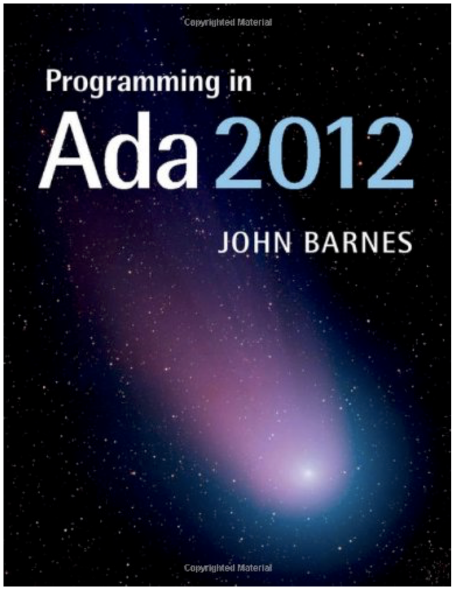
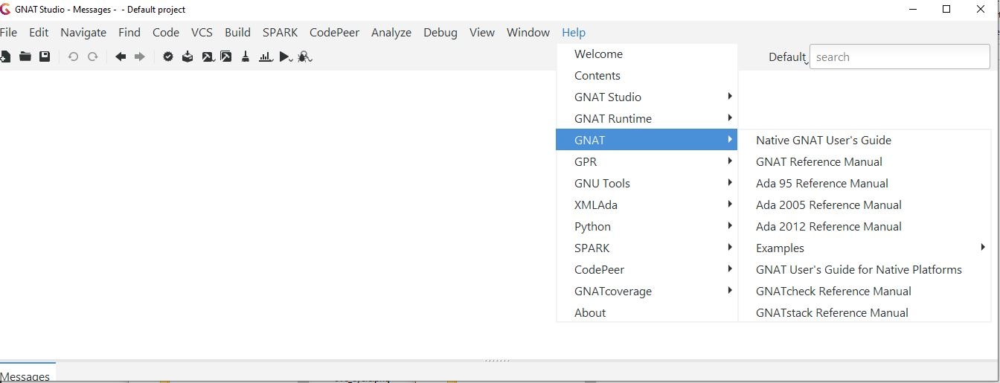

*********************
Reference Materials
*********************

==========================
General Ada Information
==========================

---------------------------
Learning the Ada Language
---------------------------

* Written as a tutorial for those new to Ada

------------------
Reference Manual
------------------

* **LRM** - Language Reference Manual (or just **RM**)

   - Always on-line (including all previous versions) at `www.adaic.org`

* Finding stuff in the RM

   - You will often see the RM cited like this **RM 4.5.3(10)**
   - This means *Section 4.5.3, paragraph 10*
   - Have a look at the table of contents

       * Knowing that chapter 5 is *Statements* is useful.

   - Index is very long, but very good!

----------------------
Current Ada Standard
----------------------

* "ISO/IEC 8652(E) with Technical Corrigendum 1"
* Useful as a Reference Text but not intended to be read from beginning to end

=====================
GNAT-Specific Help
=====================

------------------
Reference Manual
------------------

* Reference Manual(s) available from GNAT Studio Help

-------------
GNAT Tools
-------------

* GNAT User's Guide

   - LOTS of info about the main tools: the GNAT compiler, binder, linker etc.

* GNAT Reference Manual

   - How GNAT implements Ada, pragmas, aspects, attributes etc. etc.

* GNAT Studio (the IDE)

   - Tutorial
   - User's Guide
   - Release notes

* Many other tools

==================
AdaCore Support
==================

----------------
Need More Help?
----------------

* If you have an AdaCore subscription:

   - Find out your customer number #XXXX

* Open a "TN" via the GNAT Tracker web interface and/or email.

   - Send to: `support@gnat.com`
   - Subject should read: #XXXX - (descriptive text)

      * Where XXXX is your customer number

* Not just for "bug reports" 

   - Ask questions, make suggestions etc. etc.
