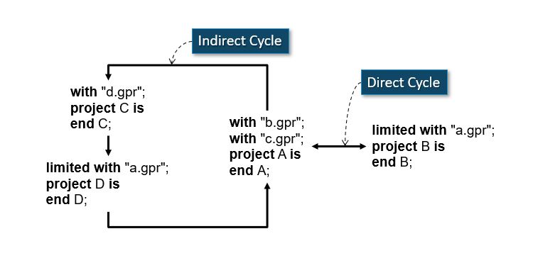
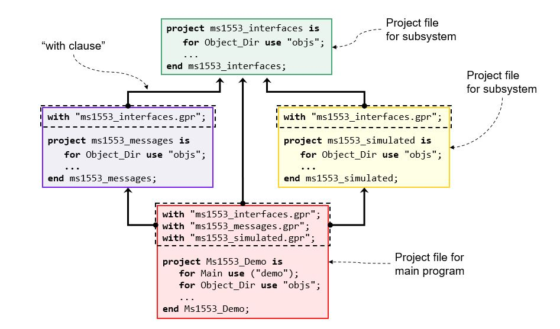

******************************
Structuring Your Application
******************************

.. role:: ada(code)
   :language: ada

=========================
Building an Application
=========================

--------------------
Importing Projects
--------------------

+ Compilation units in source files of one project may depend on compilation units in source files of other projects

  + *Depend* in the Ada sense (contains :ada:`with` clauses)

+ We want to localize properties of other projects

  + Switches etc.
  + Defined in one place and not repeated elsewhere

+ Thus dependent projects *import* other projects to place other projects' source files on search path

-------------------------
Project Import Notation
-------------------------

+ Similar to Ada's :ada:`with` clauses

  + But uses strings

  *with <literal string> {, <literal  string>};*

+ String literals are path names of project files

  + Relative
  + Absolute

  .. code:: Ada

     with "/gui/gui.gpr", "/math/math.gpr";
     project MyApp is
       ...
     end MyApp;

----------------------------
Importing Projects Example
----------------------------

.. code:: Ada

   with GUI, Math;
   package body Pack is 
      ...

* Source Architecture

 .. list-table::
   :header-rows: 1
    
   * - :filename:`/gui`

     - 
     - :filename:`/myapp`
     - 
     - :filename:`/math`

   * - :filename:`gui.gpr`

     - :math:`\rightarrow`
     - :filename:`myapp.gpr`
     - :math:`\leftarrow`
     - :filename:`math.gpr`

   * - :filename:`gui.ads`

     - 
     - :filename:`pack.ads`
     - 
     - :filename:`math.ads`

   * - :filename:`gui.adb`

     - 
     - :filename:`pack.adb`
     - 
     - :filename:`math.adb`

   * -

     - 
     - :filename:`main.adb`
     - 
     -

* Project File

   .. code:: Ada

      with "/gui/gui.gpr", "/math/math.gpr";
      project MyApp is
        ...
      end MyApp;

--------------------------
Cycles In Import Clauses
--------------------------

+ Allowed only by :ada:`limited with` clauses
+ Intent is to include project in the overall build

  + Cannot reference an imported project via :ada:`limited with`

------------------------------
Referencing Imported Content
------------------------------

+ Use the Ada "dot notation" for declarations

  + Start with the project name

+ Use the tick (') for attributes

.. code:: Ada

   with "foo.gpr";
   project P is

      package Compiler is
         for Default_Switches ("Ada") use 
            Foo.Compiler'Default_Switches --
            & "-gnatwa";
      end Compiler;

   end P;

----------
Renaming
----------

+ Packages can rename (imported) packages
+ Effect is as if the package is declared locally

  + Much like the Ada language

.. code:: Ada

   with "../naming_schemes/rational.gpr";
   project Clients is
      package Naming renames Rational.Naming;
      for Languages use ("Ada");
      for Object_Dir use ".";
      package Builder is ...
      package Compiler is ...
      ...
   end Clients;

------------
Subsystems
------------

+ Sets of sources and folders managed together
+ Represented by project files

  + Connected by project *with clauses* or project extensions
  + Generally one "primary" project file
  + Potentially many project files, assuming subsystems composed of other subsystems

+ Have at most one "objects" folder per subsystem

  + A defining characteristic
  + Optional

--------------------
Subsystems Example
--------------------

---------------------
Building Subsystems
---------------------

+ One project file given to the builder
+ Everything necessary will be built, transitively

=====
Lab
=====

.. include:: labs/060_structuring_your_application.lab.rst
