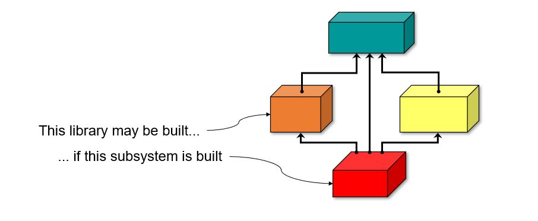

********************
Building Libraries
********************

===========
Libraries
===========

-----------
Libraries
-----------

+ Are subsystems packaged in a specific way
+ Represented by project files with specific attributes
+ Referenced by other project files, as usual

  + Contents become available automatically, etc.

+ Library Project

   .. code:: Ada

      library project Static_Lib is
         ...
      end Static_Lib;

+ Standard Project referencing library

   .. code:: Ada

      with "static_lib.gpr";
      project Main is
         ...
      end Main;

---------------------------
Creating Library Projects
---------------------------

+ Several global attributes are involved/possible
+ Required attributes

   Library_Name
      Name of the library

   Library_Dir
      Where is it installed

+ Optional attributes

   Library_Kind
      Static or shared?

   Library_Version
      What version of shared image?

   Library_Interface
      Restrict interface to subset of units

   Library_Auto_Init
      Should autoinit at load (if supported)

   Library_Options
      Extra arguments to pass to linker

   Library_GCC
      Use custom linker

-------------------------
Supported Library Types
-------------------------

+ Static Libraries

  + Code is statically linked into client applications
  + Becomes a permanent part of client during build
  + Each client gets a separate, independent copy

+ Dynamic Libraries

  + Code is dynamically linked at run-time
  + Not a permanent part of application
  + Code is shared among all clients

+ Stand-Alone Libraries (SAL)

  + Minimize client recompilations when library internals change
  + Contain all necessary elaboration code for Ada units within
  + Can be static or shared

+ See the *GNAT Pro Users Guide* for details

=======================
Example Library Files
=======================

------------------------------
Library Project File Example
------------------------------

+ Note that not all attributes are illustrated here...

.. code:: Ada

   library project Static_Lib is
      for Languages    use ("Ada", "C");
      for Source_Dirs  use ("lib_src");
      for Object_Dir   use "obj";
      for Library_Dir  use "lib";    -- Installation location
      for Library_Kind use "static"; -- Type
      for Library_Name use "l1";     -- Name
   end Static_Lib;

--------------------
Building Libraries
--------------------

+ Built directly when project file is specified to builder, as usual
+ Built automatically as a dependency, as usual

--------------------------------
Static Library Project Example
--------------------------------

.. code:: Ada

   library project Name is
      for Source_Dirs use ("src1", "src2");
      for Library_Dir use "lib";
      for Library_Name use "name";
      for Library_Kind use "static";
   end Name;

+ Creates library :filename:`libname.a` on Windows

------------------------------------
Standalone Library Project Example
------------------------------------

.. code:: Ada

   library project Name is
      Version := "1";
      for Library_Interface use ("int1", "int1.child");
      for Library_Dir use "lib";
      for Library_Name use "name";
      for Library_Kind use "relocatable";
      for Library_Version use "libdummy.so." & Version;
   end Name;

+ Creates library :filename:`libname.so.1` with a symlink :filename:`libname.so` that points to it

=====
Lab
=====

.. include:: labs/080_building_libraries.lab.rst
