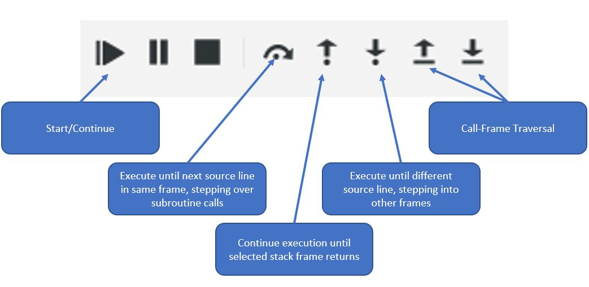

.. role:: ada(code)
   :language: ada

*************************************
:toolname:`GNAT Studio` Quick Start
*************************************

=================
Getting Started
=================

----------------------
1. Start GNAT Studio
----------------------

Start from the command line using :command:`gnatstudio` or from the application menu via :toolname:`GNAT Studio`

   *Note: If you use the command line, and there is only one GPR file in the directory where you start GNAT Studio, then the tool will open that project automatically (so you can skip to Step 3)*

-----------------------------
2. Open an Existing Project
-----------------------------

.. columns::

   .. column::

      a. From the *Welcome* dialog, select :menu:`Open Project`

         .. image:: ../../images/gnat_studio/quickstart/getting_started-welcome_dialog.jpg

   .. column::

      b. Select the project directory
      c. Open the project :filename:`radar.gpr` file

         .. image:: ../../images/gnat_studio/quickstart/getting_started-open_project.jpg

-----------------------
3. Open a Source File
-----------------------

In the *Project* pane on the left, double-click :filename:`main.adb` file under the :filename:`src/` directory

   .. image:: ../../images/gnat_studio/quickstart/getting_started-main.jpg

-------------------------
4. Build the Executable
-------------------------

.. columns::

   .. column::

      a. Locate and click on the :menu:`Compile & Run` button

         .. image:: ../../images/gnat_studio/run_main_icon.jpg

   .. column::

      b. Notice the compilation messages and run execution status at the bottom of screen.

         *(It should succeed)*

         .. image:: ../../images/gnat_studio/quickstart/getting_started-success.jpg

-------------------------
5. Remove Build Results
-------------------------

 You can clean the project files by click the :menu:`Clean` button

   .. image:: ../../images/gnat_studio/clean_icon.jpg

=================
Code Navigation
=================

---------------------------------------
Finding Declaration or Implementation
---------------------------------------

1. In :filename:`main.adb` right-click on :ada:`Time_Step`

   .. image:: ../../images/gnat_studio/quickstart/navigation-declaration.jpg

2. To examine the code for :ada:`Time_Step` you can:

   * Click :menu:`Go To Declaration` to look at the specification
   * Click :menu:`Go To Body or Full Declaration` to look at the implementation

--------------------
Finding References
--------------------

.. columns::

   .. column::

      1. In :filename:`main.adb` right-click on :ada:`Time_Step`

         .. image:: ../../images/gnat_studio/quickstart/navigation-references.jpg

   .. column::

      2. Select :menu:`Find All References` to see a listing of all uses for the object

         .. image:: ../../images/gnat_studio/quickstart/navigation-reference_result.jpg

===========
Debugging
===========

-----------------------
1. Start the Debugger
-----------------------

.. columns::

   .. column::

      Click on the Build and Debug icon

         .. image:: ../../images/gnat_studio/debug_icon.jpg

   .. column::

         :toolname:`GNAT Studio` will go into debugging perspective, which you can see because a few more views have popped up.

         .. image:: ../../images/gnat_studio/debug_active_perspective.jpg

Eight new buttons are added to the toolbar, allowing for precise debugging actions.

---------------------
2. Set a Breakpoint
---------------------

a. Open source file :file:`main.adb` and select an executable line
b. Right-click and select :menu:`Debug` :math:`\rightarrow` :menu:`Continue until line <>`

   * Temporary breakpoint will be set, but *Debugger Console* states "The program is not being run"

c. In toolbar, click :menu:`Debug Continue` icon

   * **Run/Start** dialog will appear - make sure *Stop at beginning of main subprogram* is selected, then press :menu:`OK`
   * Execution halts at first line of executable code

d. Click :menu:`Debug Continue` button again

   * Execution halts at line you previously selected

e. Practice clicking the remaining navigation buttons

-------------------
3. Examining Data
-------------------

.. columns::

   .. column::

      a. While execution is stopped, hover over any variable to see it's value and other information

         .. image:: ../../images/gnat_studio/quickstart/debug-data_hover.jpg

   .. column::

      b. To monitor a data object during execution, you can add it to the **Variables** window

         * Right-click the object and select :menu:`Debug` :math:`\rightarrow` :menu:`Display <> in Variables view`

         .. image:: ../../images/gnat_studio/quickstart/debug-data_view.jpg
