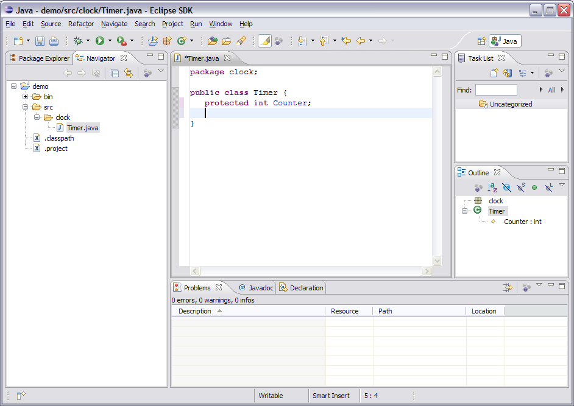
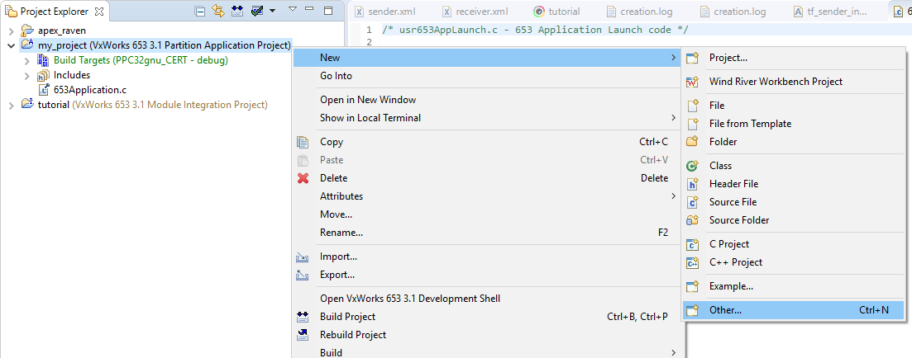
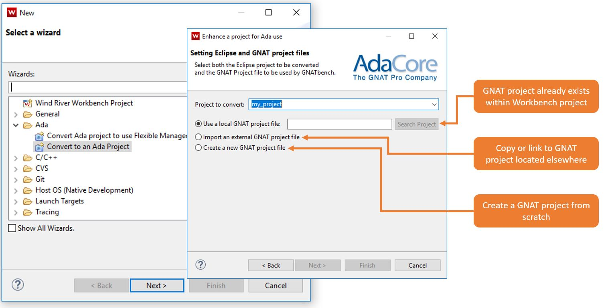
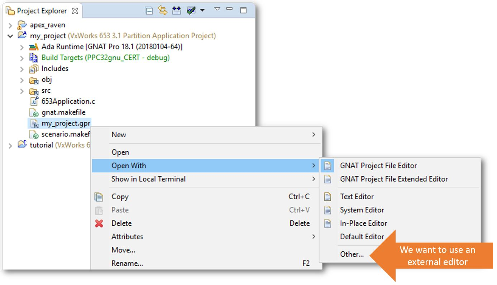
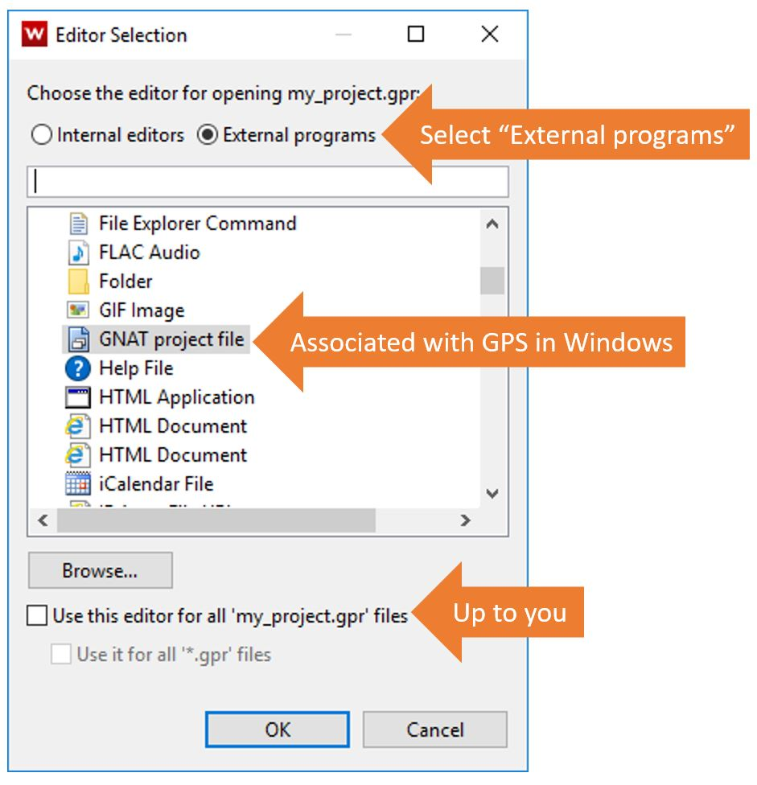

*******************************
GNATbench for VxWorks 653 3.x
*******************************

==============
Introduction
==============

---------------------
Eclipse At A Glance
---------------------

+ It's a development platform
+ Based on JVM
+ Extensible Architecture
+ Extensions via "plug-ins"
+ *Primarily, a development platform for IDEs*

-------------
"Workbench"
-------------

+ The UI personality of the Eclipse Platform
+ What you see when you run :toolname:`Eclipse`

* *Note: This is Workbench in Eclipse.  Wind River Workbench is Wind River's branded distribution of Eclipse + more stuff.*

-----------
GNATbench
-----------

+ A plug-in for :toolname:`Eclipse` providing Ada support

  + Really a collection of plug-ins

+ Comes in two versions

  + For standard Eclipse
  + For Wind River Systems (WRS) :toolname:`Workbench` (WRWB)

+ Much is common between versions

  + Same functionality and user interface

+ Parts are indeed different between versions

  + Builder
  + Debugger
  + Help files

------------------------------
Wind River Systems Workbench
------------------------------

+ A full version of :toolname:`Eclipse`

  + Will change in the future

+ A set of plug-ins for cross development
+ Dedicated builder
+ Dedicated cross debugger
+ Dedicated help files

==============================
Projects: Workbench and GNAT
==============================

----------------
An Ada Project
----------------

* Recap: An Ada project consists of a GPR file and all the stuff it references.

* Project :filename:`my_project.gpr`

   .. image:: ../../images/gnatbench/my_project.jpg

----------------------------------
GNAT Projects and GNAT Pro Tools
----------------------------------

* GNAT project mechanism is what many of AdaCore's tools use to orient themselves.  It's used not only for GPRbuild, but for all of the tools listed here and more.

   + :toolname:`GNAT Studio` and :toolname:`GNATbench`
   + :toolname:`SPARK`
   + :toolname:`GNATcoverage`
   + :toolname:`GNATstack`
   + :toolname:`GPRbuild`
   + :toolname:`GNATtest`
   + :toolname:`CodePeer`
   + :toolname:`QGen`
   + Add-Ons 

      + :toolname:`PolyOrb`
      + :toolname:`Ada Web Server`
      + :toolname:`GtkAda`

---------------------
A Workbench Project
---------------------

* An Eclipse or Wind River Workbench project is how the environment organizes "resources" so that it may perform builds, sharing, and version management.

   * Plug-ins to the Workbench can use their own specialized projects, folders, and files.

+ **My_Project**

   + Builds
   + Sharing
   + Resource Organization
   + Version Management

---------------------
Project Integration
---------------------

+ :toolname:`GNATbench` is a set of plug-ins for the use of Ada and GNAT within :toolname:`Eclipse` and :toolname:`Wind River Workbench`
+ A :toolname:`Workbench` project can be "flavored" by :toolname:`GNATbench` so that Ada can be easily used within it

  + Additional "glue" files deposited in the :toolname:`Workbench` project provide integration with GNAT tools
  + Your GNAT project can live within the :toolname:`Workbench` project, or it can reside elsewhere in your filesystem

------------------------------
Same Name, Different Domains
------------------------------

.. columns::

   .. column::

      Wind River Workbench project

         .. image:: ../../images/gnatbench/project_explorer.png

  .. column::

      GNAT project :filename:`my_project.gpr`

         .. image:: ../../images/gnatbench/my_project.jpg

----------------------------
Invoking the Ada Converter
----------------------------

--------------------
Conversion Process
--------------------

+ GNAT project already exists within Workbench project
+ Copy or link to GNAT project located elsewhere
+ Create a GNAT project from scratch

---------------------------
Relationship Established!
---------------------------

.. columns::

  .. column::

     Wind River Workbench project

     .. image:: ../../images/gnatbench/project_explorer-converted.jpg

  .. column::

     + GNAT project :filename:`my_project.gpr`

        .. image:: ../../images/gnatbench/my_project.jpg

=====
Lab
=====

---------------------------------------------------
Old Tutorial: VxWorks 653 3.x Integration Project
---------------------------------------------------

+ Assemble apex_raven project

   + Purely for convenience

+ Create and configure Module Integration Project (MIP)

   + Sender & Receiver Partition Operating System (POS) projects are created during this step

+ Configure Partition Operating System (POS) projects

   + Import sources (including GPR files)
   + Convert to Ada project (that is, configure for GNATbench support)

+ Build the Module Integration Project (MIP)

   + All subprojects will also be built

---------------------------------------------------
New Tutorial: VxWorks 653 3.x Integration Project
---------------------------------------------------

+ Assemble apex_raven project

   + Purely for convenience

+ Create and configure Module Integration Project (MIP)

   + Use Wind River provided debug agent example
   + Discard demo partitions, keep the debug agent partition

+ Create Partition Operating System (POS) projects

   + Import sources (including GPR files)
   + Convert to Ada project (that is, configure for GNATbench support)
   + Integrate into MIP

+ Build the Module Integration Project (MIP)

   + All subprojects will also be built

-------
Setup
-------

+ Bring up :toolname:`GNATbench` tutorial for creating a VxWorks 653 3.x Module Integration Project
+ Set up **apex_raven** project according to the *Preliminary Project Setup* section
+ Remove or rename :filename:`hardware.xml` file, if it exists
+ Stop following the tutorial before you get to *Creating and configuring the Module Integration Project*

-----------------------------------------
Create WR's Integration Project Example
-----------------------------------------

+ :menu:`File` :math:`\rightarrow` :menu:`New` :math:`\rightarrow` :menu:`Example...`
+ Choose :menu:`xWorks 653 Sample System`
+ Choose :menu:`A Debug Agent APEX Q Demonstration System`

  + Call it whatever you want ("demo" if you are unimaginative)
  + Choose the correct BSP
  + Leave the rest blank

------------------------------------------------
Start Modifying the Module Integration Project
------------------------------------------------

+ Delete all sub-partitions except *_pos_da (the debug agent POS)
+ Double-click on MIP's Module Configuration
+ Delete all cores except core 0 (contains ``debugSched``)
+ Delete ``hellow``, ``sender``, ``receiver`` partitions

------------------------------------------
Create Ada-Based Sender & Receiver POS's
------------------------------------------

+ Using :menu:`File` :math:`\rightarrow` :menu:`New` :math:`\rightarrow` :menu:`Wind River Workbench Project...`

  + Create a new All-in-One Cert POS called ``receiver``
  + Create a new All-in-One Cert POS called ``sender``

+ Copy/Paste contents of ``apex_raven/receiver`` and ``apex_raven/sender`` to ``receiver`` and ``sender`` projects, respectively

  + Overwrite the :filename:`usrAppInit.c` file

+ Right-click on ``receiver`` project, :menu:`New` :math:`\rightarrow` :menu:`Other...`

  + Convert to an Ada project

+ Do the same for ``sender`` project

------------------------------
Integrate New POS's into MIP
------------------------------

+ Move ``sender`` and ``receiver`` POS's into your MIP
+ In MIP configuration's Module tab

  + Add sender partition, with sender payload
  + Add receiver partition, with receiver payload
  + Adjust ModuleOS core 0 debugSched schedule:

    + Set duration for both sender & receiver to 250000000

-------------------------------------
Configuration in MIP Partitions Tab
-------------------------------------

.. columns::

   .. column::

      + For sender:

        + Add uart1poll device (well, depends on your hardware)
        + Add Queuing Port

          + Name: queuing_sender
          + Direction: SOURCE
          + When full: BLOCK
          + Max num. of messages: 25
          + Max size of messages: 4

   .. column::

      + For receiver:

        + Add uart0poll device (again, depends on your hardware)
        + Add Queuing Port

          + Name: queuing_dest
          + Direction: DESTINATION
          + Max num. of messages: 25
          + Max size of messages: 4

---------------------------------
Configure Communication Channel
---------------------------------

+ Back to MIP Configuration Module Tab: Add a Channel

  + Region: RAM
  + Transport: PARTITION
  + Source: sender/queuing_sender
  + Destination: receiver/queuing_dest

------------------
The Home Stretch
------------------

+ Go back to Tutorial documentation
+ Set scenario variables according to tutorial docs, a couple of pages up from the end of the tutorial
+ Build Project

  + Right-click on :menu:`MIP` :math:`\rightarrow` :menu:`Build Project`

-----------------------------------
Invoking GPS from Workbench (1/2)
-----------------------------------

+ We want to use an external editor

-----------------------------------
Invoking GPS from Workbench (2/2)
-----------------------------------

+ Will open the selected project in GPS

=========
Summary
=========

---------
Summary
---------

* Workshop?
* Questions?
