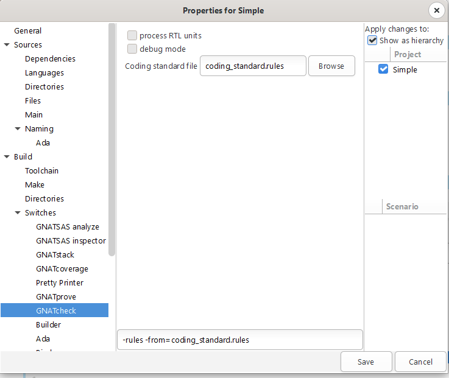

***********
GNATcheck
***********

.. role:: ada(code)
   :language: ada

==============
Introduction
==============

-----------------
GNATcheck Is...
-----------------
+ An automated coding standards checker
+ Capable of expressing a variety of rules

  + GNAT compiler warnings and style checks
  + Language-defined and GNAT-defined restrictions
  + Complexity metrics
  + Specific GNATcheck-defined rules (~80, and growing)

+ Qualified to DO-178 in several programs
+ A command-line tool
+ Integrated in GPS / GNATbench

   .. image:: ../../images/number_one_ribbon.png
      :height: 20%

   + Recommended approach

---------------------
Required by DO-178B
---------------------

   .. image:: ../../images/gnatcheck/do178_table_a5.jpg

--------------------------------------
Conformance To Standards Requirement
--------------------------------------

.. container:: latex_environment beamercolorbox {blueonorange}

   **6.3.4 Reviews and Analyses of the Source Code**

   [...]

   d. Conformance to standards: The objective is to **ensure that the Software Code Standards were followed** during the development of the code, especially complexity restrictions and code constraints that would be consistent with the system safety objectives. Complexity includes the degree of coupling between software components, the nesting levels for control structures, and the complexity of logical or numeric expressions. This analysis also ensures that deviations to the standards are justified.

---------------------------
GNATcheck Is An ASIS Tool
---------------------------
+ Source must be compilable

  + Warnings issued otherwise
  + GNATcheck will continue without analyzing them

+ All source dependencies must be available

  + Those units named in with-clauses, transitively
  + Whether or not they are to be analyzed themselves

-------------------------
Command Line Invocation
-------------------------

.. container:: latex_environment footnotesize

   :command:`gnatcheck [options] {filename} | {-files=filename} -rules rule_switches`

.. epigraph::

   **options**

      Including project file switch and name (*-P <filename.gpr>*)

.. epigraph::

   **{filename}**

      Source file names; wildcards allowed

**OR**

.. epigraph::

   **{files=filename}**

      Name of a file containing source file names

.. epigraph::

   **-rules rule_switches**

      Specific rules, or name of a text file containing rules (*-from=filename*)

Examples:

.. container:: latex_environment footnotesize

   :command:`gnatcheck main.adb  -rules +RPositional_Parameters`

   :command:`gnatcheck -P foo.gpr`

----------------------
Some Useful Switches
----------------------
**--help** | **-h**

  + List rule identifiers with very brief descriptions

**--show-rule**

  + Append rule names to messages

**- Xname=value**

  + Specify an external reference for argument in project file

**-o filename**

  + Specify the name of the report file
  + Default is *toolprefix-*gnatcheck.out

---------------------
Using Project Files
---------------------

+ The optimum approach
+ Convenient for multiple source directories
+ Convenient for checking multiple projects

  + Root project and dependencies

+ Usable with both command line and IDEs
+ File specified via switch **-P** as usual
+ Uses a tool-specific package named **Check**

------------------------------
Specifying Rules In GPR File
------------------------------

.. code:: Ada

   project Gnatcheck_Example is
      ...
      package Check is
         for Default_Switches ("Ada") use      
            ("-rules", -- DON'T FORGET THIS!
             "+RAbstract_Type_Declarations",
             "+RAnonymous_Arrays",
             "+RLocal_Packages",
             "+RFloat_Equality_Checks",
             "+REXIT_Statements_With_No_Loop_Name",
             "+RStyle_Checks:e"); 
      end Check;
   end Gnatcheck_Example;

----------------------------
Rules File Use In GPR File
----------------------------

Convenient due to typically large number of rules

.. code:: Ada

   project Gnatcheck_Example is
      for Source_Dirs use (...);
      package Check is
         for Default_Switches ("Ada") use (
               "-rules",
                -- arbitrary filename:
                "-from=coding_standard");
      end Check;
   end Gnatcheck_Example;

------------------------------------------
GNATcheck Switches In Project Properties
------------------------------------------

As always, direct manual entry is also supported

-------------------
Basic Rule Syntax
-------------------

.. epigraph::

   **+R <rule name>**

      Activates rule specified

.. epigraph::

   **+R <rule name : parameter>**

      Activates rule specified, for the value of the parameter

.. epigraph::

   **-R <rule name>**

      Deactivates specified rule previously activated

.. epigraph::

   **-R <rule name : parameter>**

      Deactivates specified rule, depending on parameter value

.. epigraph::

   **-from=rule_option_filename**

      Textually includes rules from specified file name (Hence files can reference other files)

*Rule names are not case sensitive*

-------------------
Sample Rules File
-------------------

::

   -----------------------------------------------------
   -- This is a sample gnatcheck coding standard file --
   -----------------------------------------------------
   --  First, turn on rules that are defined by gnatcheck
   +RAbstract_Type_Declarations
   +RAnonymous_Arrays
   +RLocal_Packages
   +RFloat_Equality_Checks
   +REXIT_Statements_With_No_Loop_Name
   --  Then, activate some checks defined by GNAT compiler:
   +RStyle_Checks:e
   --  This style check checks if a unit name is present
   --  on END keyword that is the end of the unit declaration

-------------------------------
Sample Invocation Results (1)
-------------------------------

.. container:: latex_environment footnotesize

   .. code:: Ada

      package Pack is
         type T is abstract tagged private; -- declaration of abstract type
         procedure P (X : T) is abstract;
         package Inner is -- declaration of local package
            type My_Float is digits 8;
            function Is_Equal (L, R : My_Float) return Boolean;
         end Inner;
      private
         type T is abstract tagged null record; -- declaration of abstract type
      end; -- (style) "end Pack" required

-------------------------------
Sample Invocation Results (2)
-------------------------------

.. code:: Ada

   package body Pack is
      package body Inner is
         function Is_Equal (L, R : My_Float) return Boolean is
         begin
      	     return L = R; -- use of equality for float values
         end; -- (style) "end Is_Equal" required
      end Inner;
   end Pack;

------------------------------------------
Rule Exemptions Specified In Source Code
------------------------------------------

+ Uses GNAT-specific pragma Annotate

  + Used by source-oriented tools external to compiler
  + Syntax checked by compiler but no compilation effect

     .. code:: Ada

        pragma Annotate (identifier [,identifier {, arg}]);

+ GNATcheck-specific usage

     .. code:: Ada

        pragma Annotate (gnatcheck,
                         exemption_control,
                         rule_name,
                         [justification]);

     * exemption_control ::= *Exempt_On | Exempt_Off*
     * rule_name ::= *string_literal*
     * justification ::= *string_literal*

* Usage errors are detected by GNATcheck

------------------------
Example Rule Exemption
------------------------

.. code:: Ada

   procedure Main is

      -- Included in reports
      pragma Annotate (gnatcheck, Exempt_On,
                       "Anonymous_Arrays", "this one is fine");
      -- Ignored
      Anon_Array : array (1 .. 10) of Float;
      pragma Annotate (gnatcheck, Exempt_Off, "Anonymous_Arrays");

      -- Message: anonymous array type
      Another_Anon_Array : array (1 .. 10) of Integer;

      ...

   begin
      ...
   end Main;

*Exemption sections can be nested*

-----------------------------
Sample Report File Produced
-----------------------------

:filename:`toolprefix-gnatcheck.out`

::

   GNATCheck report
   date              	: 2014-02-24 11:45
   gnatcheck version	: gnatcheck Pro 7.3.0w (20140219-47)
   command line      	: C:\GNATPRO\7.3.0w\bin\gnat.exe check -P gnatcheck_example.gpr
   runtime              : <default>
   coding standard      : coding_standard
   list of sources      : gnatcheck-source-list.out

   1. Summary
      fully compliant sources                  : 0
      sources with exempted violations only    : 0
      sources with non-exempted violations     : 3
      unverified sources                       : 0
      total sources                            : 3
      non-exempted violations                  : 8
      rule exemption warnings                  : 0
      compilation errors                       : 0
      exempted violations                      : 1

   2. Exempted Coding Standard Violations

   main.adb:6:23: anonymous array type  (this one is fine)

   3. Non-exempted Coding Standard Violations

   main.adb:9:31: anonymous array type
   main.adb:19:15: exit statement with no loop name
   pack.adb:5:24: use of equality operation for float values
   ...

=======
Lab 1
=======

-------------------------------------------
Installation Verification & Basic Use Lab
-------------------------------------------

+ Open a command line prompt window
+ Go to the :filename:`gnatcheck/basic` folder in the folders provided
+ Invoke gnatcheck using the project file supplied

   :command:`gnatcheck -P gnatcheck_example.gpr -XPLATFORM=native`

+ Verify results
+ Leave the command prompt window open

----------------------------
Accessing the GNATcheck RM
----------------------------

+ From within GPS

  + In HTML
  + Via Help :math:`\rightarrow` GNAT menu

+ Outside GPS, on the file system

  + Located under your GNAT Pro installation directory tree
  + Multiple file formats provided
  + In subdirs corresponding to the file format
  + File name is gnatcheck_rm .[pdf | html | txt | info]
  + Eg: <installation>/share/doc/gnat/pdf/gnatcheck_rm.pdf

-----------------------------------
Accessing GNATcheck RM Within GPS
-----------------------------------

.. image:: ../../images/gnatcheck/rm_cascade.png

----------------------------------
GNATcheck RM Sections In Browser
----------------------------------

.. image:: ../../images/gnatcheck/rm_browser.png

+ One big section, thus searchable

=======
Lab 2
=======

-----------------------------------
Accessing GNATcheck RM in GPS Lab
-----------------------------------
+ Use the command prompt window already open

  + At the :filename:`basic` lab directory

+ Open GPS by typing :command:`gps` on the command line

  + GPS will find the one project file there and use it

+ Open the GNATcheck Reference Manual
+ Find the *Predefined Rules* chapter
+ Leave both GPS and the browser showing the GNATcheck Reference Manual open

------------------------------------------
GPS: Check All Sources In Single Project
------------------------------------------

.. image:: ../../images/gnatcheck/perform_check_cascade.png

+ TBD: Right-click to display contextual menu
+ TBD: Click to invoke

---------
Results
---------

.. image:: ../../images/gnatcheck/check_results.png

+ TBD: File for 1 st entry
+ TBD: Click to focus on source line

---------------------------------
GPS Source File Contextual Menu
---------------------------------

.. image:: ../../images/gnatcheck/perform_right_click.png

+ TBD: Right-click to display contextual menu
+ TBD: Click to invoke

--------------------------------------
What Predefined Rules Are Available?
--------------------------------------

+ Defined by the language and AdaCore

  + Using :ada:`pragma Restrictions`

+ Defined by GNAT compiler

  + Style checks
  + Additional identifiers for pragma Restrictions

+ Defined by GNATcheck itself

  + Based on *Guide for the Use of the Ada Programming Language in High Integrity Systems"  (ISO/IEC TR 15942)
  + Based on customers' certification requirements
  + Others...

+ All can be listed by GNATcheck with :command:`-h` switch

  + Lists rule identifiers with very brief descriptions

-----------------------------------
"Predefined Rules" Categorization
-----------------------------------
+ Style-Related Rules

  + Object Orientation
  + Portability
  + Program Structure
  + Programming Practice
  + Readability
  + Tasking
  + *Rules appear underneath the (sub)categories*

+ Feature Usage Rules
+ Metrics-Related Rules
+ SPARK Ada Rules

---------------------------------
Rules for Compiler Style Checks
---------------------------------
+ Allows expressing compiler style checks as rules
+ Syntax

   ``+R Style_Checks : style-string-literals``

+ Example: enabling GNAT's built-in style checks

  + As compiler switch or :ada:`pragma Warnings` argument

      :command:`-gnaty`

  + As GNATcheck rule

      + Enable: ``RStyle_Checks:y``
      + Disable: ``+RStyle_Checks:yN``

-----------------------------
Rules for Compiler Warnings
-----------------------------
+ Allows expressing compiler warning switches as rules
+ Syntax

   ``+RWarnings: warning-string``

+ Example: enabling (most of the) optional warnings

  + As compiler switch or :ada:`pragma Warnings` argument

      :command:`-gnatwa`

  + As GNATcheck rule

      + Enable: ``RWarnings:a``
      + Disable: ``+RWarnings:`` - *must use individual disabler characters*

---------------------------------------
Rules for Language Restriction Checks
---------------------------------------

+ Allows expressing :ada:`pragma Restrictions` as rules

  + And GNAT-defined :ada:`pragma Restriction_Warnings`

+ Syntax

   ``+RRestrictions : restrictions-parameter``

+ Example: disabling dynamic dispatching

  + As :ada:`pragma Restrictions` argument

     :ada:`pragma Restrictions (No_Dispatch);`

  + As GNATcheck rule

     ``+RRestrictions:No_Dispatch``

  + Disabled using -RRestrictions with parameter

-------------------------------------
Example for Detecting Implicit Code
-------------------------------------

Rules File

.. list-table::

  * - +RRestrictions:No_Implicit_Heap_Allocations

    - -- defined by Ada

  * - +RRestrictions:No_Implicit_Loops

    - -- defined by GNAT

  * - +RRestrictions:No_Implicit_Dynamic_Code

    - -- defined by GNAT

  * - +RRestrictions:No_Implicit_Conditionals

    - -- defined by GNAT

.. code:: Ada

   with F; -- a function
   package P is
      -- An implicit heap allocation in GNAT
      Obj : array (1 .. F) of Integer;
   end P;

``p.ads:3:04: warning: violation of restriction "No_Implicit_Heap_Allocations"``

---------------------------------
Graphically Editing Rules Files
---------------------------------

.. image:: ../../images/gnatcheck/edit_rules_cascade.png

+ Same as via project contextual menu
+ Invokes dialog

--------------------------
Rules File Editor Dialog
--------------------------

.. image:: ../../images/gnatcheck/rules_editor.png

+ TBD: Editable; empty if no file specified already
+ TBD: Buttons invoking sub-dialogs
+ TBD: Editable; reflects choices via sub-dialogs

-----------------------------------
When Rules Files Contain Comments
-----------------------------------

.. image:: ../../images/gnatcheck/rules_comment_warning.png

+ Even if you don't change anything, pressing Save removes the comments
+ TBD: verify and update screenshot if needed

------------------------------------
The "Edit Rules File" Dialog Boxes
------------------------------------

.. image:: ../../images/gnatcheck/rules_example_dialog.png

----------------------
Style Rules: Tasking
----------------------
+ Multiple_Entries_In_Protected_Definitions

  + Flags a protected definition with more than one entry
  + Processing for those with only one entry can be optimized

+ Volatile_Objects_Without_Address_Clauses

  + Flags each volatile object lacking an address clause
  + Two reasons for volatile objects:

    + Shared variable communication between tasks
    + Objects imported from external source set independently of Ada code
    + In this case an address clause will appear also

       .. code:: Ada

          Weight_On_Wheels : Unsigned_8 with
                Volatile,
                Address => To_Address (16#DEAD_BEEF#);

=======
Lab 3
=======

------------------------
Tasking Style Rule Lab
------------------------

+ Two reasons for volatile objects (at least):

  + Shared variable communication between tasks
  + Objects imported from external source and set externally

    + In this case an address clause will appear also

       .. code:: Ada

          Weight_On_Wheels : Unsigned_8 with
                Volatile,
                Address => To_Address (16#DEAD_BEEF#);

+ Some standards disallow shared variables for communicating between tasks
+ Use the rules file editor to specify the rule flagging volatile objects that do not have address clauses

  + Hint: Style

------------------------
Tasking Style Rule Lab
------------------------

.. image:: ../../images/gnatcheck/tasking_rules_dialog.png

--------------------------------------------
Enforcing Abstraction & Information Hiding
--------------------------------------------

.. code:: Ada

   package P is

      type Content is array (Positive range <>) of Integer;

      type Stack (Size : Positive) is record
         Values : Content (1 .. Size);
         Top    : Natural := 0;
      end record;

      procedure Push (This : in out Stack;  Value : Integer) with
        Pre => not Full (This);

      function Full (This : Stack) return Boolean is 
        (This.Top = This.Size);

   end P;

*Stack should be a private type!*

   * If this was a private type with that same discriminant, no violation would be reported 

--------------------
OO Style Rule Quiz
--------------------

+ Question: what is the rule for enforcing abstraction & information hiding for types -- i.e., private types?
+ Answer: :animate:`+RVisible_Components`

.. code:: Ada

   package P is
      type Content is array (Positive range <>) of Integer;

      type Stack (Size : Positive) is record
         Values : Content (1 .. Size);
         Top    : Natural := 0;
      end record;
      ...
   end P;

``p.ads:5:4: type defines publicly accessible components``

-----------------------------------------
Exception Propagation Beyond Visibility
-----------------------------------------

.. columns::

   .. column::

      .. code:: Ada

         package P is
            procedure Q;
         end P;

         package body P is
            Error : exception;
            procedure Q is
            begin
               raise Error;
            end Q;
         end P;

   .. column::

      .. code:: Ada

         with P;
         procedure Client is
         begin
            P.Q;
         exception
            -- not visible!
            when P.Error =>
               ...
         end Client;

-----------------------------------
Program Structure Style Rule Quiz
-----------------------------------

+ Question: What is the rule for detecting exception propagation beyond the visibility of that name?
+ Answer: :animate:`+RRaising_External_Exceptions`

.. code:: Ada

   package body P is
      Error : exception;
      procedure Q is
      begin
         raise Error;
      end Q;
   end P;

``p.adb:7:17: raised exception is not declared in visible part of enclosing library package``

-----------------
Beware "Others"
-----------------

+ A maintenance issue: compiler can't detect lack of specific handling when new values added
+ Case statement example

  + Suppose a new value **must** have a new case statement alternative, per application requirements
  + If you forget to add the new alternative, the compiler can't detect that fact because :ada:`others` covers new value too

.. code:: Ada

   -- Future mods may add many more agencies
   type Space_Agencies is (NASA, ESA, RFSA); 
   Bureau : Space_Agencies;
   ...
   case Bureau is
      when ESA => ...
      when NASA => ...
      when others => ...
   end case;
   ...

---------------------------------
Programming Practice Style Quiz
---------------------------------

+ Question: what are the rules for detecting the most important maintainability issues for "case statements"?
+ Answer:

.. container:: animate

   ::

         OTHERS_In_CASE_Statements
         Enumeration_Ranges_In_CASE_Statements

---------------------------
"Use Package" Clause Quiz
---------------------------

+ There has been much controversy over whether or not "use clauses" should be applied

  + Some say they decrease readability by removing info
  + Some say they help readability by reducing noise
  + Nowadays a decent IDE can tell you everything...

+ Question: what is the rule for detecting "use clauses" for packages?

  + Use-type clauses are ignored

+ Answer: :animate:`USE_PACKAGE_Clauses`

---------------------------------------------
Feature Usage Rule Example: "Magic Numbers"
---------------------------------------------

+ Numeric literals used instead of named numbers, constants, or attributes
+ Prevented using ``Numeric_Literals`` rule
+ Syntax

   + ``+RNumeric_Literals [:  N  |  All  |  Statements_Only]``

   **N**

      *Allow integer literals not exceeding this value*

   **All**

      *All integer literals are flagged*

   **Statements_Only**

      *Numeric literals are flagged only when used in statements*

+ If no parameters are set, max unflagged value is 1 and is not limited to statements

----------------------------------------
Unassigned Mode OUT Parameters Example
----------------------------------------

+ Always a coding error
+ For scalar types, worse: *by-copy* mechanism will copy something back

  + May copy junk, with unpredictable effects

.. code:: Ada

   procedure Q (Input : in Integer;  Output : out Integer) is
   begin
      if ... then
         return;
      end if;
   end Q;

-------------------------
Feature Usage Rule Quiz
-------------------------

+ Question: what is the rule for detecting formal parameters of mode "out" that are not assigned within a subprogram?
+ Answer: :animate:`Unassigned_OUT_Parameters`

.. code:: Ada

   procedure Q (Input  : in  Integer;
                Output : out Integer) is
   begin
      if ... then
         return;
      end if;
      Output := ...
   end Q;

.. container:: animate

   + *Note that any assignment to a mode* **out** *formal satisfies the check for that formal*

      + *This error is not detected by GNATcheck, maybe will be by the compiler, definitely will be by CodePeer*

----------------------
Combining Rule Forms
----------------------

+ You may need to apply a combination of the forms in order to achieve a specific effect

  + Compiler-defined rules (switches)
  + Ada pragma Restrictions
  + GNATcheck-defined rules

+ Any combination of the three forms is allowed

  + No need to use any one form

+ Their individual effects will overlap somewhat

---------------------------------------
Sample Combination: Boolean Operators
---------------------------------------

+ You may want to require use of short-circuit form

  + :ada:`and then` instead of :ada:`and`, :ada:`or else` instead of :ada:`or`
  + For sake of reducing complexity of MC/DC checks, etc.

+ Compiler style check rule ``+RStyle_Checks:B``

  + Flags :ada:`and` as well as :ada:`or` for boolean types, except for simple variables and constants

+ Restriction rule ``+RRestrictions:No_Direct_Boolean_Operators``

  + Flags operators :ada:`and`, :ada:`or`, and :ada:`xor` for boolean types

+ GNATcheck rule ``+RNon_Short_Circuit_Operators``

  + Flags all calls to predefined :ada:`and` and  :ada:`or` for booleans
  + Not flagged for use on modular types or boolean array types

-------------------------------------------
Sample Combination : Preventing Recursion
-------------------------------------------

+ Compiler always applies the style check rule

  + Not optional
  + Flags possible infinitely recursive calls
  + Can be justified with pragma Warnings(Off)

+ Restriction rule ``+RRestrictions:No_Recursion``

  + Flags locally detected recursion
  + Program is erroneous if it uses recursion

+ GNATcheck rule ``+RRecursive_Subprograms``

  + Flags all recursive chains of direct calls
  + Indirect calls via pointers are not detected

-----------------
Getting Started
-----------------

+ A switch is defined to facilitate rules file creation

   + :command:`gnatcheck --write-rules= file_name`
   + Creates a file with name as specified

+ File contains all the rules, all turned off

  + A project file, if given, has no effect on content

+ Edit this file to get your own rules file
+ You will not use all the defined rules!

  + Many of them conflict with others
  + Define the subset that matches your (existing) code

-------------------
GNATcheck Summary
-------------------

+ An automated coding standards verifier/checker
+ Capable of expressing a variety of rules

  + GNAT compiler warnings and style checks
  + Language restrictions (via pragma Restrictions)
  + Complexity metrics (GNATmetric results)
  + Others, including SPARK related rules

+ You should not use all the existing rules!

  + Some of them conflict with others

+ Use switch :command:`--help` for useful switches list

  + E.g., :command:`-jn` for concurrent processing
