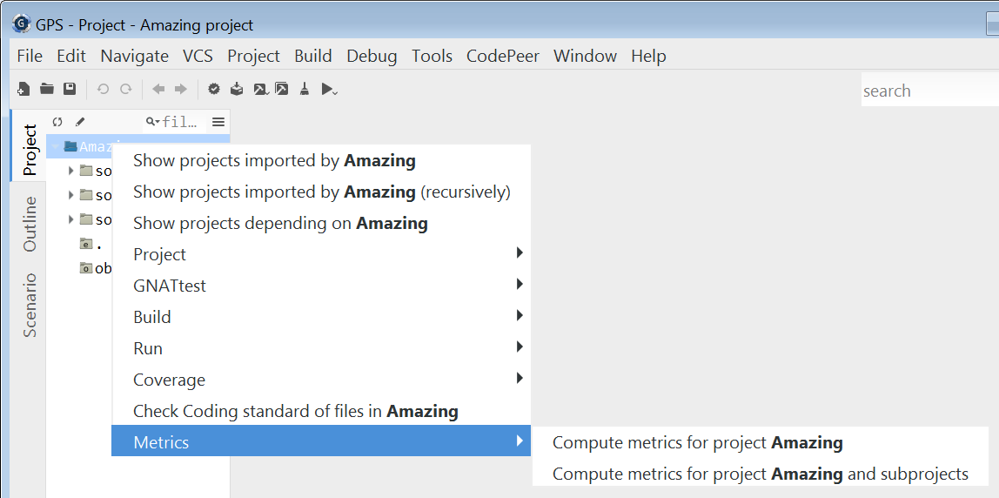
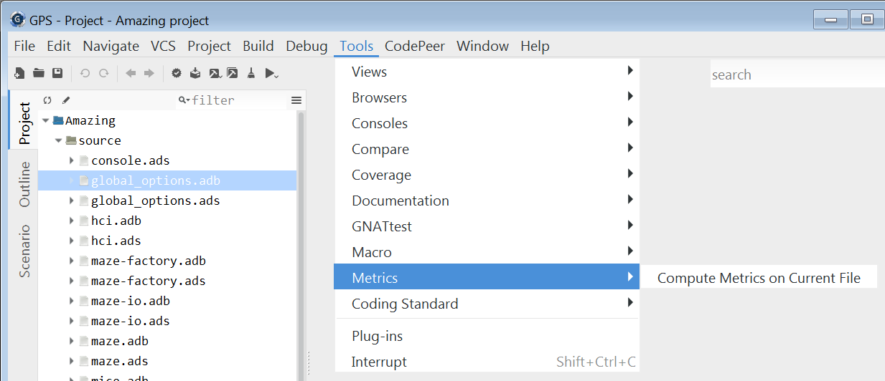
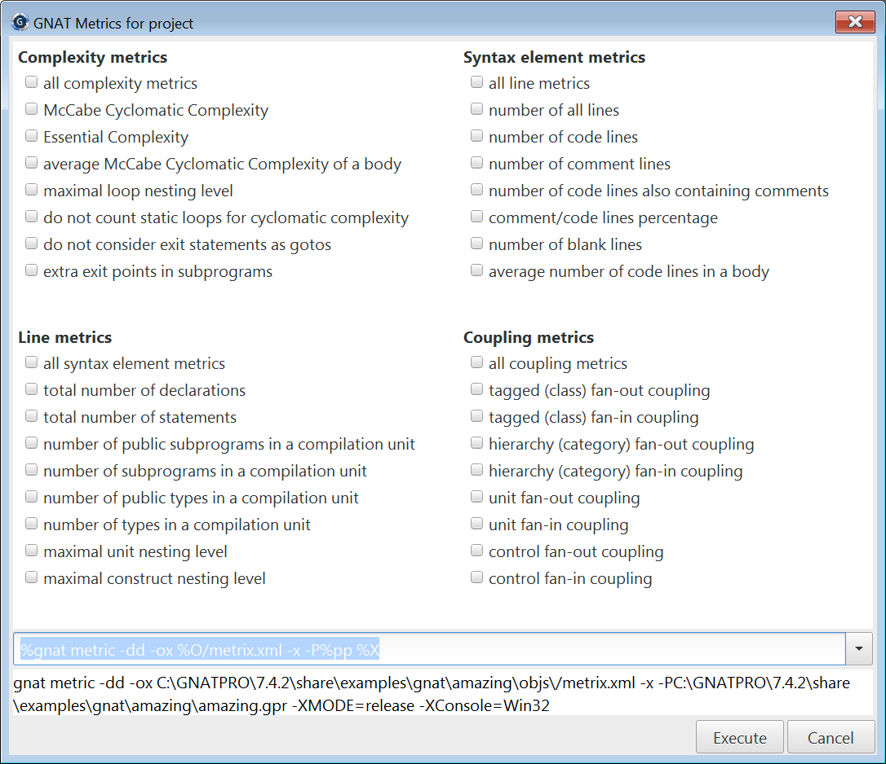
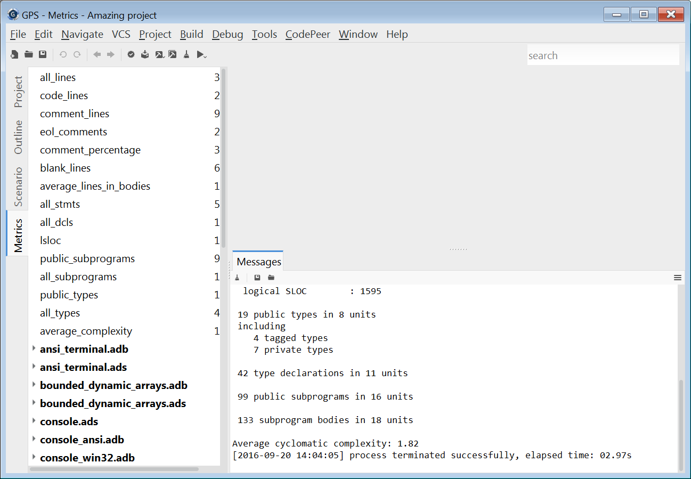

************
GNATmetric
************

------------------------
Overview of gnatmetric
------------------------
+ GNAT software metrics generation tool
+ Configurable metrics selection
+ Configurable scope of analysis

  + All source files in the project
  + One source file in the project
  + A specific entity in a source file, e.g. a subprogram

    + When applicable

+ GPS provides a GUI interface

  + Selecting the metrics to compute
  + Selecting the scope of analysis
  + Displaying the results

-----------------------
Invoking the Analyses
-----------------------
+ Use contextual menus (Project view, Tools)

+ **Tailored for project**

------------------------------------------------
File-Specific Entry in Project Contextual Menu
------------------------------------------------

--------------------
Metrics Dialog Box
--------------------

-----------------------
Exploring the Results
-----------------------

+ Summary in Messages window
+ Metrics
+ view
+ **Global results**
+ **Unit-specific results**

-----------------------
Line Metrics Computed
-----------------------
+ Total number of lines
+ Total number of comment lines
+ Percentage comments
+ Average number of code lines in subprogram bodies, task bodies, entry bodies and statement sequences in package bodies
+ Others...
+ Switches can disable individual metrics

-------------------------
Syntax Metrics Computed
-------------------------
+ Logical source lines of code
+ Max static nesting level of inner program units
+ For package specs, the number of subprograms and generic subprograms declared in the visible part
+ Total number of subprogram bodies in a compilation unit
+ Others...
+ Switches can disable individual metrics

-------------------------------
Metrics for Type Declarations
-------------------------------
+ For package specs and generic package declarations, the total number of visible types

  + Only types, not subtypes, are included

+ Totals for other types:

  + Abstract types
  + Root tagged types (abstract, non-abstract, private, non-private).

    + Type extensions are not counted

  + Private types (including private extensions)
  + Task types
  + Protected types

+ Others...
+ Switches can disable individual metrics

-----------------------------
Complexity Metrics Computed
-----------------------------
+ McCabe Cyclomatic complexity
+ McCabe Essential complexity
+ Maximal loop nesting level
+ Computed for any program unit that has executable sequence of statements

  + Subprogram body (including generic bodies)
  + Task body
  + Entry body
  + Package body containing its own statement sequence

+ Switches can disable individual metrics

---------------------------------
Understanding McCabe Complexity
---------------------------------
+ Given a control flow graph of a program

  + E - number of edges
  + N - number of nodes
  + P - number of connected components (exit nodes)

+ The complexity is computed by:

  + E - N + 2 * P

+ Aimed a measuring the complexity of execution paths
+ Needs to be adapted for each language

----------------
McCabe Example
----------------
+ !A
+ A
+ B
+ !B
+ !C
+ C
+ 9 edges - 7 nodes + 2 * 1 exit = complexity 4
+ if
+ **A**
+ then
+ **Put_Line ("A");**
+ else
+ **Put_Line ("!A");**
+ end
+ ****
+ if
+ **;**
+ ****
+ if
+ **B**
+ or
+ ****
+ else
+ **C**
+ then
+ **Put_Line ("BC");**
+ end
+ ****
+ if
+ **;**

----------------------------------
Object-Oriented Metrics Computed
----------------------------------
+ Uses Ada's approach to definition of "class"

  + Tagged types declared within packages
  + Interface types declared within packages

+ Two kinds of coupling computed

  + Number of other classes that a given class depends upon
  + Number of other classes that depend on a given class

+ Package bodies and specs for "classes" are both considered when computing dependencies
+ Switches can disable individual metrics

-----------------
Closing Remarks
-----------------
+ See the GNAT User's Guide for the meaning of all the switches
+ For GPS, switches specified via the "Metrics" package in the project's GNAT project file
+ Note requirements on input source files

  + They must all be available

    + Including all those mentioned in context clauses, transitively

  + They must be able to be compiled
