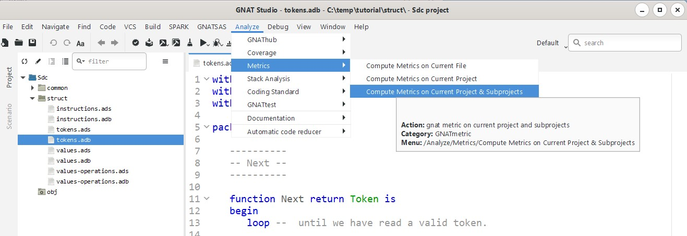
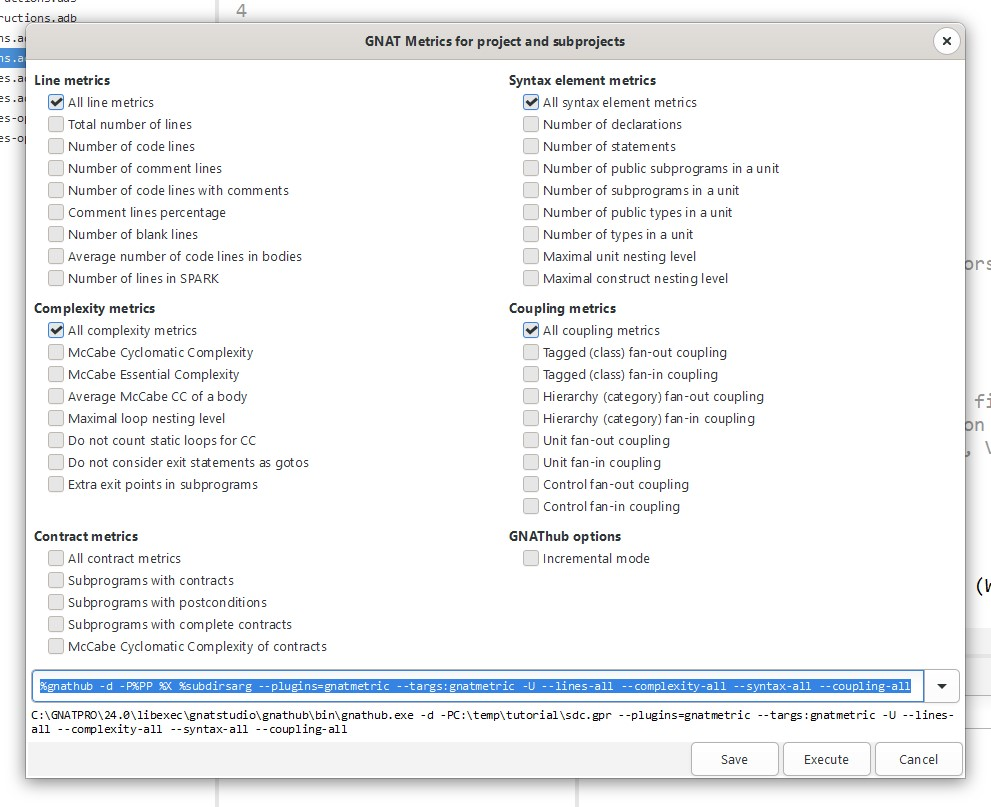
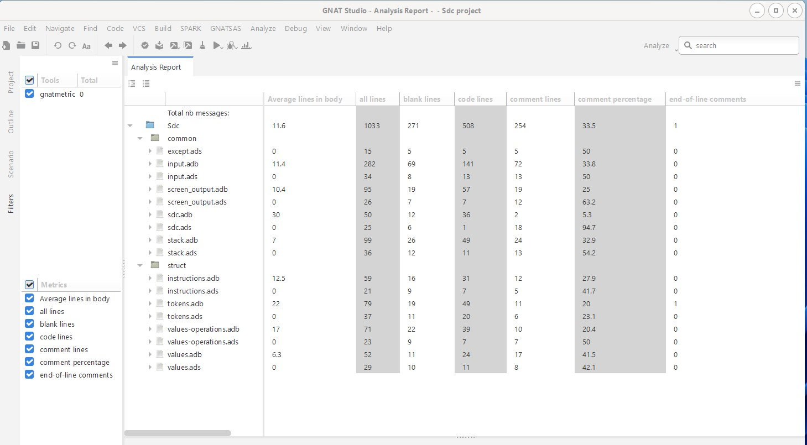
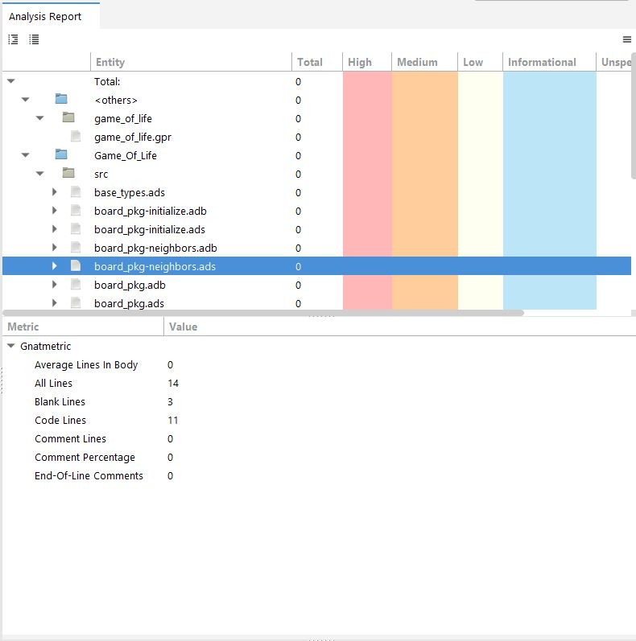
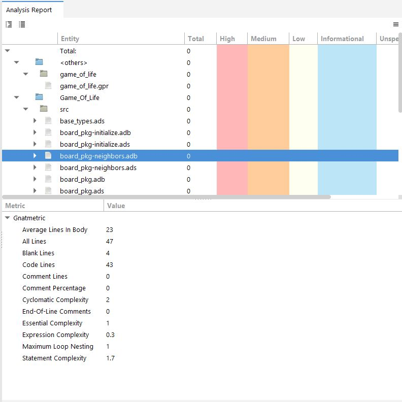

************
GNATmetric
************

==============
Introduction
==============

------------------------
Overview of gnatmetric
------------------------
+ GNAT software metrics generation tool
+ Configurable metrics selection
+ Configurable scope of analysis

  + All source files in the project
  + One source file in the project
  + A specific entity in a source file, e.g. a subprogram

    + When applicable

+ GPS provides a GUI interface

  + Selecting the metrics to compute
  + Selecting the scope of analysis
  + Displaying the results

-----------------------
Invoking the Analyses
-----------------------
+ From the :menu:`Analyze` menu

--------------------
Execute Dialog Box
--------------------

=======================
Exploring the Results
=======================

-----------------
Project Results
-----------------

----------------------
Package Spec Results
----------------------

----------------------
Package Body Results
----------------------

------------------------
Line Metrics Explained
------------------------

**Average Lines In Body**
   Average number of code lines in subprogram bodies, task bodies, entry bodies and package body executable code

**All Lines**
   Total number of lines in file(s)

**Blank Lines**
   Total number of blank in file(s)

**Code Lines**
   Total lines of code in file(s)

**Comment Lines**
   Total lines of comments in file(s)

**Comment Percentage**
   Comment lines divided by total of code lines and comment lines

**End-Of-Line Comments**
   Count of code lines that also contain comments

----------------------------------
Syntax Element Metrics Explained
----------------------------------

**All Declarations**
 Total number of objects declared

**All Statements**
 Total number of statements in file(s)

**All Subprogram Bodies**
 Total number of subprograms in file(s)

**All Type Definitions**
 Total number of types in file(s)

**Logical SLOC**
 Total of declarations plus statements

**Public Subprograms**
 Count of subprograms declared in visible part of package

**Public Types**
 Count of types (not subtypes) declared in the visible part of a package plus in the visible part of a generic nested package

**Maximal Construct Nesting**
 Maximal nesting level of composite syntactic constructs

**Maximum Unit Nesting**
 Maximal static nesting level of inner program units

------------------------------
Complexity Metrics Explained
------------------------------

**Average Complexity**
    Total Cyclomatic Complexity divided by total number of subprograms

**Cyclomatic Complexity**
    McCabe cyclomatic complexity

**Essential Complexity**
    McCabe essential complexity

**Expression Complexity**
    TBD

**Maximum Loop Nesting**
    TBD

**Statement Complexity**
    TBD

---------------------------------
Understanding McCabe Complexity
---------------------------------

http://www.mccabe.com/pdf/mccabe-nist235r.pdf

+ Given a control flow graph of a program

  + E - number of edges
  + N - number of nodes
  + P - number of connected components (exit nodes)

+ The complexity is computed by:

  + E - N + 2 * P

+ Aimed a measuring the complexity of execution paths
+ Needs to be adapted for each language

----------------
McCabe Example
----------------

.. columns::

  .. column::

   .. code:: Ada

      if A then
         Put_Line ("A");
      else
         Put_Line ("!A");
      end if;

      if B or else C then
         Put_Line ("BC");
      end if;

  .. column::

     .. image:: ../../images/cyclomatic_complexity_edges_and_nodes.jpg

     9 edges - 7 nodes + 2 * 1 exit = complexity 4

------------------------------
Coupling Metrics Explained
------------------------------

TBD

------------------------------
Coupling Metrics
------------------------------

+ Uses Ada's approach to definition of *class*

  + Tagged types declared within packages
  + Interface types declared within packages

+ Two kinds of coupling computed

  + Number of other classes that a given class depends upon
  + Number of other classes that depend on a given class

+ Package bodies and specs for *classes* are both considered when computing dependencies

-----------------
Closing Remarks
-----------------

+ See the GNAT User's Guide for the meaning of all the switches
+ For GPS, switches specified via the "Metrics" package in the project's GNAT project file
+ Note requirements on input source files

  + They must all be available

    + Including all those mentioned in context clauses, transitively

  + They must be able to be compiled
