.. role:: ada(code)
    :language: Ada

**********
GNATtest
**********

----------
GNATtest
----------

+ An automatic unit test stub generator, including driver infrastructure
+ Handles large, complex projects
+ Can integrate external tests
+ Supports contract-based programming tests
+ Helps verify OOP requirements of DO-178C
+ Integrated into GPS
+ Supports native, cross & high-integrity platforms

---------------------------
Why Automate the Process?
---------------------------

+ Developing tests is labor-intensive
+ Much of the effort is not specific to the tests

  + Developing the harness and driver

    + How to test generic units, etc.

  + Verifying output is as expected
  + Maintenance and update when new units to be tested

+ Ideally developers should concentrate on the high-value part: the test cases themselves
+ GNATtest makes that ideal possible

------------------------
What Can Be Automated?
------------------------

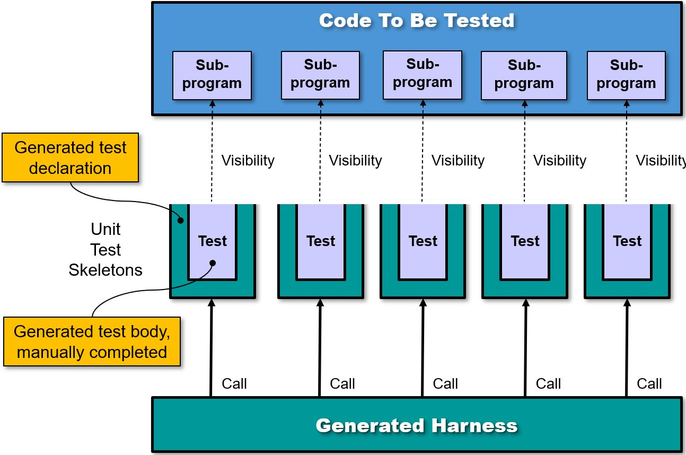

--------------
An ASIS Tool
--------------

+ TBD - is this still true?

+ Sources must be compilable

  + Warnings issued otherwise
  + If not, GNATtest will skip it and continue to any others

+ All source dependencies must be available

  + Those units named in with-clauses, transitively
  + Whether or not they are to be analyzed themselves

----------------
Based On AUnit
----------------

+ Unit test framework based on CppUnit for C++
+ Generates the boilerplate code for test harnesses, suites, and cases needed to use the framework
+ For more information on AUnit view the series of tutorials created by Daniel Bigelow

  + http://www.youtube.com/user/DanielRBigelow

+ Installation required for GNATtest

-------------------------
Command Line Invocation
-------------------------

.. container:: latex_environment footnotesize

   :command:`gnattest -P <project-filename> {switches} [filename] [-cargs GCC_switches]`

.. epigraph::

   **<project-filename>**

      Name of the GNAT Project File

.. epigraph::

   **{switches}**

      GNATtest-specific switches

.. epigraph::

   **[filename]**

      File containing package to test (optional)

.. epigraph::

   **[-cargs GCC_switches]**

      Switches passed to compiler invocations

Examples:

   + gnattest -P foo.gpr src/repository.ads
   + gnattest -P foo.gpr

-------------------
Generated Outputs
-------------------

+ Automatic harness code (driver infrastructure)

  + Can be destroyed and regenerated at will
  + You *can* but *should not* modify this code manually because your changes could easily be overwritten

+ Unit test skeletons (actual unit test code)

  + One for each visible subprogram in packages to be tested
  + You manually modify for specific tests' logic
  + *Not* overwritten if already exists

-------------------------------------
Default Directory Names & Locations
-------------------------------------

+ Under the object directory specified by project file

  + Harness code in "gnattest/harness/"
  + Unit test skeletons in "gnattest/tests/"

.. columns::

   .. column::

      .. code:: Ada

         project Demo is
	    for Object_Dir use "obj";
             ...
         end Demo;

   .. column::

      .. image:: ../../images/gnattest/object_directory_hierarchy.jpg

--------------------------
Switches for the Harness
--------------------------

**--harness-dir=dirname**

   + Specifies the directory that will hold the harness packages and project file for the test driver
   + If *dirname* is a relative path, it is relative to the object directory

**--passed-tests=value**

  + Controls whether or not passed tests should be shown when tests are run
  + Value is either **show** (the default) or **hide** (lowercase)

----------------------------
**Miscellaneous Switches**
----------------------------

**-r**

  + Process all sources from all projects in a tree of projects
  + Directories are generated for each project, local to each

**-Xname=value**

  + External variable *name* is set to *value* for current invocation

**-q**

  + Suppresses noncritical output messages

**-v**

  + Verbose mode: generates version information

Others...

----------------------------------------
Are The Default Locations Good Enough?
----------------------------------------

+ The defaults are perfectly workable, but...
+ Object directory contents are conceptually transient
+ The test harness is regenerated as needed, and never manually modified, thus transient
+ Hence the test harness can stay under the object directory
+ Unit tests are (in automatically generated) source files, manually modified and thus persistent

   + Under configuration control too

+ Hence you may want to put unit tests elsewhere

--------------------------
Where To Put Unit Tests?
--------------------------

+ Since the object dir should not hold them
+ We likely don't want to mix unit tests and application code directly in same directories
+ Thus various GNATtest switches are applicable
+ The `source-dir/**` notation is a potential issue

  + **All** directories rooted at *source-dir* are treated as application source directories
  + Your tests would thus be treated as part of the application

----------------------------------------
Switches for Tests Directory Structure
----------------------------------------

**--tests-dir=dirname**

  + All test packages are placed in the *dirname* directory
  + If *dirname* is a relative path, it is relative to the object dir

**--tests-root=dirname**

  + Specifies root of directory hierarchy for test source dirs
  + **A test directory corresponding to each source directory will be created**
  + If *dirname* is a relative path, it is relative to the object dir
  + Cannot combine with "--tests-dir" switch

**--subdir=dirname**

  + Generated test packages are placed in subdirectories named *dirname*, **under the corresponding source directories**

----------------------------------
The "--test-dir" Switch Effect
----------------------------------

All tests are located in the specified directory

   :command:`gnattest -P simple --test-dir=../unit_tests`

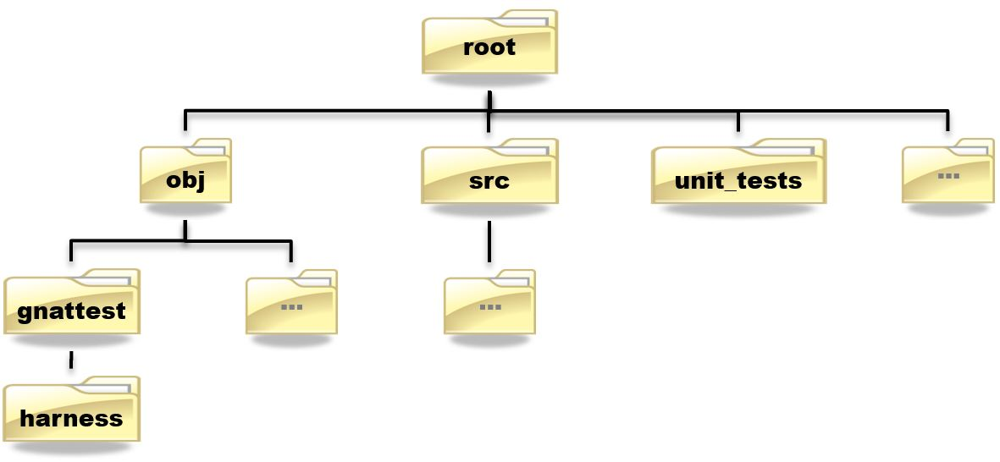

-----------------------------------
The "--tests-root" Switch Effect
-----------------------------------

The source dir hierarchy is *replicated*, starting at the root dir specified

   :command:`gnattest -P simple --tests-root=../unit_tests`

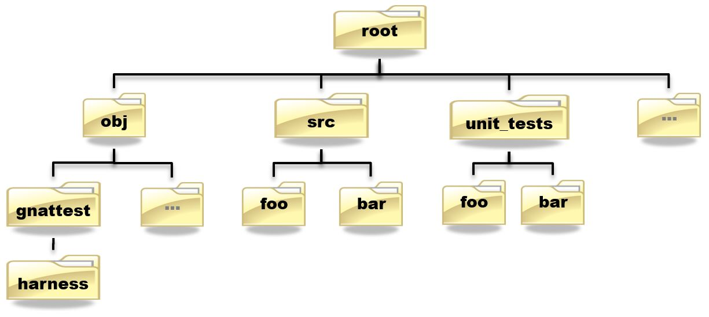

--------------------------------
The "--subdir " Switch Effect
--------------------------------

The source dir hierarchy is *supplemented*, using the dir name specified

   :command:`gnattest -P simple --subdir=unit_tests`

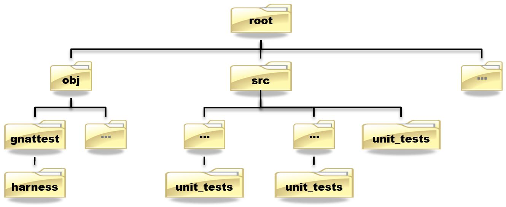

*Beware "src/\*\*" for Source_Dirs*

----------------------
Project File Support
----------------------

.. columns::

   .. column::

      + Tool package :ada:`GNATtest`
      + Generate list attribute :ada:`GNATtest_Switches`
      + Specific attributes corresponding to *some* switches

        + :ada:`Harness_Dir`
        + :ada:`Tests_Dir`
        + :ada:`Tests_Root`
        + :ada:`Subdir`
        + :ada:`Additional_Tests`
        + :ada:`Skeletons_Default`
        + *Meaning and values as per switches*

   .. column::

     .. code:: Ada

        project Demo is
           ...
           package GNATtest is
              for Tests_Root use "../unit_tests";
              ...
              for GNATtest_Switches use ("-v");
           end GNATtest;
           ...
        end Demo;

-------------------------------------
Fundamental Concept of the Approach
-------------------------------------

+ Code to be tested resides in library packages
+ Tests are in hierarchical library units that are "children" of the packages to be tested
+ Thus no need to alter the code to be tested

* Code to be tested

   .. code:: Ada

      package Parent is
         ...
      private
         ...
      end Parent;

* Test Declarations

   .. code:: Ada

      package Parent.Child is
         ...
      private
         ...
      end Parent.Child;

* Test Bodies

   .. code:: Ada

      package body Parent.Child is
         ...
      end Parent.Child;

-----------------------------------------
Child Unit Compile-Time Visibility: ADT
-----------------------------------------

.. columns::

   .. column::

      .. container:: latex_environment tiny

         * Parent

            .. code:: Ada

               package Integer_Stacks is
                  type Stack is limited private;
                  procedure Push (This  : in out Stack;
                                  Input : in Integer);
                  procedure Pop (This    : in out Stack;
                                  Output : out Integer);
                  ...
                  Max : constant := 100;
               private
                  type Contents is array (1 .. Max) of Integer;
                  type Stack is
                     record
                        Values   : Contents;
                        Top       : Natural range 0 .. Max := 0;
                     end record;
               end Integer_Stacks;

   .. column::

      .. container:: latex_environment tiny

         * Child

            .. code:: Ada

               package Integer_Stacks.Utils is
                  procedure Reset (This : in out Stack);
               end Integer_Stacks.Utils;

               package body Integer_Stacks.Utils is
                  procedure Reset (This : in out Stack) is
                  begin
                     This.Top := 0;
                  end Reset;
               end Integer_Stacks.Utils;

-----------------------------------------
Child Unit Compile-Time Visibility: ADM
-----------------------------------------

.. columns::

   .. column::

      .. container:: latex_environment tiny

         * Parent

            .. code:: Ada

               package Integer_Stack is
                  procedure Push (Input : in Integer);
                  procedure Pop (Output : out Integer);
                  ...
                  Max : constant := 100;
               private
                  type Contents is array (1 .. Max) of Integer;
                  Values : Contents;
                  Top    : Natural range 0 .. Max := 0;
               end Integer_Stack;

   .. column::

      .. container:: latex_environment tiny

         * Child

            .. code:: Ada

               package Integer_Stack.Utils is
                  procedure Reset;
               end Integer_Stack.Utils;

               package body Integer_Stack.Utils is
                  procedure Reset is
                  begin
                     Top := 0;
                  end Reset;
               end Integer_Stack.Utils;

-----------------------------
Test Skeleton Naming Scheme
-----------------------------

Note that the generated test packages' names may conflict with application unit names

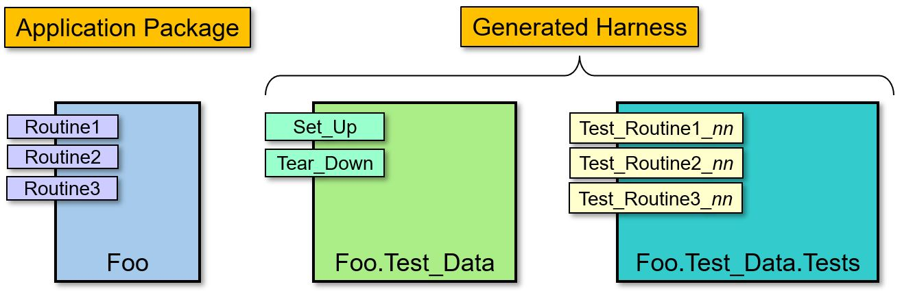

Test routines get unique numeric suffixes

------------------------------------------
Building & Executing the Generated Tests
------------------------------------------

+ Performed via the (re)generated harness code
+ Building

   + Entry point is generated project file :filename:`test_driver.gpr`

+ Executing

   + Main program is :filename:`test_runner`

      + :command:`gnatmake -P<harness-dir>/test_driver`
      + :command:`test_runner`

+ Note you may need to specify scenario variables' values if not using the AUnit defaults

   + **-Xvariable=value**

------------------------------------------
In Practice: Unimplemented Tests Results
------------------------------------------

+ The generated test driver can report the results of unimplemented tests in two ways
+ Can report them as failed

  + Useful to see which tests are still unimplemented
  + The default behavior

+ Can report them as passed

  + To sort those unimplemented from those actually failing

+ Controlled by user

  + Switch **--skeleton-default=value**
  + Attribute *Skeleton_Default* in project file
  + Value is either *fail* or *pass* (lowercase)

----------------------
The "Simple" Example
----------------------

+ Included in the GNAT installation examples
+ Application code:

.. code:: Ada

   package Simple is
      function Inc (X : Integer) return Integer;
   end Simple;

   package body Simple is
      function Inc (X : Integer) return Integer is
      begin
         return X + 1;
      end Inc;
   end Simple;

------------------------------------
Generated Child Package Test_Data
------------------------------------

.. container:: latex_environment small

 .. code:: Ada

   --  This package is intended to set up and tear down  the test environment.
   --  Once created by GNATtest, this package will never be overwritten
   --  automatically. Contents of this package can be modified in any way
   --  except for sections surrounded by a 'read only' marker.

   with AUnit.Test_Fixtures;

   package Simple.Test_Data is

   --  begin read only
      type Test is new AUnit.Test_Fixtures.Test_Fixture
   --  end read only
      with null record;

      procedure Set_Up (Gnattest_T : in out Test);
      procedure Tear_Down (Gnattest_T : in out Test);

   end Simple.Test_Data;

-------------------------------------
Test Case Declaration, As Generated
-------------------------------------

+ Unique names guaranteed by code generator

  + Handles overloading, if any, in application code

.. container:: latex_environment small

 .. code:: Ada

   --  This package has been generated automatically by GNATtest.
   --  Do not edit any part of it, see GNATtest documentation for more details.

   --  begin read only
   with Gnattest_Generated;

   package Simple.Test_Data.Tests is

      type Test is new GNATtest_Generated.GNATtest_Standard.Simple.Test_Data.Test
      with null record;

      procedure Test_Inc_4f8b9f (Gnattest_T : in out Test);
      --  simple.ads:7:4:Inc

   end Simple.Test_Data.Tests;
   --  end read only

-----------------------------
Assertion Facility Provided
-----------------------------

+ A procedure rather than a pragma
+ Exported from :ada:`AUnit.Assertions`

   + :ada:`AUnit.Assertions.Assert ( boolean-expression, message );`

      * *boolean-expression* :math:`\rightarrow` Assert this proposition
      * *message* :math:`\rightarrow` Message to display when proposition does *not* hold
   
.. code:: Ada

   AUnit.Assertions.Assert (Head = null,
                            "Head is not null initially.");

------------------------------
Test Case Body, As Generated
------------------------------

.. code:: Ada

   with AUnit.Assertions; use AUnit.Assertions;
   package body Simple.Test_Data.Tests is

   --  begin read only
      procedure Test_Inc (Gnattest_T : in out Test);
      procedure Test_Inc_4f8b9f (Gnattest_T : in out Test) renames Test_Inc;
   --  id:2.2/4f8b9f38b0ce8c74/Inc/1/0/
      procedure Test_Inc (Gnattest_T : in out Test) is
      --  simple.ads:7:4:Inc
   --  end read only

         pragma Unreferenced (Gnattest_T);
      begin
         AUnit.Assertions.Assert 
            (Gnattest_Generated.Default_Assert_Value,
             "Test not implemented.");

   --  begin read only
      end Test_Inc;
   --  end read only

   end Simple.Test_Data.Tests;

-------------------------
Modified Test Case Body
-------------------------

.. code:: Ada

   with AUnit.Assertions; use AUnit.Assertions;
   package body Simple.Test_Data.Tests is

   --  begin read only
      procedure Test_Inc (Gnattest_T : in out Test);
      procedure Test_Inc_4f8b9f (Gnattest_T : in out Test) renames Test_Inc;
   --  id:2.2/4f8b9f38b0ce8c74/Inc/1/0/
      procedure Test_Inc (Gnattest_T : in out Test) is
      --  simple.ads:7:4:Inc
   --  end read only

         pragma Unreferenced (Gnattest_T);
      begin
         -- new assertion values
         AUnit.Assertions.Assert (Inc (1) = 2, "Inc failure.");

   --  begin read only
      end Test_Inc;
   --  end read only

   end Simple.Test_Data.Tests;

--------------------------------
Using the Package Private Part
--------------------------------

+ Put implementation artifacts in the private part if they will be needed by the test code

  + Type declarations
  + *Subprogram declarations*
  + Et cetera

+ They will be compile-time visible to test code
+ They will remain hidden from client code

  + Good software engineering

-----------------
Support for OOP
-----------------

+ Tests for tagged types are automatically inherited

  + Inherited tests can be overridden in subclasses

+ Global Type Consistency can be verified

  + A form of Liskov Substitutability Principle (LSP) regarding preconditions and postconditions
  + One of the new objectives of DO-178C supplement on Object-Oriented Technology and Related Techniques (DO-332)

-----------------------------------
Test Inheritance for Tagged Types
-----------------------------------

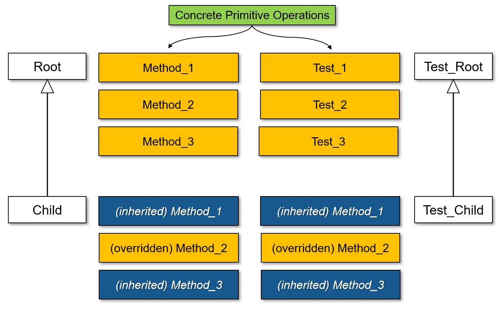

-----------------------------------------
Liskov Substitutability Principle (LSP)
-----------------------------------------

+ Any subclass object can be used in place of a corresponding superclass object, transparently
+ An essential property for abstracting away specific type info via dynamic dispatching
+ Makes specific subclass independence conceivable

  + Data structures
  + Algorithms

+ This is one of the goals of OOP, i.e., isolating the effects of change

--------------------------------------
Subclass-Independent Data Structures
--------------------------------------

.. columns::

   .. column::

      .. code:: Ada

         package Robot is
            type Instruction is tagged private;
            procedure Respond (To : Instruction);
            ..
         end Robot;

      .. code:: Ada

         type Any_Instruction is access Robot.Instruction'Class;

         type Node;
         type List is access Node;
         type Node is
            record
               Command : Any_Instruction;
               Next    : List;
            end record;

   .. column::

   .. column::

      .. image:: ../../images/gnattest/data_structure_hierarchy.jpg
         :align: right

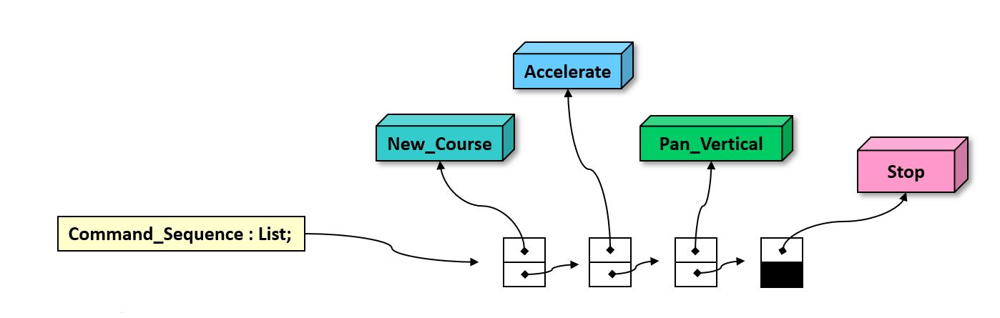

---------------------------------
Subclass-Independent Algorithms
---------------------------------

+ Uses dynamic dispatching to transparently invoke subclass-specific overridings (if any)

.. code:: Ada

   procedure Perform (Commands : in List) is
      Ptr : List;
   begin
      Ptr := Commands;
      while Ptr /= null loop
         Ptr.Command.Respond;  -- dynamic dispatching
         Ptr := Ptr.Next;
      end loop;
   end Perform;

-----------------------------------------
Recap: Preconditions and Postconditions
-----------------------------------------

+ Optionally specify subprogram client (caller) and implementer (supplier) obligations
+ **Precondition** :math:`\rightarrow` Assertion expected to hold when a given subprogram is called by a client
+ **Postcondition** :math:`\rightarrow` Assertion expected to hold when a given subprogram (supplier) returns normally

.. code:: Ada

   procedure Push (This : in out Stack;  Value : Content) with
      Pre  => not Full (This),
      Post => not Empty (This) and Top (This) = Value;
   ...
   function Top (This : Stack) return Content;
   function Full (This : Stack) return Boolean;

---------------------------------------
The Contractor-Subcontractor Metaphor
---------------------------------------

+ Inheritance with overriding and dynamic binding means that clients may be using a subclass of the supplier they specify, without knowing it
+ Thus supplier subclasses are *subcontractors* to superclass suppliers
+ Subcontractors can define additional preconditions and postconditions on overridden primitives

  + Subcontractor-specific contracts with clients

-------------------------
Global Type Consistency
-------------------------

+ Preserved when, in all cases, a subcontractor will do the job as contracted, or better, but not less
+ Hence no stronger preconditions

  + No demands beyond those of superclasses

+ Hence no weaker postconditions

  + No guarantees weaker than those of superclasses

-----------------------------------
Verifying Global Type Consistency
-----------------------------------

+ For a given derived type, run all tests from all parent types

  + Verifies no stronger preconditions
  + Verifies no weaker postconditions

+ Requires switch **--validate-type-extensions**
+ Find tests that would otherwise pass, when applied to specific type defining them

----------------------------
Support for External Tests
----------------------------

+ Those AUnit tests created manually
+ Use switch "--harness-only" initially

  + Only generate the harness since these tests already exist

  .. container:: latex_environment footnotesize

     + :command:`gnattest -P additional/external.gpr --harness-dir=external --harness-only`

+ Add switch "--additional-tests=project-file-name" when generating the tests

  + Sources described in :filename:`project-file-name` are considered additional manual tests to be added to the test suite

  .. container:: latex_environment footnotesize

     + :command:`gnattest -P simple.gpr --additional-tests=additional/external.gpr --harness-dir=external`

----------
Stubbing
----------

.. columns::

   .. column::

      + Designed to test a high-level subsystem in isolation from its dependencies
      + Activated by --stub switch
      + -r adds + recursivity

      .. image:: ../../images/gnattest/stub_before.jpg

   .. column::

      * Stub at the :ada:`Input` level

         .. image:: ../../images/gnattest/stub_level1.jpg

      * Stub at the :ada:`Console` level

         .. image:: ../../images/gnattest/stub_level2.jpg

----------------------------------------
Integration with GPS: Generating Tests
----------------------------------------

.. columns::

   .. column::

      .. image:: ../../images/gnattest/invoke_gnattest.jpg

   .. column::

      .. image:: ../../images/gnattest/invoke_gnattest_dialog.jpg

-------------------------------------
Integration with GPS: Running Tests
-------------------------------------

+ Invoking a test generator setup menu will automatically switch to the test harness project
+ Just build and run as any other project

  + Invocation dialog allows overriding switches

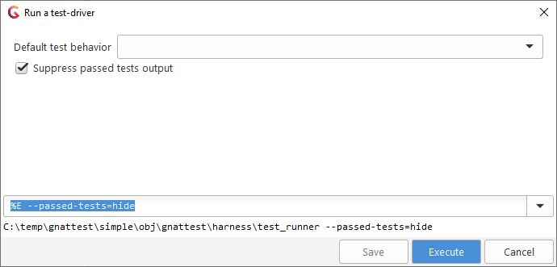

------------------------------------
Integration with GPS: Test Results
------------------------------------

+ TBD
+ GPS automatically opens the app source file and designates the failed test file with a link

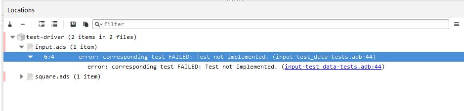

---------------------------------------
Integration with GPS: Exiting Testing
---------------------------------------

+ To return to the development project

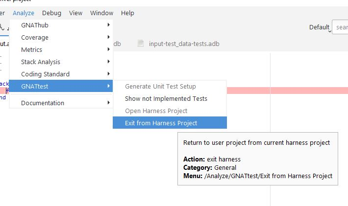

-------------------------------------------
Non-Native Platforms & Runtime Libraries
-------------------------------------------

+ May support only a subset of full Ada

  + Memory allocation, exceptions, etc.

+ Thus may need to generate tests differently, corresponding to those limitations
+ Can be requested via **-X** switch

   + **-Xname=value**

+ Defined scenario variable names:

  + PLATFORM
  + RUNTIME

+ Allowed values depend on products purchased

---------------------------------
Example: LynxOS-178 for PowerPC
---------------------------------

+ A cross-development platform

  + Hence we use the cross-development version of the tool
  + No need to specify PLATFORM

+ Available run-time libraries

  + **pthread** (full Ada)
  + **ravenscar-cert**
  + **cert**
  + **zfp**

:command:`powerpc-xcoff-lynxos178-gnattest -P simple.gpr -XRUNTIME=zfp`

--------------
Getting Help
--------------

+ Invoke gnattest with :command:`--help` switch
+ See the GNAT Pro User Guide

  + Section 27 "Creating Unit Tests with gnattest"
  + Available from within GPS
  + Available under your GNAT Pro installation directory tree

    + In a subdir corresponding to the file format
    + File name is :filename:`gnat_ugn.[pdf | html | txt | info]`
    + Example: *C:\\GNATPRO\\7.2.1\\share\\doc\\gnat\\pdf\\gnat_ugn.pdf*
    + Where *C:\\GNATPRO\\7.2.1\\share\\doc\\gnat* is the default path

-------------------------
Getting Help Within GPS
-------------------------

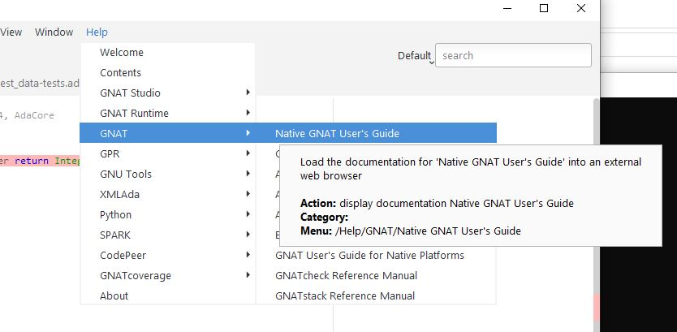

----------------------------------
Currently Unsupported Constructs
----------------------------------

+ Tests for protected subprograms and entries
+ See the latest GNAT Pro User Guide for status

---------------
DO-178C Ready
---------------

+ Natural path from DO-178 low level requirements to structural coverage

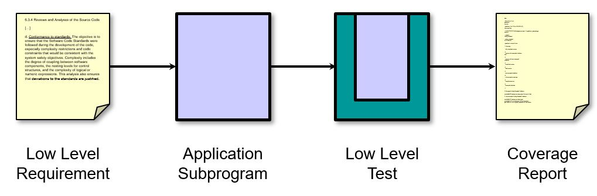

+ Substitution verification implemented, to support OOP supplement of DO-178C

------------------
GNATtest Summary
------------------

+ Automatically creates and maintains harness code, and unit test skeletons for each subprogram to be tested
+ Developers can thus focus on the high-value task of writing the actual test cases
+ Especially valuable in systems requiring high levels of reliability, safety, and/or security

  + Simplifies effort required to implement required test procedures
  + Can use GNATcoverage to verify test completeness

+ Fully integrated into GPS
+ Supports native, cross and high-integrity platforms
