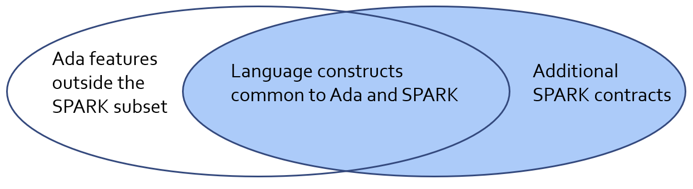

*****************
Course Overview
*****************

==================
A Little History
==================

--------------------
Motivating Example
--------------------

* Consider these lines of code from the original release of the Tokeneer code

   .. code:: Ada

      if Success and then
          (RawDuration * 10 <= Integer(DurationT'Last) and
           RawDuration * 10 >= Integer(DurationT'First))
      then
         Value := DurationT(RawDuration * 10);
      else

* Can you see the problem?
* This error escaped lots of testing!

.. container:: speakernote

   Overflow can happen before check

------------------------
The Verifying Compiler
------------------------

* Could a compiler find the error we just saw?

   - Static analysis of source code...

* What if we had a verifying compiler?

   - Check correctness at compile time
   - Perform exhaustive checking
   - Use types, assertions, and other information in the source code as correctness criteria
   - Work in combination with other program development and testing tools

* Grand Challenge for computer science [Hoare 1968]

.. container:: speakernote

   It exists. GNATprove. This is what we will talk about.

------------------------------------------------
Static Verification and Programming Languages
------------------------------------------------

* There is a catch...
* Our ability to deliver automatic static verification critically depends on the language that is being analyzed.
* Most languages were not designed with static verification as a primary design goal.

---------------------------
Static Verification Goals
---------------------------

* Ideally we would like static verification to be:

   - Deep (tells you something useful)
   - Sound (with no false negatives)
   - Fast (tells you now)
   - Complete (with as few false alarms/positives as possible)

   - Modular and Constructive (works on incomplete programs)

* SPARK is designed with these goals in mind. Since the eighties!

.. container:: speakernote

   "Since the 80ies!" does not mean it is dusty technology!
   We're actually very proud to know what and why we are doing with SPARK over such a long time. This is not something anyone can build overnight. Technically it has been infeasible, but not really anymore...

=======
SPARK
=======

----------------
What is SPARK?
----------------

* SPARK is

   - A programming language
   - A set of program verification tools
   - A design approach for high-integrity software

* All of the above!

----------------
What is SPARK?
----------------

* Programming language - relationship with Ada:

|

=================
Course Contents
=================

-----------------
Course Outline
-----------------

.. container:: columns

 .. container:: column

    * Course Introduction
    * SPARK Rationale And Overview

       - Formal Methods and SPARK
       - SPARK Language and Tools

    * Introduction to Verification with SPARK

       - Data Flow Analysis
       - Contracts
       - Type Contracts

    * Introduction to Proof

       - Proving Programs Correct
       - Proving Absence of Run-Time Errors
       - The Proof Cycle

 .. container:: column

    * Advanced Verification

       - Advanced Proof
       - Depends Contract and Information Flow Analysis
       - State Abstraction

    * Interfacing

       - Crossing the SPARK Boundary
       - Interfaces
       - Interfacing to Other Languages

    * Applying SPARK

       - Designing for SPARK
       - Adoption Guidance

    * Putting It All Together

       - SPARK Example Project

--------------
Course Goals
--------------

* What will you do after the course?

   - Be comfortable with the fundamentals of SPARK.

   - Know where to find out more.
   - Let SPARK work for you on your next project?
   - ... ?
