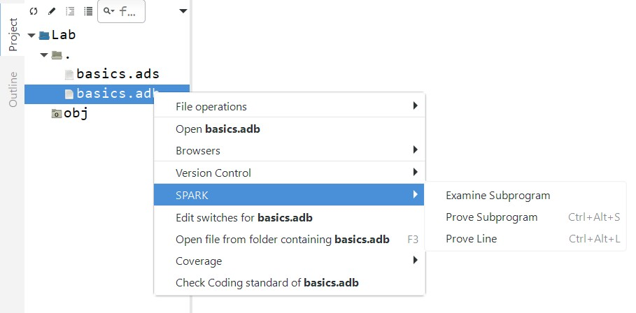

**************************
SPARK Language and Tools
**************************
.. |rightarrow| replace:: :math:`\rightarrow`

=================
Introduction
=================

---------------------------
Static Verification Goals
---------------------------

* Deep, i.e., tells you something useful
* Sound

   - Presents no false negatives
   - If it does not indicate a problem, there is no problem in the analyzed code
   - With as few false alarms as possible

* Fast
* Modular and constructive, works on incomplete programs

=================
Language Design
=================

-------------------------
SPARK - A Brief History
-------------------------

* The SPARK language has continually evolved along with the major revisions of Ada

|

.. image:: ../../images/ada_and_spark_timeline.png
   :width: 85%

.. container:: speakernote

   With SPARK 2014 the lag is (almost) gone (because the tools are built upon the compiler). 

----------------------------
Language Design Principles
----------------------------

* Support the largest practical subset of Ada 2012 that is

   - Unambiguous.
   - Amenable to formal verification which is sound.

* DO-333 says: 

   - "...an analysis method can only be regarded as formal analysis if its determination of a property is sound. Sound analysis means that the method never asserts a property to be true when it is not true."

--------------------------------------
Language Design Principles Explained
--------------------------------------

* "Unambiguous" - What does this mean in practice?

   - No erroneous behavior allowed.
   - No unspecified language features.
   - Limit implementation-defined features to as small a set as possible and allow these to be configured for a particular implementation.

.. container:: speakernote

   Note about first point:
   "Erroneous Execution" in Ada terminology.
   An Ada program is erroneous when it generates an error that is not required to be detected by the compiler or run-time environments.
   Some examples: Unchecked Conversion, Use of Uninitialized Variables, Unchecked Deallocation, Unchecked Access.
   These are excluded from SPARK 

----------------------------
Language Design Principles
----------------------------

* Support the requirements of all relevant software engineering standards and guidance, including DO-178C and DO-333.

   - SPARK 2014 is designed to be a **formal method** as defined by DO-333.

* Support contract-based programming

   - For programmers to declare intent and responsibilities of different parts of the source code
   - Support both static and dynamic verification of contracts

--------------------
The SPARK Language
--------------------

* Designed for static verification 

   - Completely unambiguous
   - All implementation dependencies are made explicit
   - All rule violations are detectable
   - Formally defined
   - Tool supported

* Designed to enable reasoning rigorously about software

   - Nothing hidden, especially state dependencies

* Based on Ada's foundation for high reliability

-------------------------------------------
A Simple Example of Verifiable Properties
-------------------------------------------

.. code:: Ada

   procedure Increment (X : in out Integer) with
   Global  => null,     -- global variable dependencies
   Depends => (X => X), -- flow dependencies
     Pre     => X < Integer'Last,    
     Post    => X = X'Old + 1;
   procedure Increment (X : in out Integer) is
   begin
      X := X + 1;
   end Increment;
 
* These properties are proven (or not) for all possible cases

--------------------------------------------
Verification Requires Construct Exclusions
--------------------------------------------

* Design according to the SPARK design principles:

   - Exclude language features difficult to specify/verify
   - Eliminate sources of ambiguity

* Exclusions

   - Access types and values except "ownership" subset

      + Note you don't need them nearly as much in Ada/SPARK

   - Expressions (including function calls) with side effects
   - Aliasing of names
   - The dreaded `goto` statements

      + Can create loops, which require a specific treatment in formal verification

   - Controlled types (complex control flow)
   - Exception handlers (raising them is allowed)
   - Tasking constructs other than in Ravenscar and Jorvik

======================
Language Limitations
======================

-------------------------------------
Functions May Not Have Side-Effects
-------------------------------------

* The analysis of SPARK programs relies on the property that expressions are free from side-effects
* Function calls can appear in expressions, so function calls must be free from side-effects
* What is a side-effect?

   - With functions, they make nasty situations possible

      + Not so with procedures, due to differences in calling

------------------------
What Is a Side-Effect?
------------------------

.. container:: columns

 .. container:: column
  
    * An expression is side-effect free if its evaluation does not update any object
    * The objects updated by a subprogram call are any parameters of mode out (or in out), plus global variables updated by the subprogram body

 .. container:: column
  
    .. code:: Ada
    
       function F (X : in out Integer)
                   return Integer;
       function Sqrt (X : in Integer) 
                      return Integer;
       
       Global : Integer := 0;
       
       function F (X : Integer)
          return Integer is
       begin
          Global := Global + X;
          return X;
       end F;
     
.. container:: speakernote

   "in out" in a function is illegal SPARK
   modifying a global in a function is illegal SPARK

------------------------------------------
Why not Side Effects - Modifying Globals
------------------------------------------

.. code:: Ada

   Global : Integer := 0;
   function F return Integer is
   begin   
      Global := Global + 1
      return Global;
   end F;
   
   procedure Gear_Down (X, Y : in Integer) is
   begin
      if X = Y then -- put gear down
         ...
      end if;
   end Gear_Down;
   
   Gear_Down (Global, F);
 
* Causes Order-Dependent Code (ODC)

   - If left parameter evaluated first, X=0, Y=1
   - If right parameter evaluated first, X=1, Y=1

-----------------------------------------
Why not Side Effects - `in out` Formals
-----------------------------------------

.. code:: Ada

   function F (X : in out Integer) return Integer is
   begin   
      X := X + 1;
      return X;
   end F;
   ...
   procedure Gear_Down (X, Y : in Integer);
   ...
   Something : Integer := 0; 
   Gear_Down (X => Something, Y => F (Something));
 
* Order Dependent Code

   - If left parameter evaluated first, X=0, Y=1
   - If right parameter evaluated first, X=1, Y=1

----------------------------------------
ODC Without Parameters or Side Effects
----------------------------------------

.. code:: Ada

   procedure Demo is 
      function F (X : in out Integer) return Integer is
      begin   
         X := X + 1;
         return X;
      end F;
      Values : array (1 .. 5) of Integer := (1,2,3,4,5);
      Index : Integer := 1;
   begin
      Values (Index) := F (Index);
      for V of Values loop
         Put_Line (Integer'Image (V));
      end loop;
   end Demo;
 
* For the array assignment (the first statement), the language doesn't say whether the LHS is evaluated first, or the RHS.
* This is rejected in SPARK, functions are not allowed to have mode `in out` or `out` formals.

   - If left hand side evaluated first, result = "22345"
   - If right-hand side evaluated first, result  = "12345"

-------------------------
Parameter Name Aliasing
-------------------------

* In terms of formal and actual parameters
* Occurs when there are multiple names for an actual parameter inside the routine's body

   - Global variable passed as actual parameter and referenced inside subprogram via global name
   - Same actual passed to more than one formal
   - Two actuals are overlapping array slices
   - One actual is contained within another actual

* Can lead to code dependent on parameter-passing mechanism

-----------------------------------------
Parameter Aliasing with Global Variable
-----------------------------------------

.. code:: Ada

   procedure Demo_Aliasing is
     Actual : String := "Hello";
     procedure Print (Formal : in String) is
     begin
       Actual := "World";
       Put_Line (Formal);
     end Print;
   begin
     -- if pass by copy, result is "Hello"
     -- if pass by reference, result is "World"
     Print (Formal => Actual);
   end Demo_Aliasing;
 
.. container:: speakernote

   Rejected in SPARK if Print is not inlined so we would need to either add a precondition or use the --no-inlining GNATprove switch.
   This is a bounded error in Ada 2012. It might raise Program Error, but it might just run (i.e., not be detected) and do whatever it will do.
   What it will do depends on how Formal is passed, and that is up to the compiler since Character is a by-copy type.  If passed by copy, the assignment to Actual does not affect the copy in Formal.
   See RM 6.4.1 paragraphs 6/17-19

-----------------------------------------
Parameter Aliasing via Repeated Actuals
-----------------------------------------

.. code:: Ada

   with Ada.Text_IO;  use Ada.Text_IO;
   procedure Demo_Aliasing is
     Actual : String := "Hello";
     procedure Print (Formal1 : out String;
                      Formal2 : in String) is
     begin
       Formal1 := "World";
       Put_Line (Formal2);
     end Print;
   begin
     -- if pass by copy, result is "Hello"
     -- if pass by reference, result is "World"
     Print (Actual, Actual);
   end Demo_Aliasing;
 
----------------------------------
Aliasing with Complex Data Types
----------------------------------

* Arrays

   - Array elements can be indexed dynamically so this is not allowed (because X and Y could be the same, and aliasing checks are done at flow analysis stage)

      .. code:: Ada

         Swap (My_Array (X), My_Array (Y)); -- Illegal
 
   - In the future, these checks might be moved to the proof stage, allowing the tools to be less restrictive

* Records

   - Aliasing of inputs is permitted if they do not overlap with outputs
   - Different fields of a record cannot overlap so this is allowed

      .. code:: Ada

         Swap (My_Record.F1, My_Record.F2); -- OK
 
----------------------------------------
Parameter Aliasing Prevention In SPARK
----------------------------------------

* Goal: changing the value of an object should not also alter the value of some other object
* Multiple output parameters must not be aliased
* Input and output parameters must not be aliased, unless the inputs are always passed by copy
* Output parameters must never be aliased with global variables referenced by the subprogram
* Input parameters must not be aliased with global variables written by the subprogram, unless they are always passed by copy (reading is OK)

   - Functions cannot have parameters (or global variables) of mode `out` or `in out` so function calls cannot introduce illegal aliasing

----------------------------
Data Initialization Policy
----------------------------

* Modes on formal parameters and data dependency contracts have a stricter meaning than in Ada
* Mode `in` (and global mode `Input`): the object should be completely initialized before the call
* Mode `out` (and global mode `Output`): the object should be completely initialized before returning
* Mode `in out` (and global mode `In_Out`): the object should be completely initialized before calling the subprogram

-----------------------------------------
Data Initialization Policy Consequences
-----------------------------------------

* All inputs must be completely initialized on entry

* All outputs must be completely initialized on exit 

* All objects must be completely initialized when read

   - Except for record objects, provided those components that are read are initialized
   - Above rule exception doesn't apply to array objects

* A parameter or global variable partially written in a subprogram should be mode `in out`, not mode `out`
* :toolname:`GNATprove` will complain if policy is violated

-------------------------------------------
No Initialization Across Library Packages
-------------------------------------------

* In SPARK, package elaboration cannot initialize variables declared in other library packages

* In combination with other rules, prevents elaboration order issues 

.. code:: Ada

   package P is
      X : Integer;
   end P;
   
   with P;
   package body Z with SPARK_Mode is
      ...
   begin
      P.X := 42; -- illegal (can't call P to do it either)
   end Z;
 
-----------------------------
Thus The Term "Safe Subset"
-----------------------------

* A good idea even if you don't yet use all of SPARK

   - Helpful for better coding practices in Ada

      + Reduces chances of errors

   - Works for other languages as well

      + Even without language limitations, useful for reducing complexity of code
      + Enforce through standards rather than compiler

===================================
Differences Between SPARK and Ada
===================================

------------------------------------
Various Other Differences from Ada
------------------------------------

* Important extensions and restrictions

   - E.g., additional aspects not defined by Ada
   - E.g., record type default initialization must be all or nothing

* SPARK Reference Manual mirrors the Ada RM, showing what, if any, is different per construct

   - 3.9.4 Interface Types

      + No extensions or restrictions.

   - 3.10 Access Types - Legality Rules

      1. All forms of access type and parameter declarations are prohibited. [This follows from the rule forbidding use of the Ada reserved word access.]
      2. The attribute 'Access shall not be denoted.

* We will cover many of them

----------------------
Mixing SPARK and Ada
----------------------

* May be necessary for new code

   - A prohibited construct may be "best" approach

* May be necessary for reusing existing code

   - Prohibited constructs may require extensive changes
   - May want to approach legacy code incrementally
   - May have extensive reusable libraries

* Allows verifying as much as possible of a code base

   - An "all or nothing" approach would preclude that

* Therefore SPARK tools only check code "in SPARK"

   - I.e., code intended to comply with the SPARK subset

------------------------
Identifying SPARK Code
------------------------

* Aspect and `pragma SPARK_Mode` specify whether code is intended to be in SPARK

   - Argument values are `On` and `Off`

* Can be applied to individual units, or globally as a default
* Absent the aspect/pragma, code is assumed to be full Ada

------------------------------------
Meaning of `SPARK_Mode` Argument
------------------------------------

* `On`

   - Corresponding code is required to be in SPARK
   - Corresponding code will be analyzed by :toolname:`GNATprove`
   - The default argument when no argument specified explicitly

* `Off`

   - Corresponding code can be in full Ada
   - Corresponding code will not be analyzed by :toolname:`GNATprove`
   - Corresponding code cannot be referenced by SPARK code

-------------------------------
The Pragma Will Be Used Often
-------------------------------

* Because there is no syntax defined for an aspect at several points in the language

   - E.g., optional private part of a package or task declaration

* Can be used anywhere the aspect can be used
* Must appear first (so that it applies to all of it), except for other pragmas if any

---------------------------------
Meaning of "Corresponding Code"
---------------------------------

* Several Ada constructs have multiple parts

   - Package declarations: visible and optional private parts
   - Package bodies: declarative and optional executable parts
   - Subprogram declarations and bodies
   - Others...

* Different modes can be applied to different parts, thus mixing

======================
Mixing SPARK and Ada
======================

------------------------
Identifying SPARK Code
------------------------

* `SPARK_Mode` (aspect or pragma)
* Specifies whether code is intended to be SPARK
* It should be added to every unit to be analyzed

   - or can be set globally using a configuration pragma
   - note that `with`ed units default to `Auto`

      + Up to :toolname:`GNATprove` to determine whether or not a given construct is in SPARK

--------------------
Mixing SPARK Modes
--------------------

   .. code:: Ada

      package P
        with SPARK_Mode => On
      is
         -- package spec is SPARK, so can be used
         -- by SPARK clients
      end P;
      package body P
        with SPARK_Mode => Off
      is
         -- body is NOT SPARK, so assumed to
         -- be full Ada
      end P;
 
------------------------
Setting `SPARK_Mode` 
------------------------

* `SPARK_Mode` can be `On` or `Off` for

   - visible part of package specification
   - private part of package specification
   - declarative part of package body
   - statement part of package body
   - subprogram specification
   - subprogram body

* If SPARK mode is `Off` for a package or subprogram then it cannot be switched `On` for a later part of that package or subprogram
* Note that a package spec and its corresponding body are not the same construct!

   - Mode for the spec does not set mode for the body

--------------------------------------
"Later" Parts Can Be Turned `Off`
--------------------------------------

.. code:: Ada

   package P 
      with SPARK_Mode -- on for package spec
   is
      ...
   private
      pragma SPARK_Mode (Off); -- off for private section
      ...
   end P;
   package body P
      with SPARK_Mode -- on for package body
    is
      ...
   begin
      pragma SPARK_Mode (Off); -- off for package processing
      ...
   end P;
 
-----------------------------------
Two General Principles for Mixing
-----------------------------------

* SPARK code must only reference SPARK code

   - But a SPARK declaration may have a non-SPARK completion

* SPARK code is assumed to enclose SPARK code

   - Unless enclosed code is explicitly marked as non-SPARK

* The word **reference** is key: 

   - The spec is what is referenced (i.e., the declaration) so the completion need not be in SPARK 

   - A non-SPARK package can be "withed" by SPARK code as long as the referenced parts comply with the SPARK subset

---------------------------------
Common Mixed SPARK/Ada Approach
---------------------------------

.. code:: Ada

   package P
      with SPARK_Mode => On
   is
      -- package spec is SPARK, so can be used
      -- by SPARK clients
      procedure Do_This with ...
      ...
   end P;
   package body P
      with SPARK_Mode => Off
   is
      -- body might NOT be in SPARK, i.e., assumed to
      -- be full Ada
   end P;
 
.. container:: speakernote

   The body uses full Ada features which, therefore, should not (and will not) be analyzed.

---------------------------------
Can Verify Selected Subprograms
---------------------------------

* Some specs with `SPARK_Mode` `On`, others `Off`

   - Modes determine what is allowed in the specs

.. code:: Ada

   package Q
     with SPARK_Mode
   is
     -- 'access' legal because subprogram OFF
     procedure P(X : access Integer)
       with SPARK_Mode => Off,
            Pre => X /= null;
     procedure R(X : in out Integer); -- SPARK mode
     -- 'access' illegal because package ON
     procedure S(X : access Integer);
   end Q;
 
.. container:: speakernote

   Of course, we could do the reverse too: set the package's SPARK Mode to Off and only turned On some of the subprograms.

-------------------------------------
So What Can't SPARK Code Reference?
-------------------------------------

* SPARK code must only reference SPARK code

   - Otherwise analysis cannot provide strong guarantees
   - Only one semantics: as if ``100%`` SPARK code in use
   - :toolname:`GNATprove` will reject invalid mixing

* But what constitutes SPARK code?

   - Code explicitly set to `SPARK_Mode` `On`
   - Code covered by a global default value of `On`
   - Code in Ada packages included by with-clauses, as long as the referenced parts are compliant

* Hence: cannot reference non-compliant code and code with `SPARK_Mode` explicitly `Off`

-----------------------------------------
SPARK Code Cannot Use Mode `Off` Code
-----------------------------------------

* That is, when spec is explicitly marked as `Off`

.. code:: Ada

   package Q with SPARK_Mode is
      -- can be called by SPARK code
      -- (even if body of Q isn't SPARK)
      procedure S (X : Integer);
      -- cannot be called by SPARK code
      -- (even though Q is SPARK)
      procedure P (X : Integer)
        with SPARK_Mode => Off;   
   end Q;
 
---------------------------------
Subprogram Specs Are Sufficient
---------------------------------

* `SPARK_Mode` `On` for declaration, `Off` for body
* SPARK callers "see" only SPARK, thus callable

.. code:: Ada

   package Z with SPARK_Mode is
      procedure R (X : in out Integer);
   end Z;
   package body Z with SPARK_Mode is
      -- R is callable because its spec is ON
      procedure R (X : in out Integer) is
         pragma SPARK_Mode (Off);      
      begin
         ...
      end R;
   end Z;
 
-----------------------------------------
Mode `Off` for Bodies Allows Full Ada
-----------------------------------------

.. code:: Ada

   with System;
   with Ada.Unchecked_Conversion;
   package body Z is
      ...
      procedure R (X : in out Integer) is
         pragma SPARK_Mode (Off);
         type Pointer is access all Integer;
         function As_Pointer is new Ada.Unchecked_Conversion
           (Source => System.Address, Target => Pointer);
         
         P : constant Pointer := As_Pointer (X'Address);
      begin
         P.all := P.all + 1;  --!
      end R;
      ...
   end Z;
 
.. container:: speakernote

   Not that anybody would write that specific code for R:w

------------------------------------------
If Implementing A SPARK Spec In Full Ada
------------------------------------------

* The user must verify SPARK properties

   - Failure to do so may invalidate entire :toolname:`GNATprove` analysis of SPARK caller code, silently!

.. code:: Ada

   procedure P (X : in out Integer) with
      SPARK_Mode => On,
      {SPARK verification aspects,} - user must verify
      Pre  => ..., -- User can enable run-time checks
      Post => ...;
   procedure P (X : in out Integer)
      with SPARK_Mode => Off
   is
      ...
   begin
      ...
      pragma Assume (...); -- user must verify
      ...
   end P;
 
-----------------------------------------
What If the Mode Is Not Explicitly Set?
-----------------------------------------

* I.e., `SPARK_Mode` aspect/pragma is not applied 

   - Neither in the unit in question nor globally

* The mode is then said to be `Auto`
* In this mode :toolname:`GNATprove` only checks subset conformance on declarations of entities actually referenced in SPARK code

   - Their implementations are not analyzed by :toolname:`GNATprove`

* Allowed for Ada packages named in `with` clauses

   - Language-defined packages
   - Application packages to be reused without analysis

* Such Ada code can still be used with SPARK code

---------------------------------
Auto `SPARK_Mode` Example
---------------------------------

.. code:: Ada

   package Ada.Text_IO is -- no SPARK mode set
      ...
      type File_Access is
          access constant File_Type; -- not SPARK
      function Standard_Input
          return File_Access;        -- not SPARK
      function Standard_Output
          return File_Access;        -- not SPARK
      ...
      ...
      procedure Put_Line (Item : String); -- SPARK-compliant
      ...
      ...
   end Ada.Text_IO;
 
------------------------------------------
Example Usage of Auto `SPARK_Mode`
------------------------------------------

.. code:: Ada

   with Ada.Text_IO;  use Ada.Text_IO;
   package body QQ is
     pragma SPARK_Mode (On);
     procedure R (X : in out Integer) is
       F : constant File_Access := Standard_Output;
     begin
       Set_Output (F.all);
       ...
       Put_Line (Integer'Image (X));
     end R;
   end QQ;
 
.. code:: console

   File_Access is not allowed in SPARK violation of
      pragma SPARK_Mode at line 4
   explicit dereference is not allowed in SPARK violation
      of pragma SPARK_Mode at line 4
   warning: no Global contract available for Put_Line
   warning: assuming Put_Line has no effect on global items

.. container:: speakernote

   Put Line is not rejected because its spec is SPARK conformant.

-----------------------------------------
Setting Default `SPARK_Mode` Globally
-----------------------------------------

* Achieved via *configuration pragma* usage

   - In a file containing only pragmas
   - Applies to entire partition (program), by definition
   - Illustrated later...

* If the argument is `Off` then Ada is assumed

   - Only code explicitly marked `On` is assumed to be in SPARK
   - Appropriate when only a very small amount is in SPARK

* If the argument is `On` then SPARK is assumed

   - Only code explicitly marked as `Off` is assumed to be in Ada
   - Appropriate when only a small amount is in Ada

-----------------------------------------
When `SPARK_Mode` Is Globally `Off`
-----------------------------------------

.. code:: Ada

   package Z is -- SPARK mode globally Off
      procedure Q with
        SPARK_Mode => On;
   private
      pragma SPARK_Mode (On);
      ...
   end Z;
 
* You cannot turn it on in a later part without also turning it on in the earlier part

   .. code:: console

     z.ads:4:06: cannot change SPARK_Mode from Off to On
     z.ads:4:06: SPARK_Mode was set to Off at config.adc:1
     z.ads:7:23: incorrect use of SPARK_Mode
     z.ads:7:23: value Off was set for SPARK_Mode on "Z" at
        config.adc:1

---------------------------------------------
When `SPARK_Mode` Is Globally `Off` (2)
---------------------------------------------

* Only the pragma can turn it on for a unit

.. code:: Ada

   pragma SPARK_Mode (On);
   package Z
      --  with SPARK_Mode => On this would be rejected
   is
      procedure Q with
        SPARK_Mode => On;
   private
      pragma SPARK_Mode (On);
   end Z;
 
================
Language Tools
================

-----------------
SPARK Key Tools
-----------------

* GNAT compiler

   - checks conformance of source with Ada 2012 and SPARK 2014 

   - compiles source into executable

* :toolname:`GNATprove`

   - Performs additional SPARK checks
   - Performs flow analysis
   - Performs integrity and functional verification using formal proof

* Integrated Development Environments (2)
* :toolname:`GNATtest` (not really a SPARK tool)

   - An automatic unit test stub generator, including driver infrastructure

---------------------------------------------
:toolname:`GNATprove` - A Command Line Tool
---------------------------------------------

* Invocation syntax:

   - :command:`gnatprove -P prj-file [switches] [-cargs switches]`

* Project file required
* A large number of switches

   - Basic switches such as Help and number of processors to use
   - Analysis modes
   - Reporting and Warnings modes
   - Prover controls

* See the User Guide appendix *"Command Line Invocation"* for the full list

--------------------------------------
:toolname:`GNATprove` Under the Hood
--------------------------------------

.. image:: ../../images/gnatprove-general_flow.png

.. container:: speakernote

   If CodePeer is installed and in the PATH, the command line option --codepeer=on enables this feature.
   CodePeer will then be run before the other SPARK analyses. If it proves a check, GNATprove will not attempt to run another prover on this check

----------------------------------------
:toolname:`GNATprove` Output for Users
----------------------------------------

---------------------------------------
Analysis Summary File "gnatprove.out"
---------------------------------------

* Located in :filename:`gnatprove/` under project object dir
* An overview of results for all checks in project
* Especially useful when results must be documented
* Details in the UG *"How to View GNATprove Output"*

|

-----------------------------------------------
:toolname:`GNATprove` Message Categories (1/2)
-----------------------------------------------

* Error Messages

   - Indicate illegalities
   - E.g., SPARK subset violations and violations of flow analysis
   - Processing cannot continue so cannot be suppressed

      .. code:: console

         explicit dereference is not allowed in SPARK violation
           of pragma SPARK_Mode at line 4
         global "Z" is missing from input dependence list
 
* Information Messages

   - Notify users of limitations of :toolname:`GNATprove` on some constructs
   - Prevent confusion regarding other output
   - Can include the list of proved checks if requested

      .. code:: console

         info: overflow check proved
 
------------------------------------------------
:toolname:`GNATprove` Message Categories (2/2)
------------------------------------------------

* Warning Messages

   - Indicate suspicious situations, e.g., useless assignments
   - Prefixed with **warning:**
   - Can be suppressed with `pragma Warnings`

      .. code:: console

         warning: no Global contract available for "Put_Line"
         warning: assuming "Put_Line" has no effect on global items
 
* Check Messages

   - Indicate potential problems affecting correctness
   - E.g., possible failing run-time checks or unproved contracts
   - Prefixed with **low** or **medium** or **high**
   - Cannot be suppressed like warning messages
   - Can be individually justified with `pragma Annotate`

      .. code:: console

         medium: postcondition might fail,
           cannot prove X < Integer'last (e.g. when X = 2147483647)
 
--------------------------------------
:toolname:`GNATprove` Analysis Modes
--------------------------------------

* **Check** simply verifies code is in SPARK subset
* **Flow Analysis**

   - Verifies no uninitialized data read, performs flow analyses

* **Proof**

   - Verifies program has no run-time errors and that contracts are respected in the implementation

* Selected by switch :command:`--mode=<mode>`

   :check: Fast partial check for SPARK subset
   :`check_all`: Full check for SPARK subset (e.g., side effects)
   :flow: Flow mode
   :prove: Proof mode
   :all: ``check_all`` + flow + prove (default)

----------------------------------------------
General :toolname:`GNATprove` Usage Workflow
----------------------------------------------

* Invoke :toolname:`GNATprove` on your sources, using **mode** switch to select analysis
* Modes determine the proofs :toolname:`GNATprove` attempts
* Thus modes determine what is accepted/rejected
* Rejection is indicated by error messages

   - Messages starting with **low** or **medium** or **high**

* By default, absence of error messages |rightarrow| success

   - Analysis is sound: guaranteed no mode-specific error in code analyzed

* If rejected, change the code: fix or justify (if can)

---------------------------------
What Is Verified In "flow" Mode
---------------------------------

* Code intended to be in SPARK is indeed in subset
* With no SPARK-specific aspects (standard Ada), success means no reads of uninitialized data
* With Global aspects added, success means correct use of global data, or no use at all
* With Depends aspects added, success means information flow for parameters is as specified
* If you get error messages, change the code...
* We will cover these aspects in detail

----------------------------------
What Is Verified In "prove" Mode
----------------------------------

* SPARK subset conformance 

* Success proves absence of run-time errors

   - From Ada language-defined run-time checks
   - From explicit raise statements
   - From Assert pragmas
   - But you will likely need to add some contracts to get there

* With preconditions and postconditions, success proves those contracts always hold

   - Unit functionality, as expressed in postconditions

   - Any arbitrary abstract properties you specified 

* If you get error messages, change the code...

-------------------------------------------------
Using SPARK Features with :toolname:`GNATprove`
-------------------------------------------------

* Can start with only Ada and basic checking modes

   - Nothing SPARK-specific
   - No Ada contracts required (but allowed)
   - :toolname:`GNATprove` only attempts to verify SPARK subset compliance

* As contracts are added, invoke :toolname:`GNATprove` with more advanced analysis modes

   - Increases the strength of the properties proven (e.g., no buffer overflow, functional correctness)

* Use a more advanced mode only after analysis at all lower modes is successful

   - Higher modes' analyses depend on them (e.g., subset conformance, no uninitialized data is read)
   - Higher modes perform nearly all lower modes' analyses

--------------------
Which Mode To Use?
--------------------

* Note proof logic assumes valid flow analysis results

   - E.g., invalid data initialization may invalidate proof

* Thus make sure you pass flow analysis (using "flow" mode) before moving on to "proof" mode 

* Consider that mode "all" does all the necessary analyses and does them in the necessary order
* But doing all analyses every time is inefficient if you know lower mode analysis will pass... thus the options

------------------------------------------
:toolname:`GNATprove` Project File Usage
------------------------------------------

* Apply the usual attributes to define source dirs, set compiler switches, and so on
* Tool package `Prove` corresponds to :toolname:`GNATprove`

   - Use attribute `Proof_Switches` to apply tool-defined switches

.. code:: Ada

   project SPARK_Dev is
     for Languages use ("Ada");
     ...
     package Compiler is
       for Default_Switches ("Ada") use ("-gnatwa", 
        "-gnata", ... ); -- Enable contracts and assertions
     end Compiler;
     package Prove is
       for Proof_Switches use ("--level=3");
     end Prove;
     ...
   end SPARK_Dev;
 
-----------------------------------------
To Specify Default `SPARK_Mode` Value
-----------------------------------------

* Include pragma `SPARK_Mode` in a "configuration pragmas" file, with the chosen default value
* The project file specifies path/name of this file via the `Global_Configuration_Pragmas` attribute
* GPR file

   .. code:: Ada

      project P is
         package Builder is
            for Global_Configuration_Pragmas
               use "config.adc";
         end Builder;
         ...
      end P;
 
* config.adc

   .. code:: Ada

      pragma SPARK_Mode (On);
      pragma ...
      ...
 
-------------------------------------
Two Available IDEs Supporting SPARK
-------------------------------------

* :toolname:`GNAT Studio`

   - The AdaCore flagship IDE
   - Best overall

* GNATbench for Eclipse

   - If you are already using Eclipse

---------------------------------
Basic :toolname:`GNAT Studio` Look and Feel
---------------------------------

-----------------------------------------
:toolname:`GNATprove` "SPARK" Main Menu
-----------------------------------------

.. container:: speakernote

   "all" = all provers
   The "Examine *" menu entries also check for SPARK subset conformance.
   Proof involves the Flow Analysis function as well.

------------------------------
Project Tree Contextual Menu
------------------------------

-----------------------------
Source Code Contextual Menu
-----------------------------

.. container:: speakernote

   Prove Line - The current line under the cursor when the contextual menu was invoked.

---------------------------------------
"Basic" Profile's Proof Dialog Panel
---------------------------------------

.. image:: ../../images/prove_dialog-basic.jpeg

.. container:: speakernote

   SPARK Menu - Prove All

----------------------------------------
Example Analysis Results in :toolname:`GNAT Studio`
----------------------------------------

----------------------------------
Preference for Selecting Profile
----------------------------------

.. container:: columns

 .. container:: column
  
    * Controlled by SPARK preference "User profile"

       - Basic
       - Advanced

    * Allow more control and options

       - Fast versus precise proof
       - Prover timeout (seconds)
       - Et cetera

 .. container:: column
  
    .. image:: ../../images/gnatstudio-preferences-spark.jpeg

-------------------------------
"Advanced" Proof Dialog Panel
-------------------------------

.. image:: ../../images/prove_dialog-advanced.jpeg

========
Lab
========

.. include:: labs/030_spark_language_and_tools.lab.rst

=========
Summary
=========

--------
FAQs
--------

* Why can't I find the "SPARK" Menu?

   - Check that :toolname:`GNATprove` is on your PATH

* What if I have both the SPARK 2005 and SPARK 2014 toolsets installed?

   - Two menus will appear - "SPARK" and "SPARK 2014"
   - Use the "SPARK 2014" one in this course

-------------------------
SPARK Language Benefits
-------------------------

* Amplifies the strengths of Ada

   - Truly complete specifications for subprograms etc.

* Gives program source text a precise meaning
* Guarantees freedom from certain classes of error

   - Extremely important errors, such as buffer overflow

* Simplifies early detection of other errors
* Captures important design information in the code

--------------------------------------
SPARK Language and Key Tools Summary
--------------------------------------

* Restrictions are imposed on language constructs

   - Some because their effects would defy formal analysis
   - Others because analysis is feasible but not yet mature
   - Some are always suspect (e.g., side-effects)

* Language subset is very large, most of Ada 2012

   - The subset is expanding over time

* Includes additional aspects not in Ada (yet)
* Mixing with Ada allows flexibility and reuse

   - Semantics are same as ``100%`` SPARK code

* Based on a few key tools and IDE support
