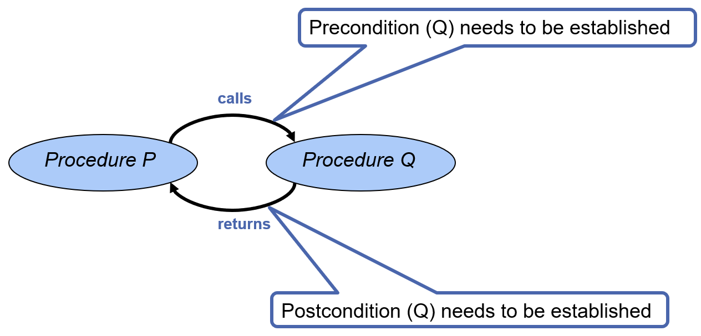
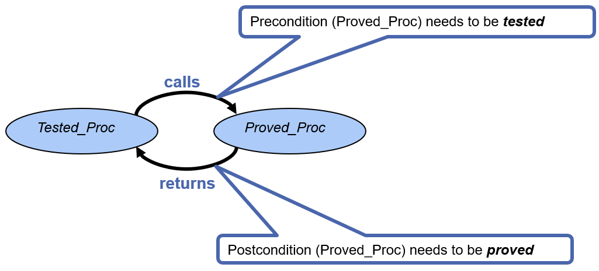
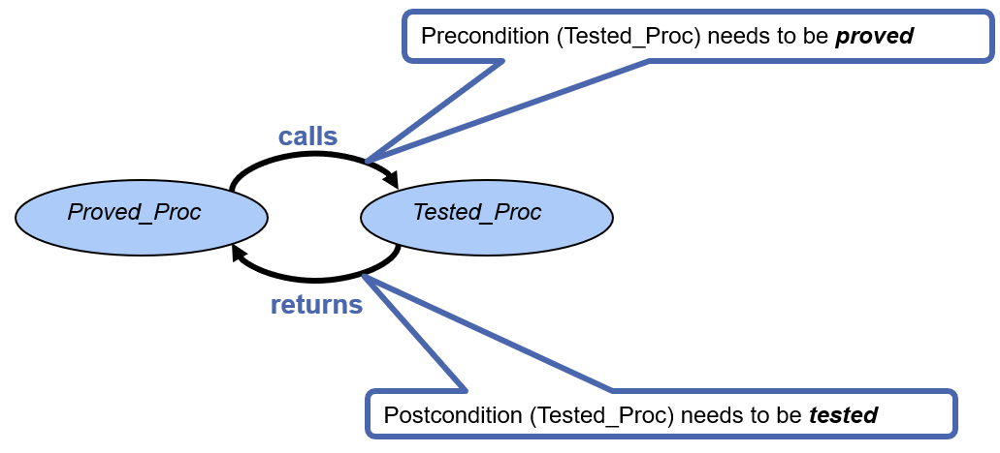
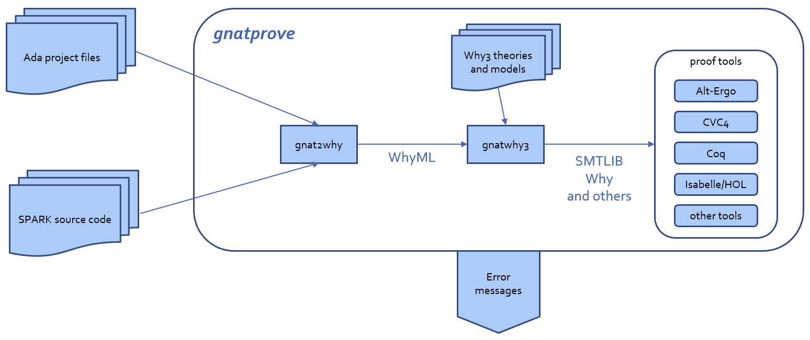

**************************
Proving Programs Correct
**************************

==============
Introduction
==============

-----------------------------------
Verification Condition Generation
-----------------------------------

* Verification Condition/Proof Obligation/Check

   - Logical formula

* Is the verification condition (VC) valid?

   - Can be checked by an automatic prover

* What does it mean if a VC is not valid?
* How are verification conditions generated?

   - Weakest precondition calculus

---------------
Hoare Triples
---------------

* Hoare triples used to reason about program correctness 

   - With pre- and postconditions

* Syntax: ``{P}S{Q}``

   - ``S`` is a program
   - ``P`` and ``Q`` are predicates
   - ``P`` is the precondition
   - ``Q`` is the postcondition

* Meaning of ``{P}S{Q}`` triple:

   - If we start in a state where ``P`` is true and execute ``S``, then ``S`` will terminate in a state where ``Q`` is true.

-----------------------
Example Hoare Triples
-----------------------

* Are these valid?

.. code:: Ada

   {true} x := 5 {x = 5}
   {x = y} x := x + 3 {x = y + 3}
   {x > 0} x := x * 2 {x > -2}
   {x = a} if (x < 0) then x := -x {x = |a|}
   {false} x := 3 {x = 8}
 
-------------------------------------------
Example Triplets - Stronger Postcondition
-------------------------------------------

* Example:

   .. code:: Ada

       {X = 5} X := X * 2 {X > 0}
 
* Is this triplet valid?
* How can we make a stronger postcondition?

   - What about 5 `<` X and X `<` 20 ? 

* What is the strongest possible postcondition for this precondition and program statement?

.. container:: speakernote

   Strongest postcondition for this precondition and program is X = 10.

-------------------------
Strongest Postcondition
-------------------------

* Strongest postcondition (generally): 

   - if ``{P}S{Qstrong}`` and for all ``Q`` such that ``{P}S{Q}``, ``Qstrong => Q``, then ``Qstrong`` is the strongest postcondition of ``S`` with respect to ``P``

----------------------
Weakest Precondition
----------------------

* Conversely: what is the weakest precondition?

* Generally: 

   - If for all P such that ``{P}S{Q}``, ``P => WP``, then ``WP`` is the weakest precondition of ``S`` with respect to ``Q``

* All valid preconditions, what do they have in common?

   - That is the weakest precondition.

-----------------------------------------
Example Triplets - Weakest Precondition
-----------------------------------------

* Same example, consider the postcondition is fixed, what is the weakest precondition (WP)?:

   .. code:: Ada

       {WP} X := X * 2; {X = 10}
 
* Modified example:

   .. code:: Ada

       {WP} X := X * 2; {5 < X and X < 20}
 
   - Some valid preconditions?
   - What is the weakest precondition?

.. container:: speakernote

   Weakest precondition for first example is X = 5.
   Valid preconditions for second example: X = 3, X = 4, ..., X = 9
   Is X = 10 a valid precondition? No
   WP second example: `2 < X` and `X < 10`

-------------------------------
Weakest Precondition Calculus
-------------------------------

* A calculus for "backward reasoning"
* Predicate transformer to ``WP``
* Function ``WP`` that takes a program statement ``S`` and a postcondition ``Q`` and returns a precondition
* Read ``WP(S,Q)`` as "the weakest precondition of ``S`` with respect to ``Q``"

-------------------------------
Weakest Precondition Calculus
-------------------------------

* How is WP calculus used for program verification?
* Observation: ``{P}S{Q}`` iff ``(P => WP (S, Q))``

   - For a sequence of statements ``S``, for example a subprogram, want to prove ``{P}S{Q}``.
   - We may prove ``P => WP (S, Q)`` instead.

* Verification is reduced to the calculation of weakest preconditions!

======================
Modular Verification
======================

----------------------
Modular Verification
----------------------

---------------------------
Comparison Test and Proof
---------------------------

* Pros and Cons

   - Presence/Absence of Bugs
   - State-of-the-art, State-of-practice

* Both techniques flawed
* Both techniques can be expensive
* Industry standards

   - DO-178B, DO-178C, DO-333

* Another problem - program not all SPARK, not even all Ada - some COTS, Libraries, C, ???  What can you do?
* How to combine?

=========================
Combining Proof and Test
=========================

---------------------------
Combining Proof and Test 
---------------------------

* Same contract for test and proof
* Modular verification
* Combination should be at least as strong as testing
* What happens when some subprograms are tested and some are proved?

--------------------------------------
Proof and Test - Hybrid Verification
--------------------------------------

* Scenario: **tested** procedure calls proved procedure
* Still modular verification
* Responsibilities!

--------------------------------------
Proof and Test - Hybrid Verification
--------------------------------------

* Scenario: **proved** procedure calls tested procedure
* Still modular verification
* Responsibilities!

------------------------------------------
Combining Proof and Test - Cost Benefit 
------------------------------------------

.. container:: columns

 .. container:: column
  
    * 80/20 rule holds for both test and proof activities
    * Same area of code is usually not simultaneously difficult to prove and difficult to test

 .. container:: column
  
    .. image:: ../../images/80-20_provable_or_testable.png

--------------------------
Combining Proof and Test
--------------------------

* In Ada 2012 the proof contracts are executable - they can be checked at run time and an error is raised when a check fails
* Compilation options to support integration of test and proof

   - Assertion checks enabled via :command:`-gnata` compiler switch
   - Aliasing can be checked at run time with the :command:`-gnateA` switch.
   - Initialization and Validity of Data can be checked at run time with the :command:`-gnateV` and :command:`-gnatVa` switches.
   - See the *SPARK 2014 Toolset User's Guide* for more details.

-----------------------------------------
:toolname:`GNATprove` Tool Architecture
-----------------------------------------

==============
Summary
==============

---------
Summary
---------

* Proving correctness of a subprogram

   - Extent to which it complies with its specification.
   - Proof that it can't fail (AoRTE)

* We now need to test/prove contracts

   - We've just moved where the bugs can be found
