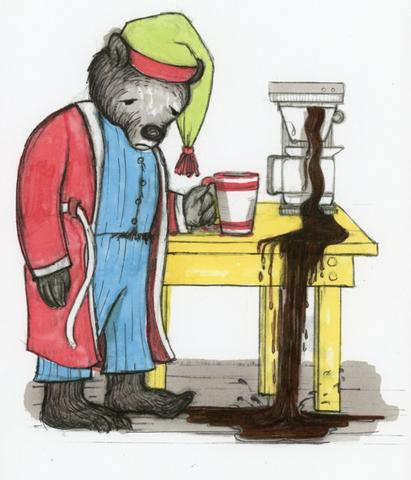
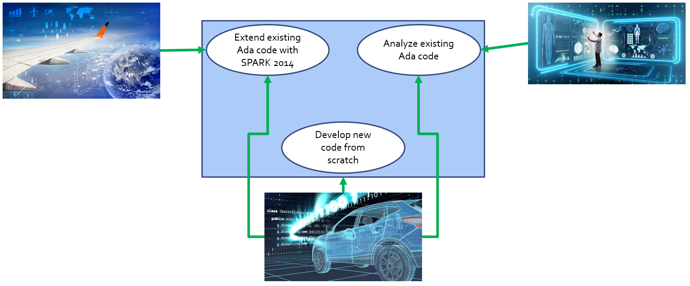

************************************
Proving Absence of Run Time Errors
************************************
.. |rightarrow| replace:: :math:`\rightarrow`

==============
Introduction
==============

-----------------
Run-Time Errors
-----------------

---------------------------
Run-Time Errors - Example
---------------------------

.. container:: columns

 .. container:: column
  
    * A simple assignment statement
    
    .. code:: Ada
    
       A (I + J) := P / Q;
       
    * Which are the possible run-time errors for this example?

 .. container:: column
  
    *  ``I+J`` might overflow the base-type of the index range's subtype
    *  ``I+J`` might be outside the index range's subtype
    *  ``P/Q`` might overflow the base-type of the element type
    *  ``P/Q`` might be outside the element subtype
    *  ``Q`` might be zero

====================================
Absence of Run Time Errors (AoRTE)
====================================

----------------------------
Run-time Exception Freedom
----------------------------

* By default, the compiler will generate an executable that contains checks 

   - So that an exception is raised if a run-time error occurs

* Having proved that there are no run-time errors, the Ada checks can be justifiably removed:

   - Faster executable, with closer correspondence between source code and object code

* However, you might not want to do this:

   - Verification assumes a stable environment
   - If the environment is hostile (e.g. if memory could be externally modified), you may want defense-in-depth by retaining the Ada checks

----------------------------
Run-time Exception Freedom
----------------------------

* :toolname:`GNATprove` can automatically produce verification conditions to prove the absence of run-time errors
* A verification condition is generated for:

   - Every potential run-time error, or
   - Every execution path leading to a potential run-time error
   - (Depending on the VC generation strategy)

* Proving every verification condition proves that the potential run-time errors cannot arise in practice
* Special case of regular proof

--------------------------------
RTE Freedom - A Simple Example
--------------------------------

* :toolname:`GNATprove` generates verification conditions to show that no exceptions will be raised

   .. code:: Ada

      procedure Increment (X: in out Integer)
      is
      begin
         X := X + 1;
      end Increment;
 
* But it cannot prove this for the assignment statement so it reports: overflow check not proved
* How can we ensure that ``X + 1`` doesn't overflow?

--------------------------------
RTE Freedom - A Simple Example
--------------------------------

* How can we ensure that ``X + 1`` doesn't overflow?
* We can add a precondition to the subprogram

   .. code:: Ada

      procedure Increment (X: in out Integer)
         with Pre => (X < Integer'Last)
      is
      begin
         X := X + 1;
      end Increment;
 
* This avoids the potential overflow

   - But only if we can guarantee that the precondition is met
   - The tools automatically (attempt to) prove that the precondition holds for all callers of `Increment`

--------------------------
RTE Freedom - An Example
--------------------------

* A procedure that adds two to `X` via multiple calls to `Increment`

   .. code:: Ada

      procedure Add2 (X : in out Integer)
      is
      begin
         Increment (X);
         Increment (X);
      end Add2;
 
* The tools report *precondition not proved* for each call to `Increment`

* So let's add a precondition to `Add2` ... 

--------------------------
RTE Freedom - An Example
--------------------------

* So let's add a precondition to `Add2` ... 

   .. code:: Ada

      procedure Add2 (X : in out Integer)
         with Pre => (X <= Integer'Last - 2)
      is
      begin
         Increment (X);
         Increment (X);
      end Add2;
 
* This eliminates the problem for the first call to `Increment`, but the tools still can't prove the check for the second call
* Why not?

--------------------------
RTE Freedom - An Example
--------------------------

* Recall: The tools perform modular verification

   .. code:: Ada

      procedure Add2 (X : in out Integer)
         with Pre => (X <= Integer'Last - 2)
      is
      begin
         Increment (X);
         Increment (X);
      end Add2;
 
* When proving `Add2`, all we know about `Increment` must come from its contract, not its body
* So after the first call to `Increment`, we know nothing about the new value of `X` (except that it is in type)

--------------------------
RTE Freedom - An Example
--------------------------

* We can add a postcondition to tell the tools what `Increment` does...

   .. code:: Ada

      procedure Increment (X: in out Integer)
         with Pre  => (X < Integer'Last),
              Post => (X = X'Old + 1)
      is
      begin
         X := X + 1;
      end Increment;
 
* The tools prove that the body of `Increment` satisfies the postcondition - easy!
* And now all checks are proved for `Add2` so we can be sure it will not raise any run-time exceptions

=======
Usage
=======

-----------------
Usage Scenarios
-----------------

.. container:: speakernote

   What is this diagram trying to show?
   There are different clients with different requirements.
   Some will want only to develop new code from scratch, some want to analyze existing code, some want to do a mixture.

-------------------------------------
Local Subprograms Without Contracts
-------------------------------------

.. code:: Ada

 procedure Increment (X: in out Integer) is
 begin
    X := X + 1;
 end Increment;
    
 procedure Add2 (X : in out Integer)
    with Pre => (X <= Integer'Last - 2)
 is
 begin
    Increment (X);
    Increment (X);
 end Add2;
     
* In fact, a local subprogram without a contract, will be inlined for proof. :toolname:`GNATprove` will then prove it!

   - Default behavior

---------------------
Inlined Subprograms
---------------------

* Inlined subprograms are analyzed specially

   - :toolname:`GNATprove` sees calls exactly as if statements in the body are textually present at the call sites 

   - Thus :toolname:`GNATprove` knows effects of body statements

* Must meet restrictions to be inlined in this sense

   - Local

   - Without contracts 

   - Not externally visible
   - See UG "7.4.5. Contextual Analysis of Subprograms Without Contracts" for full list

* Options for strict modular verification: 

   - :command:`--no-inlining`
   - :command:`--no-global-generation`

------------------------------------
Semantics of Contracts - Overflows
------------------------------------

* Remember, contracts have the same semantics as Ada:

   .. code:: Ada

      procedure P (X, Y : in Positive; Z : out Positive)
         with Post => (if X + Y <= Positive'Last
                          then Z = X + Y)
                      and
                      (if X + Y > Positive'Last
                          then Z = Positive'Last);
 
   - ``warning: overflow check might fail``

* Is this a false alarm in your context?

--------------------------
Overflow Checking Modes 
--------------------------

* Different user needs

   - Run-time assertion checking for contracts on/off in deliverable
   - Amount of proof activity, requirements on false alarm rate

* Customisable overflow checking mode
* Options

   - Strict Ada semantics for overflow checking
   - Minimized overflow checking
   - Eliminated - no possibility of overflow (mathematical semantics)

* Specified semantics is used both at run time and for proof

-------------------------
Overflow Checking Modes
-------------------------

* GNAT Pro compiler switch controls semantics of overflow checks in assertions (contracts) and code

   - :command:`-gnato13`

      + First digit specifies overflow mode for code
      + Second digit specifies overflow mode for contracts

   - 1 = strict Ada semantics for overflow checking
   - 2 = minimized overflow checking
   - 3 = eliminated - no possibility of overflow (mathematical semantics)

========
Lab
========

.. include:: labs/090_proving_absence_of_run_time_errors.lab.rst

=========
Summary
=========

--------------------
SPARK Silver Level
--------------------

* Goal is to statically prove absence of run-time errors (AoRTE)

   - No exceptions raised

* Proof at this level detects programming errors such as

   - Divide by zero
   - Out of bounds array indexes
   - Numeric overflow
