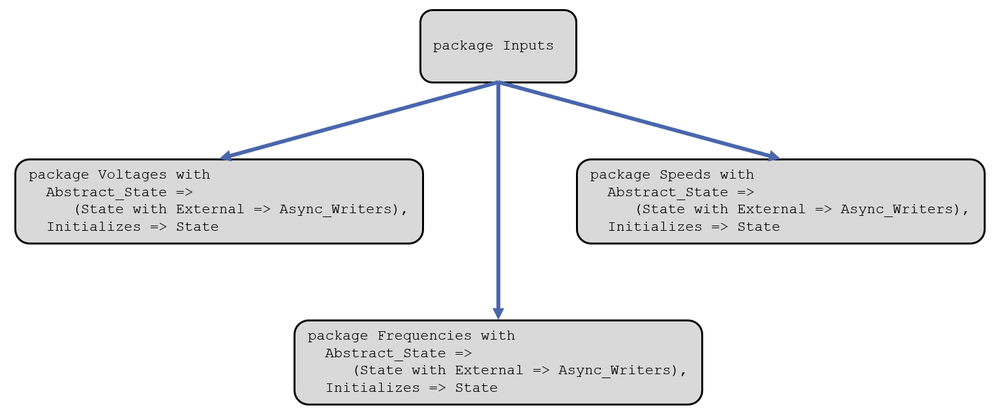
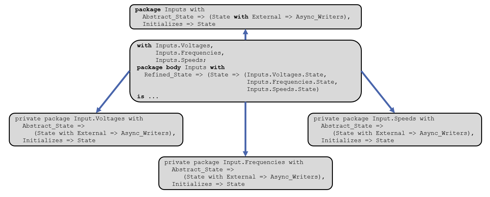

*********************
Designing for SPARK
*********************

==============
Introduction
==============

--------------
Introduction
--------------

* The design of a SPARK program can have a major impact on the size, clarity, and stability of the SPARK contracts, and hence the cost of their maintenance
* Keys factors of good SPARK programs are:

   - Identification and classification of state

   - Abstraction and localization of state

* Good SPARK design leads to contracts which add value to the software
* The principles of good SPARK design are as important for adapting pre-existing software as for new developments

==============
Architecture
==============

----------------------------
Choice Of Architecture
----------------------------

* The choice of architecture is vitally important in determining the following properties of a program:

   - Clarity
   - Simplicity of analysis
   - Simplicity of correctness proof
   - Ease of testing/validation
   - Stability

----------------------------
Importance Of Architecture
----------------------------

* Of particular importance are

   - Aggregation of state
   - Location of state components

* The SPARK contracts are a measure of the good use of abstraction and the degree of interaction between state components
* Good architectural choices are reflected in compact, easily comprehensible contracts
* Poor choices lead to large `Global` contracts with many variables and complex pre- and postconditions
* SPARK contracts provide an architectural quality measure

---------------------------------
Designing For Concise Contracts
---------------------------------

* SPARK provides a hierarchical package structure

   - Using this mechanism appropriately is the key to concise contracts

* We will consider how the following features of program design affect SPARK contracts

   - Unnecessary state
   - Localization of state and state abstraction
   - Localization of state and package hierarchy

   - Appropriate use of abstraction and refinement

* Good SPARK design leads to contracts which are concise, maintainable and easier to prove

---------------------------
Unnecessary State Example
---------------------------

.. code:: Ada

  procedure A_OK (Y, Z : in out Natural)
    with SPARK_Mode,
         Post => Y = Z'Old and Z = Y'Old
  is
     X : Natural;
  begin
     X := Z;
     Z := Y;
     Y := X;
  end A_OK;

  X : Natural;

  procedure A_Daft (Y, Z : in out Natural)
    with SPARK_Mode,
         Global => (Output => X),
         Post => Y = Z'Old and Z = Y'Old
  is
  begin
     X := Z;
     Z := Y;
     Y := X;
  end A_Daft;

-------------------------------
Unnecessary State Explanation
-------------------------------

* Unnecessary state complicates SPARK contract

   - `A_Daft` requires a `Global` contract and what is this `X` output that is not in the postcondition?
   - `X` will be a global variable of every subprogram that calls `A_Daft`

* Unnecessary state causes flow analysis warning

   - Unused assignment to `X` on successive calls to `A_Daft`

-------------------------------------------
Unnecessary State With State Abstractions
-------------------------------------------

.. code:: Ada

  package Store with SPARK_Mode, Abstract_State => State is
     procedure Put (X : in Natural)
       with Global => (Output => State);
     function Get return Natural
       with Global => (Input => State);
  end Store;

  with Store;
  procedure A_Dafter (Y, Z : in out Natural)
    with Global => (Output => Store.State),
         Post => Y = Z'Old and Z = Y'Old
  is
  begin
     Store.Put (Z);
     Z := Y;
     Y := Store.Get;
  end A_Dafter;

* The state of a local package is like a local variable

   - Remember that packages can be nested inside subprograms

* The state of a library-level package behaves like a global variable

   - The variables and state abstractions of such packages therefore appear in `Global` contracts

-------------------
Program Hierarchy
-------------------

* In Ada and SPARK there is a hierarchy of packages in a program

* Where modification of one package requires access to the state of another package

   - A hierarchy should be chosen to facilitate such access without the need to maintain local copies of other packages' state
   - Maintaining local copies of another package's state is error prone and may lead to complex contracts

===================
State Abstraction
===================

----------------------------
Abstraction And Refinement
----------------------------

* A record can be used to group related data into a single object

   - Reducing what could be a number of variables into a single one with components
   - Reducing the number of parameters of subprograms that operate on the data

* The record can be abstracted by declaring it as a private data type

   - Allowing subprograms operating on the data type to maintain an invariance on objects of the type and preventing users from directly meddling with its components

   - Aids maintainability; the details (refinement) of the type can be changed without directly affecting all users of the type

----------------------------------
State Abstraction And Refinement
----------------------------------

* State abstraction behaves similarly to a private type

   - For hidden data declared in a package or private child packages

.. code:: Ada

    pragma SPARK_Mode (On);
    package With_Hidden_State with
      Abstract_State => State
    is
       procedure P (N : Natural) with Global => (In_Out => State);
    end With_Hidden_State;

* A state abstraction

   - Can represent many objects at once
   - Reduces the size of Global contracts
   - Aids maintainability - refinement of state abstraction may be changed without directly affecting clients

.. code:: Ada

    pragma SPARK_Mode (On);
    package body With_Hidden_State with
      Refined_State => (State => (A, B, C))
    is
       A, B, C : ...
       procedure P (N : Natural) with
         Refined_Global => (Input  => A, Output => B);
    end With_Hidden_State;

* One state abstraction can represent many variables

----------------------------
Abstraction And Refinement
----------------------------

* Private types can have components which are themselves a private type
* Similarly, state abstractions of a package can have constituents which are state abstractions

   - But a constituent must be private to the package

* Abstraction and its refinement should only be used to group conceptually related data

   - This is recommended for private data types and state abstraction

-------------------------------------
Example: An Input Interface Package
-------------------------------------

-------------------
A Better Solution
-------------------

------------------------------------
Effective Use Of State Abstraction
------------------------------------

* The previous examples showed the importance of state abstraction in achieving concise, maintainable contracts
* The choice of refinement also affects contract clarity
* Five broad classes of data have been identified:

   - External state

      + With sub-classes: Inputs and Outputs

   - Essential state
   - State introduced by optimization
   - Logically unnecessary state
   - Local copies of other packages' state

* State can have an integrity level, such as "Top Secret", "Secret", "Safety-Critical", "Non-Safety-Critical", etc.

---------------------------------------------
Effective State Abstraction: Initialization
---------------------------------------------

* The initialization of state is crucial
* Every object and state abstraction must be initialized entirely before it is read

   - :toolname:`GNATprove` checks this using flow analysis

* The state of a package can be initialized in two ways:

   - During package elaboration by initialization at the point of declaration (including default initialization) or in the sequence of statements of a package body

   - During execution by an explicit call to an "initialize" procedure declared by the package

------------------------------------
Effective Use Of State Abstraction
------------------------------------

* Principle

   - A state abstraction should only be refined into constituents of the same class, integrity level and with the same sort of initialization

      + Do not mix different classes
      + Do not mix independent input and output streams
      + Do not mix differing integrity levels (also avoid this in private types)
      + Do not mix objects initialized at elaboration time with those initialized by an explicit procedure call

   - The aggregation of different classes of data into a single state abstraction may cause misleading coupling between items, hence add complexity and reduce clarity of contracts

* The effective use of abstraction and refinement is therefore not the same as the maximum use

-------------------------------------
Example: External State Abstraction
-------------------------------------

* Independent inputs and outputs should not be combined

   - In this example a bad choice has been made: combining an input stream reading temperatures with an output stream controlling pressure

.. code:: Ada

   package Bad_Classes with
     SPARK_Mode,
     Abstract_State => (State with External =>
                       (Async_Readers, Async_Writers)),
     Initializes => State
   is
      procedure Write_Pressure (P : Integer) with
        Global => (Output => State);
      procedure Read_Temperature (T : out Integer) with
        Global => State;
   end Bad_Classes;

-------------------------------------
Example: External State Abstraction
-------------------------------------

* Using the poorly chosen state abstraction

   - We have added a `Depends` contract to demonstrate the unintended interaction between `Pressure` and `Temperature`

      .. code:: Ada

         pragma SPARK_Mode (On);
         with Bad_Classes;
         procedure Process
           (Pressure : in Integer; Temperature : out Integer) with
           Global => (In_Out => Bad_Classes.State),
           Depends => (Temperature => Bad_Classes.State,
                       Bad_Classes.State => Pressure)
         is
         begin
            Bad_Classes.Write_Pressure (Pressure);
            Bad_Classes.Read_Temperature (Temperature);
         end Process;

* We get the following warning with or without a `Depends` contract

   .. code:: console

      warning: unused initial value of "Bad_Classes.State"

* With a `Depends` contract we also get

   .. code:: console

      warning: missing dependency "Temperature => Pressure"

-------------------------------------
Example: External State Abstraction
-------------------------------------

* A better choice of state abstractions

   - Separate state abstractions are used for the independent input and output streams

      .. code:: Ada

         package Good_Classes with
           SPARK_Mode,
           Abstract_State =>
             ((Pressure with External => Async_Readers),
              (Temperature with External => Async_Writers)),
           Initializes => Temperature
         is
            procedure Write_Pressure (P : Integer) with
              Global => (Output => Pressure);
            procedure Read_Temperature (T : out Integer) with
              Global => Temperature;
         end Good_Classes;

   - Using this package in `Process` there are no warnings

-------------------------------------------
Candidates For A Single State Abstraction
-------------------------------------------

* The essential state of a package is a strong candidate for a single state abstraction
* If this is not the case then perhaps the package should be divided
* State introduced in a package for optimization and efficiency reasons
* Logically unnecessary state of  a package

-----------------------------
Logically Unnecessary State
-----------------------------

* Logically unnecessary state is usually read-only or write-only
* Read-only variables should be considered to be constants and as such should not appear in `Global` contracts
* Write-only variables normally appear as variables or state abstractions in `Global` contracts

   - Contracts are often clearer if these are not combined by abstraction with essential state
   - Alternatively write only state may be moved outside the SPARK boundary

      + For example test points and logging during development and testing

===================
SPARK Boundary
===================

-------------------------------------
Moving State Outside SPARK Boundary
-------------------------------------

* We want to send the value of local variable `X` to a test point

   - This feature is only required during development and test
   - It is to be removed in delivered code
   - We do not want its removal to have any effect on analysis

.. code:: Ada

   with Test_Points;
   procedure Calc (A, B : Natural; C : out Natural) with
     SPARK_Mode
   is
      X : Long_Integer;
   begin
      X := Long_Integer (A) + Long_Integer (B);
      -- Call inside boundary but acts as null
      Test_Points.Copy (X);
      if X in 0 .. Long_Integer (Natural'Last) then
         C := Natural (X);
      else
         C := Natural'Last;
      end if;
   end Calc;

-------------------------------------
Moving State Outside SPARK Boundary
-------------------------------------

* We declare a `Test_Points` package which is in SPARK

   - It declares an external state abstraction `The_Point` with the property `Async_Readers`; it is a volatile output

   - The `The_Point` will never be read so it requires no initialization
   - Copy has a null `Global` contract stating that it has no globals and a null `Depends` contract stating it has no effect on any state known to the SPARK code

.. code:: Ada

   package Test_Points with
     SPARK_Mode,
     Abstract_State =>
         (The_Point with External => Async_Readers)
   is
      procedure Copy (Val : Long_Integer) with
        Global => null,
        Depends => (null => Val);
   end Test_Points;

-------------------------------------
Moving State Outside SPARK Boundary
-------------------------------------

* `Test_Points` body is also in SPARK

   - It has a `Refined_State` contract and declares the volatile variable `Test_Point` at the address of the test point port

.. code:: Ada

   with System.Storage_Elements;
   package body Test_Points with
     SPARK_Mode,
     Refined_State =>  (The_Point => Test_Point)
   is
      Test_Point : Long_Integer with
        Volatile,
        Async_Readers,
        Address => System.Storage_Elements.To_Address
                   (16#FFFF_FFF0#);

-------------------------------------
Moving State Outside SPARK Boundary
-------------------------------------

* The body of `Copy` is not in SPARK (`SPARK_Mode => Off`)

   - First a helper subprogram is implemented in SPARK which writes to `Test_Point`; the refinement of `The_Point`
   - The declaration of `Copy` has a null `Global` contract which is assumed since its body is not in SPARK: the write to `Test_Point` via the call to `To_Test_Point` is ignored

.. code:: Ada

   procedure To_Test_Point (Val : Long_Integer) with
        Global => (Output => Test_Point)
      is
      begin
         Test_Point := Val;
      end To_Test_Point;
      procedure Copy (Val : Long_Integer) with
        SPARK_Mode => Off
      is
      begin
         To_Test_Point (Val);
      end Copy;
   end Test_Points;

-------------------------------------
Moving State Outside SPARK Boundary
-------------------------------------

* After development and testing

   - The implementation of `Copy` can be replaced by a null statement without affecting the rest of the program

.. code:: Ada

   procedure Copy (Val : Long_Integer) with
        SPARK_Mode => On
    is
    begin
       null;
    end Copy;
   end Test_Points;

-----------------
Read-Only State
-----------------

* How do you deal with a memory-mapped constant that is read-only (e.g. in ROM)?
* You really don't want to declare this as a variable, since if you do, it will appear in `Global` contracts everywhere
* Ada allows a deferred constant to be imported and to have an address clause, so:

.. code:: Ada

   with System.Storage_Elements;
   package Read_Only_State with
     SPARK_Mode
   is
      type T is array (1 .. 100) of Integer;
      Data_1 : constant T;
   private
      pragma Import (Assembler, Data_1);
      for Data_1'Address use
        System.Storage_Elements.To_Address (16#FFFF_0000#);
   end Read_Only_State;

===================
Summary
===================

-------------------
Design Guidelines
-------------------

* Use abstraction and refinement to hide detail but avoid combining unlike classes of state or logically distinct data
* Use private child packages where the state of a package is wholly a constituent of some higher visibility package
* Avoid making local copies of state which is available by accessor functions from elsewhere in the system
* Strictly separate state initialized by elaboration from that initialized by explicit procedure call

-----------------------
Design Guidelines (2)
-----------------------

* Make read-only variables constants
* Separate write-only state (e.g. logging or test points) from essential state

   - Or move it outside the SPARK boundary

* Regard unexpected `Global` contract growth and contract obscurity as a warning that program structure and state location could be improved
