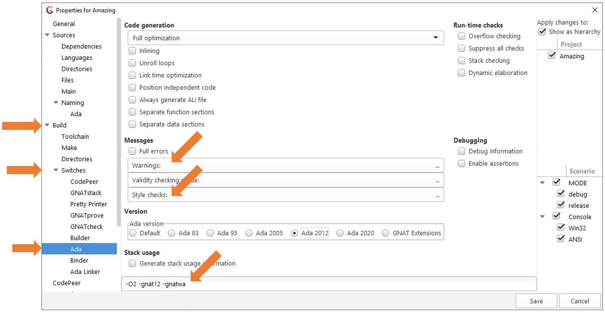
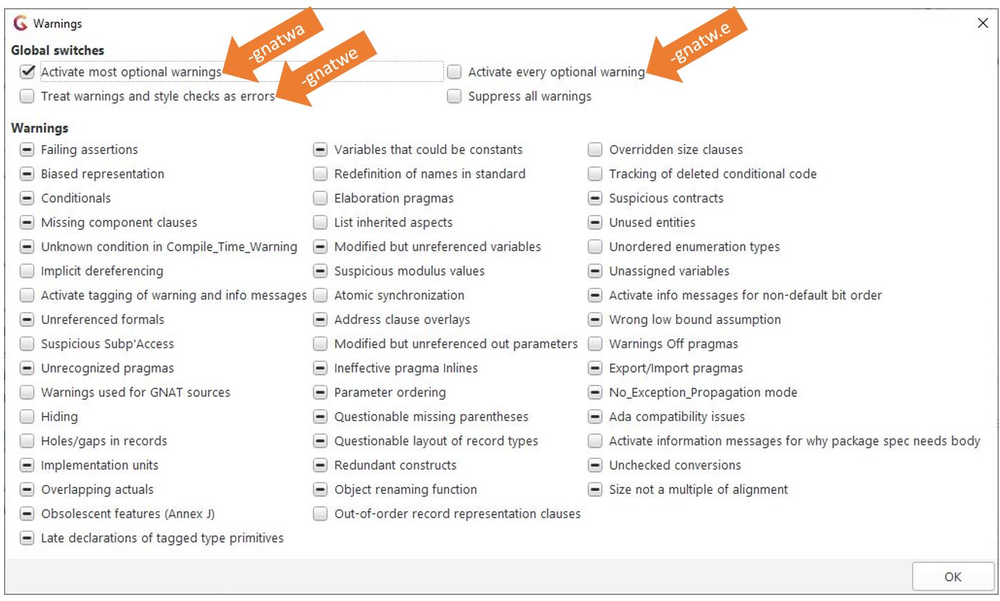
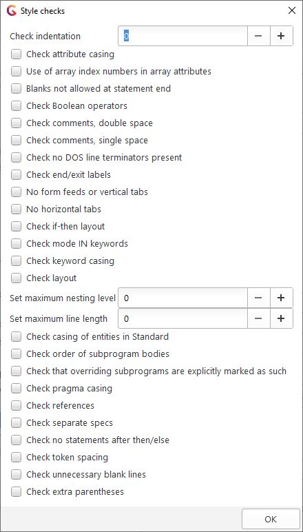
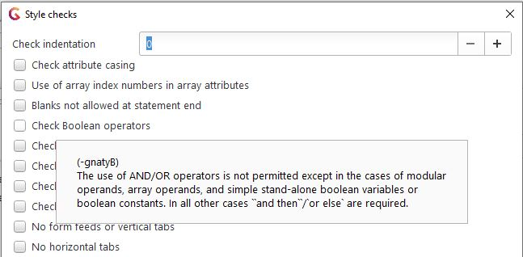
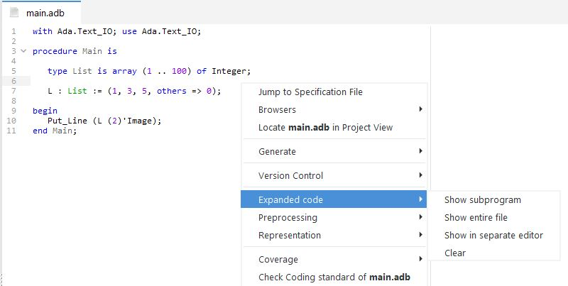
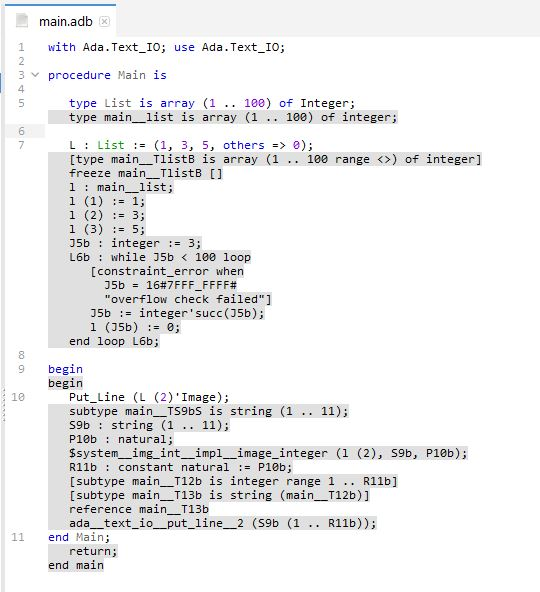

.. role:: ada(code)
    :language: Ada

******************************************
GNAT Compiler Static Checking & Analysis
******************************************

==============
Introduction
==============

--------------
Introduction
--------------

+ GNAT can be configured to perform static analysis

  + Warnings enabled via compiler switches

+ GNAT can be told that a subset of the language will be adhered to by the source code

  + Via language-defined :ada:`pragma Restrictions`
  + Affects code generation and run-time library candidates
  + Useful for certification

+ GNAT's analysis is extensive, but not without limitations

  + A compiler rather than a static analyzer
  + :toolname:`CodePeer` will be used as a counter-example

===============
GNAT Warnings
===============

-------------------------
GNAT Warning Categories
-------------------------

+ Definite errors
+ Probable errors
+ Possible mismatches with user expectations
+ Redundant code
+ Representation-related warnings

  + Biased integer representation, etc.

+ See *GNAT User's Guide* for all switches and their meanings

------------------------------------
Controlling Warnings With Switches
------------------------------------

+ Activated with option :command:`-gnatw[x]`

  + Where *x* is a character(s) specific to a warning

+ Deactivated with capitalized version of switch

  + E.g., :command:`-gnatwc` activates, :command:`-gnatwC` deactivates

+ :toolname:`GCC` back-end offers distinct warnings too
+ Warnings for nasty cases are enabled by default

  + Unintentional address clause overlays
  + Others...

------------------
Warnings Example
------------------

.. code:: Ada
   :number-lines: 1

   function Bad (B1, B2 : Boolean) return Integer is
      Result : Integer;
   begin
      Result := Result + 1;
      if B1 then
         return Result;
      end if ;
      Result := Bad (B1, B2);
   end Bad;

:command:`gcc -c -gnatwa bad.adb`

   ``bad.adb:4:14: warning: "Result" may be referenced before it has a value``

   ``bad.adb:8:04: warning: useless assignment to "Result", value never referenced``

   ``bad.adb:8:11: warning: "return" statement missing following this statement``

   ``bad.adb:8:11: warning: Program_Error may be raised at run time``

-------------------------
Definite Error Examples
-------------------------

+ When the compiler can tell that an assertion is always false
+ When exceptions are raised but not caught locally and **No_Exception_Propagation** is in place

.. columns::

   .. column::

      .. code:: Ada

         procedure Demo is
         begin
            ...
            if Failed then
               raise Failure;
            end if ;
            ...
         end Demo;

   .. column::

      .. code:: Ada

         procedure Demo is
         begin
            ...
            if Failed then
               raise Failure;
            end if ;
            ...
         exception
            when Failure =>
               ...
         end Demo;

--------------------------------
(Very) Probable Error Examples
--------------------------------

+ Conditions that are always false or always true
+ Unused formal parameters

  + Can apply :pragma:`pragma Unreferenced`, especially in OOP case

+ Variables that could be declared as constants

  + Not so much an error but should be heeded

+ Variables assigned but not read
+ Variables read but not assigned
+ Unchecked conversions with different source and target type sizes

--------------------------------------
Probable Error Examples Continued...
--------------------------------------

+ Unlikely modulus value in type declaration

   + When you have :ada:`type T is mod 2*8;` you get:

      ``warning: suspicious "mod" value, was ** intended?``

   + In case you meant :ada:`type T is mod 2**8;`

+ Suspicious actual parameter ordering

   .. code:: Ada

      package body P is
         procedure Op (Foo, Bar, Baz : Integer) is
          ...
         end Op;

         Foo, Bar, Baz : Integer;
         begin
            ...
            Op (Foo, Baz, Bar); -- Same names but different order

---------------------------------------
Run-Time Parameter Aliasing Detection
---------------------------------------

+ Specifically for SPARK (formally analyzable subset of Ada)
+ Compiler must reject code if aliasing is detected
+ For hard cases you can request run-time checks

  + Check is issued at every call, so beware performance
  + Requires :command:`-gnateA` (not a warning switch!)

.. code:: Ada

   with Ada.Text_IO; use Ada.Text_IO;
   procedure Demo is
      Actual : String := "Hello";
      procedure Print (Formal1 : out String;
                       Formal2 : in String) is
      begin
         Formal1 := "World";
         -- If by-copy, prints "Hello"
         -- If by-reference, prints "World"
         Put_Line (Formal2);
      end Print;
   begin
      Print ( Actual, Actual ); -- Program_Error raised if switch applied
   end Demo;

-------------------------
Redundant Code Examples
-------------------------

+ Type conversion when the entity is already of the target type
+ Use of attribute Base where :ada:`T'Base` is same as :ada:`T`
+ Example: Machine has 8-, 16-, and 32-bit integers

   * :ada:`type Counter is range -(2**15) .. +(2**15 - 1);`
   * :ada:`Counter'Base` would be 16-bits - same range as :ada:`Counter`

---------------------
Redundant Code Quiz
---------------------

+ Use only the GNAT documentation

  + Relevant User Guide
  + GNAT Reference manual

+ Question: What is the switch that detects comparison of a boolean expression to an explicit value of True?

   .. code:: Ada

      if Weight_On_Wheels = True then

   + Answer: :animate:`-gnatwr (enables all of them)`

---------------------------------------------
Possible User Expectation Mismatch Examples
---------------------------------------------

+ When missing parentheses may be confusing

   * :ada:`-A mod B` can be read as:

      :ada:`-(A mod B)` :math:`\checkmark`

      **OR**

      :ada:`(-A) mod B` *X* ... but probably intended

+ When :ada:`'Length` is used as an array index, thus assuming a low bound of 1
+ When :ada:`pragma Inline` is applied to a routine that cannot be generated inline

-------------------------------------------
Controlling Warnings With A Single Switch
-------------------------------------------

+ Switch :command:`-gnatwa` enables almost all warnings

  + Those typically useful
  + Good balance between actual problems and false positives

+ Switch :command:`-gnatw.e` enables absolutely all warnings

  + Including those not activated by :command:`-gnatwa`
  + Not recommended for typical use
  + Likely generates many warnings you'll end up ignoring
  + But you might want some of them, individually

---------------------------------------------------
Highly Optional Warnings Enabled By -gnatw.e
---------------------------------------------------

+ Implicit dereferencing (missing optional :ada:`.all`)
+ Nested declaration hiding an outer declaration
+ Tags (strings) added to warning messages
+ Record representation clauses that specify gaps
+ Overlapping subprogram actual parameters
+ Declaration of names already in package :ada:`Standard`
+ Possible elaboration problems
+ Listing of inherited aspects
+ Variables modified by passing to mode :ada:`out` formal parameters, but then unreferenced by caller
+ Notifications of deleted conditional code
+ Unordered enumeration value comparisons

-----------------------------------------
Unordered Enumeration Value Comparisons
-----------------------------------------

+ Most enumerations are not semantically ordered

   .. code:: Ada

      -- not semantically ordered
      type Stop_Light_Colors is (Red, Yellow, Green);
      -- semantically ordered
      type Days is (Mon, Tue, Wed, Thu, Fri, Sat, Sun);

+ Comparisons other than equality are suspect

   .. code:: Ada

      if Current_Color > Yellow then -- must be Green, so go

+ Maintainers (you!) may change order later

   .. code:: Ada

      type Stop_Light_Colors is
         (Red, Yellow, Flashing_Yellow, Green);

+ GNAT :ada:`pragma Ordered` can be used say that such comparisons make sense

   .. code:: Ada

      pragma Ordered (Days);

-------------------------------------------
Notifications of Deleted Conditional Code
-------------------------------------------

+ Also known as deactivated code
+ Applies to if-statements and case-statements
+ May be useful in certified applications

.. container:: latex_environment footnotesize

   .. code:: Ada
      :number-lines: 22

      begin
         Do_Something;
         if False then
            -- warning: this code can never be executed and has been deleted
            Not_Called;
         else
            Do_Something_Else;
         end if;

``example.adb:26:10: warning: this code can never be executed and has been deleted``

-------------------------------
Highly Optional Warnings Quiz
-------------------------------

+ Use only the GNAT documentation

  + Relevant User Guide
  + GNAT Reference manual

+ Question: What is the switch that enables notifications of deleted conditional code?

   + Answer: :animate:`-gnatwt`

---------------------------------------------
Controlling Warnings Within the Source Text
---------------------------------------------

+ Via :ada:`pragma Warnings`

  + See **Implementation Defined Pragmas** in *GNAT Reference Manual*

+ Syntax

   + All have an optional string literal parameter :ada:`Reason` ignored by compiler but perhaps processed by other tools

.. container:: latex_environment footnotesize

   .. code:: Ada

      pragma Warnings (On | Off);
      -- Local_Name => Object/Type name
      pragma Warnings (On | Off, Local_Name);
      -- Static_String_Expr => Compiler warning switches
      pragma Warnings (Static_String_Expr);
      -- Static_String_Expr => Pattern matching warning message text
      pragma Warnings (On | Off, Static_String_Expr);

--------------------------------
Pragma Warnings Usage Examples
--------------------------------

+ All warnings off in this region of code only

   .. code:: Ada

      pragma Warnings (Off);
      Free (X);
      pragma Warnings (On);

+ All warnings off for this object, throughout its scope

   .. code:: Ada

      New_Tgt_Node : Counter;
      pragma Warnings (Off, New_Tgt_Node);

+ All warnings off that emit messages matching this text, in this region of code only

   .. code:: Ada

      -- Optional; matches any message text
      pragma Warnings (Off, "loop range is null*");
      --  On monoprocessor targets, the following loop will
      --  never execute (no other CPUs).
      for CPU_Id in CPU'First + 1 .. CPU'Last loop
         Start_CPU (CPU_Id);
      end loop ;
      pragma Warnings (On, "loop range is null*");

=====================
GNAT Style Checking
=====================

-----------------------
GNAT "Style" Checking
-----------------------

+ Style rules we use within AdaCore

  + Not a general coding standards checker (see :toolname:`GNATcheck`)
  + Some are arbitrary
  + Main thing is to be consistent

+ Categories of checks

  + Layout/presentation
  + Sound Engineering

+ Note that you don't have to use any/all of these!

---------------------------------
GNAT Style Enforcement Switches
---------------------------------

+ Activated with option :command:`-gnaty[x]`

  + Where x is a character(s) specific to a warning

+ Deactivated after minus (-):

  + :command:`-gnatyc` activates, :command:`-gnaty-c` deactivates

+ :command:`-gnatyy` activates most style warnings
+ :command:`-gnatyN` suppresses all style warnings
+ See *GNAT User's Guide* section 3.2.5 for all the options available

--------------------------------
Layout and Presentation Checks
--------------------------------

+ Letter casing

  + Attributes, reserved words, user-defined identifiers consistent with declarations, etc.

+ Blank characters and lines
+ Indentation
+ Comment layout
+ Line length
+ Others...
+ Note you can directly request *Ada Reference Manual* layout
+ See the *GNAT User's Guide* for discussion

-----------------------------------
Sound Engineering Checks Examples
-----------------------------------

+ Array dimensions are specified in attributes only when necessary (for multidimensional arrays)
+ All subprograms have separate declarations
+ Short-circuit boolean operators (:ada:`and then`, :ada:`or else`) are used

  + Except when used on modular operands, array operands, simple stand-alone boolean variables and constants
  + In all other cases the short-circuit form is required

+ No extra parentheses

   .. code:: Ada

      if (Weight_On_Wheels = True) then

---------------------
Ensuring Overriding
---------------------

+ A subprogram with a semantically different profile is not overriding

  + Different (misspelled?) subprogram name
  + Different (misspelled?) formal parameter names
  + Additions or deletions of formals, etc.

+ Language allows you to ensure overriding

  + But optional so there is a GNAT switch

  .. code:: Ada

     type Parent is tagged private;
     procedure Initialize (This : in out Parent);

     type Child is new Parent with ...
     overriding procedure Initialise (This : in out Child);

  + Compilation error since not an overriding

------------------------------
Sound Engineering Style Quiz
------------------------------

+ Use only the GNAT documentation

  + Relevant User Guide
  + GNAT Reference manual

+ Question: what is the switch that enables checks for explicit overriding use on declarations?

   + Answer: :animate:`-gnatyO`

------------------------
Warnings Versus Errors
------------------------

+ If you must ensure issues are caught, failing to compile is the most rigorous enforcement
+ Compiler can be told to treat warnings as errors

  + Thus code rejected at compile-time

+ Use switch :command:`-gnatwe`

  + Warnings become errors
  + Style violations become errors too
  + Warning messages still appear but no code generation

----------------------------------------------
IDE Integration (Project Properties Editor)
----------------------------------------------

-----------------
Warnings Dialog
-----------------

---------------------
Style Checks Dialog
---------------------

--------------------------------------
Dialog Pop-Ups Explain Style Options
--------------------------------------

=============================
Language Subset Definitions
=============================

--------------------------------
Definition of Language Subsets
--------------------------------

+ Uses language-defined :ada:`pragma Restrictions`

   .. code:: Ada

      pragma Restrictions (restriction{, restriction});
      restriction ::= restriction_identifier |
                      restriction_parameter_identifier =>
                            restriction_parameter_argument

+ Provides control over many features

  + Tasking, exceptions, dispatching, code generation, elaboration, etc.

+ Benefits

  + Faster execution on a compatible run-time library
  + Safer coding
  + Certification restrictions compliance
  + Compiler and target portability

-----------------------------------------
Example Restriction & Violation Message
-----------------------------------------

.. code:: Ada
   :number-lines: 1

   pragma Restrictions (No_Implicit_Heap_Allocations);

   with Ada.Command_Line;

   package Lib_Level is

      Command_Name : constant String :=
                     -- Returns unconstrained type
                     Ada.Command_Line.Command_Name;

   end Lib_Level;

``lib_level.ads:9:04: violation of restriction "No_Implicit_Heap_Allocations" at line 1``

Only happens for library level package specs, not just any package and not package bodies.

-------------------------
Restriction Identifiers
-------------------------

+ All language-defined identifiers are implemented

  + Core restrictions (see 13.12.1)
  + Real-time tasking restrictions (see D.7)
  + High integrity restrictions (see H.4)
  + A few shown here, for comparison

+ GNAT defines additional restriction identifiers
+ All restrictions, both language-defined and GNAT-defined, are listed and described in the *GNAT Reference Manual*

------------------------
Restriction Categories
------------------------

+ Portability
+ Allocation
+ Access Types & Values
+ Exceptions
+ OOP
+ Tasking
+ Real-Time Programming
+ Code Generation
+ Miscellaneous
+ GNAT defines additional restrictions in all these categories

   + We examine some of them here...

---------------------------------------
Applying GNAT Restriction Identifiers
---------------------------------------

+ Can be in source or in a configuration file

  + Configuration file name can be default or given by gpr file
  + Default config file name is :filename:`gnat.adc`

     .. code:: Ada

        pragma Restrictions (No_Implicit_Heap_Allocations);
        pragma Restrictions (No_Implicit_Conditionals);
        pragma Restrictions (No_Entry_Calls_In_Elaboration_Code);
        ...

+ :toolname:`GNATbind` can list all restrictions that could be applied to the code corresponding to a given ALI file

  + Via :command:`-r` switch
  + Useful for code audit, and code generation control

------------------
OOP Restrictions
------------------

+ :ada:`No_Dispatch` (RM H.4)

  + Ensures at compile time that there are no occurrences of :ada:`T'Class`, for any tagged type :ada:`T`
  + Prevents dynamic dispatching but also other usage

+ :ada:`No_Dispatching_Calls` (GNAT)

  + Ensures at compile time that the generated code involves no dispatching calls
  + Allows use of record extensions, classwide membership tests and other classwide features not involving implicit dispatching
  + Comparable to :ada:`No_Dispatch` except it allows all classwide constructs that do not imply dispatching

-------------------------------------
OOP Restrictions Quiz - Definitions
-------------------------------------

.. code:: Ada

   package Definition is
   
      type T is tagged record
         Data : Natural;
      end record;
   
      procedure P (X : T);

      type DT is new T with record
         More_Data : Natural;
      end record;
   
      not overriding procedure Q (X : DT);

   end Definition;

------------------------------
OOP Restrictions Quiz - Quiz
------------------------------

.. container:: latex_environment tiny

   .. code:: Ada
      :number-lines: 1

      pragma Restrictions (No_Dispatching_Calls);

      with Definition;  use Definition;
      procedure Demo is

         procedure Test (O : T'Class) is
            N : Natural := O'Size;    --  (1) Error or OK?
            C : T'Class := O;         --  Error: implicit dispatching Call
         begin
            if O in DT'Class then     --  (2) Error or OK?
               Q (DT (O));            --  OK   : Type conversion plus direct call
            else
               P (O);                 --  Error: Dispatching call
            end if;
         end Test;

         Obj : DT;
   
      begin
         P (Obj);                    --  OK   : Direct call
         P (T'Class (Obj));          --  (3) Error or OK?
         Test (Obj);                 --  OK   : Type conversion
      end Demo;

1) Error or OK?

   .. container:: animate 2-

      Error: Dispatching call

2) Error or OK?

   .. container:: animate 3-

      OK: Membership test

3) Error or OK?

   .. container:: animate 4-

      Error: Dispatching call

-----------------------------------------
Exceptions Restrictions Form A Spectrum
-----------------------------------------

+ :ada:`No_Exceptions` (RM H.4)

  + Ensures there are no raise statements and no handlers

+ :ada:`No_Exception_Handlers` (GNAT)

  + Ensures there are no exception handlers
  + Any exception raised will result in an immediate call to the "last chance handler"

+ :ada:`No_Exception_Propagation` (GNAT)

  + Exceptions are never propagated out of a subprogram
  + Handlers are allowed (but may not contain an exception occurrence identifier)
  + Handler must be in the same subprogram, so that the effect of a raise is essentially a goto statement
  + Any other raise statement is considered unhandled

-----------------------------------------
Exception Restriction Spectrum Examples
-----------------------------------------

.. code:: Ada

   procedure Demo is
   begin
      ...
      if Failed then
         raise Failure;  -- Violoates "No_Exceptions"
         -- (If "No_Exception_Propagation" is applied - go to last chance handler)
      end if;
      -- (Does not violate "No_Exception_Handlers")
   end Demo;

.. code:: Ada

   procedure Demo is
   begin
      ...
      if Failed then
         raise Failure;  -- Violoates "No_Exceptions"
         -- If "No_Exception_Propagation" is applied - go to last chance handler
      end if;
      ...
   exception
      when Failure =>
         ...  -- Violates "No_Exception_Handlers"
         -- "No_Exception_Propagation" does not cause go to last chance handler
   end Demo;

--------------------------------
GNAT Tasking Restrictions Quiz
--------------------------------

+ Use only the GNAT documentation

  + Relevant User Guide
  + GNAT Reference manual

+ In Ravenscar, all priorities are statically assigned
+ GNAT defines a tasking restriction that requires all priority expressions to be static
+ Question: what is that restriction identifier?

   + Answer: :animate:`Static_Priorities`

---------------------------
Controlling Implicit Code
---------------------------

+ :ada:`No_Implicit_Conditionals` (GNAT)

  + Details in a moment

+ :ada:`No_Implicit_Dynamic_Code` (GNAT)

  + No "trampolines"

+ :ada:`No_Implicit_Heap_Allocations` (RM D.7)
+ :ada:`No_Implicit_Loops` (GNAT)

  + Details in a moment

+ :ada:`No_Secondary_Stack` (GNAT)

  + Ensures generated code does not use the secondary stack
  + Secondary stack is used to implement functions returning unconstrained objects (arrays or records) on some targets

---------------------------------
No_Implicit_Conditionals (GNAT)
---------------------------------

+ Ensures generated code does not contain any implicit conditionals

  + E.g., comparisons of composite objects (maybe)
  + E.g., the Max/Min attributes (maybe)

+ Modifies the generated code where possible, or rejects any construct that would otherwise generate an implicit conditional
+ If rejected, the programmer must make the condition explicit in the source

--------------------------
No_Implicit_Loops (GNAT)
--------------------------

+ Ensures generated code does not contain any implicit loops

  + Actual code

    .. code:: Ada

       X : array (1 .. 100) of Integer := (1, 2, others => 3);

  + Generated code

    .. code:: Ada

       x (1) := 1;
       x (2) := 2;
       k : integer := 2;
       while k  <  100 loop
          k := k + 1;
          x (k) := 3;
       end loop;

+ Modifies the code generation approach where possible, or rejects construct
+ If rejected, programmer must make loop explicit
+ Can improve code performance

.. container:: speakernote

   If this restriction is active, it is possible to build large array aggregates with all static components without generating an intermediate temporary, and without generating a loop to initialize individual components. Otherwise, a loop is created for arrays larger than about 5000 scalar components.

----------------------------------
GNAT Initialization Restrictions
----------------------------------

+ :ada:`No_Initialize_Scalars`

  + Ensures that no unit in the partition is compiled with :ada:`pragma Initialize_Scalars`
  + Allows the generation of more efficient code

+ :ada:`No_Default_Initialization`

  + Forbids any default variable initialization of any kind

  .. code:: Ada

      pragma Restrictions (No_Default_Initialization);
      ...
      type T is record
         C : Integer := 42;
      end record ;
      Obj : T; -- violation
      OK : T := (C => 42);
      ...

---------------------------------
Miscellaneous GNAT Restrictions
---------------------------------

+ :ada:`No_Direct_Boolean_Operators`

  + Short-circuit forms required everywhere
  + More restrictive than GNAT style switch

+ :ada:`No_Elaboration_Code`

  + Ensures that no elaboration code is generated
  + Note that this is not the same as :ada:`pragma Preelaborate`

+ :ada:`No_Enumeration_Maps`

  + No :ada:`'Image` and :ada:`'Value` applied to enumeration types so no need to keep the strings
  + Compare to :ada:`pragma Discard_Names`, which applies to enumeration types, tagged types, and exceptions

--------------------------
GNAT Stream Restrictions
--------------------------

+ :ada:`No_Stream_Optimizations`

  + Compiler performs all I/O operations on a per-character basis, rather than larger whole-array object basis

+ :ada:`No_Streams`

  + Ensures at compile/bind time that there are no stream objects created and no use of stream attributes
  + Less code generated
  + Worth considering if using tagged types on memory-constrained targets

------------------------
No_Finalization (GNAT)
------------------------

+ Disables features described in *Ada Reference Manual* section 7.6 plus all forms of code generation supporting them

  + Initialization as well as finalization

+ Following types are no longer controlled types

  + :ada:`Ada.Finalization.Controlled` and :ada:`Limited_Controlled`
  + Types derived from :ada:`Controlled` or :ada:`Limited_Controlled`
  + Class-wide types
  + Protected types
  + Task types
  + Array and record types with controlled components

+ Compiler no longer generates code to initialize, finalize or adjust objects

=============================
Getting Representation Info
=============================

----------------------------------------------
Traceability from Source Code to Object Code
----------------------------------------------

+ Expanded sources can be viewed

  + Shows how tasks implemented, aggregates expanded, etc.
  + Facilitates certification activities

+ Expanded code syntax described in *GNAT User's Guide*
+ Enabled via :command:`-gnatG`

  + Add :command:`-gnatL` to intersperse source lines as comments

+ Actual code

    .. code:: Ada

       X : array (1 .. 100) of Integer := (1, 2, others => 3);

+ Generated code

    .. code:: Ada

       x (1) := 1;
       x (2) := 2;
       k : integer := 2;
       while k  <  100 loop
          k := k + 1;
          x (k) := 3;
       end loop;

-------------------------------------------
IDE Integration for Viewing Expanded Code
-------------------------------------------

---------------------------------------
Expanded Code Viewed with Actual Code
---------------------------------------

-----------------------------------------
See How Types & Objects Are Represented
-----------------------------------------

+ Compiler switch shows all representation aspects

  + Size in memory
  + Size required for values
  + Alignment
  + Component sizes

+ Reflects user specifications

  + Record type representation
  + Array component sizes
  + et cetera

+ Reflects compiler defaults

  + When not specified by application code

--------------------------------------
Settings for Viewing Representations
--------------------------------------

-gnatR0
   No information

-gnatR1
   Size / alignment for array & record types

-gnatR2
   Size / alignment for all types and objects

-gnatR3
   Symbolic expressions for variant record info

+ If the switch is followed by an 's' the output is to a file with the name :filename:`<file>.rep` where *<file>* is the name of the corresponding source file
+ Note :command:`-gnatR` is same as -:command:`gnatR1`

.. container:: speakernote

   For -gnatR3 used on discriminated records, the symbolic info is the `Value_Size

--------------------------------------
Viewing Data Representations Example
--------------------------------------

+ Performing :command:`gcc -c -gnatR3` on:

   .. code:: Ada

      package Some_Types is
         type Temperature is range -275 .. 1_000;
         type Identity    is range 1 .. 127;
         type Info is record
            T  : Temperature;
            Id : Identity;
         end record;
      end Some_Types;

+ Generates:

   .. code:: Ada

      for Temperature'Object_Size     use 16;
      for Temperature'Value_Size      use 11;
      for Temperature'Alignment       use 2;

      for Identity'Object_Size        use 8;
      for Identity'Value_Size         use 7;
      for Identity'Alignment          use 1;

      for Info'Object_Size            use 32;
      for Info'Value_Size             use 24;
      for Info'Alignment              use 2;
      for Info use record
          T  at 0 range  0 .. 15;
          Id at 2 range  0 ..   7;
      end record;

======================
GNAT versus CodePeer
======================

----------
CodePeer
----------

+ A static analyzer

  + Provides deep analysis prior to execution and test

+ Helps identify vulnerabilities and bugs

  + Better than the compiler
  + Better than a human!

+ Is modular and scalable

  + Can be used on an entire project or a single file
  + Can be configured to be more or less strict

+ Is flexible

  + Usable with Ada 83, 95, 2005, 2012
  + Usable with other vendors' compilers

--------------------------------
Why Not Just Use the Compiler?
--------------------------------

+ The compiler does generate useful warnings
+ But :toolname:`CodePeer` far exceeds the compiler's analyses
+ :toolname:`CodePeer` does a much more thorough job
+ :toolname:`CodePeer` finds problems the compiler doesn't even try to find

-------------------------------------
GNAT Analysis "Underneath the Hood"
-------------------------------------

+ Intraprocedural

  + Ignores interactions between caller and called subprograms

+ Flow-sensitive but path- and context-insensitive

  + Takes into account the order of statements
  + Ignores the effects of conditional statements
  + Ignores the calling context

+ Low-noise
+ Very useful, but not complete

--------------
Flow Tracing
--------------

+ Compiler does no flow tracing of any kind

  + Example: can tell that a variable is never assigned, but cannot tell that it is assigned on one branch of an if-statement and not another

.. container:: latex_environment footnotesize

  .. code:: Ada

     function Example (K : Integer) return Integer is 
        A, B, C, D : Integer;
     begin
        C := A; -- warning: "A" may be referenced before it has a value
        if K > 4 then
           B := 3;
        end if;
        D := B; -- No warning here!
        ...
     end Example;

+ :toolname:`CodePeer` does full flow tracing

.. container:: speakernote

   The variable A always becomes greater than 4 in the conditional part of the if-statement at line 6, but that fact is not flagged at line 8.

---------------
Value Tracing
---------------

+ GNAT does only rudimentary value tracing

  + Traces constant values assigned in straight-line code with no conditions

  .. code:: Ada

     function Example2 (K : Integer) return Integer is
        A : Integer;
     begin
        A := 4;
        if A > 3 then -- warning: condition is always True
           A := A + 1;
        end if;
        if A > 4 then -- No warning here!
           A := A + 1;
        end if;
        return A + K;
     end Example2;

+ :toolname:`CodePeer` does full value tracing

------------------------------------------------
"Intra"procedural vs. "Inter"procedural Analysis
------------------------------------------------

+ GNAT only analyzes one routine at a time

  .. code:: Ada

     function Example3 return Integer is
        A, B, C : Integer;
        function Zero return Integer is (0);
     begin
        A := 0;
        B := 3 / A;    -- warning: division by Zero
        C := 3 / Zero; -- No warning here!
        ...
     end Example3;

+ :toolname:`CodePeer` does whole-program analysis

-----------------------------------------------
CodePeer's Capabilities Beyond the Compiler's
-----------------------------------------------

+ Detecting race conditions in tasking code
+ Incremental analysis

  + Historical database preserves results of every run
  + Allows user to focus on new problems or compare against baseline
  + Only the changes need be analyzed

+ Contract-based Programming support

  + Can generate contracts automatically from the code
  + Can detect incorrect contracts (statically)
  + Can use existing contracts in further analysis

+ Others...

---------
Summary
---------

+ Compiler can generate a large number of useful warnings
+ Multiple warning categories supported

  + Layout and presentation
  + Sound engineering coding practices
  + Language subset definitions

+ See the docs: we did not examine every possibility
+ :toolname:`CodePeer` can do much better, and much more

  + And analysis is sound

+ You can use these facilities directly but you can also apply them via :toolname:`GNATcheck`

