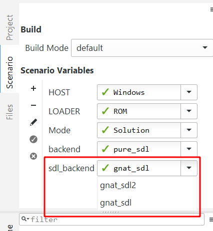

# How to use the SDL wrapper

The SDL wrapper is composed of two projects:

* `gnat_sdl` provides a thin wrapper around the SDL API. It is not meant to be used
  directly, but rather through the `game_support` project.
* `game_support` provides some Ada constructs that sit on top of the SDL wrapper.

You'll need to have the base libraries properly installed on your system, as well as the SDL
itself.

# SDL install

## Windows

For Windows users, you must download the DLL for the following libraries

* [SDL2](https://www.libsdl.org/download-2.0.php).
* [SDL2 ttf, zlib, and libfreetype](https://www.libsdl.org/projects/SDL_ttf/)
* Extract all the DLL files to a the target directory
* Add the DLL directory to your [`LIBRARY_PATH` environment variable](https://superuser.com/a/949577/72138):

## Linux

For Linux users, you'll need to install

* libsdl2-dev
* libglu1-mesa-dev
* freeglut3-dev
* libsdl2-ttf-dev

_Please note_: These instruction were tested on Ubuntu and may change
depending on your OS, in case of doubts always refer to your distribution's
documentation.

# Ada Libraries Install

You'll need to set your [`GPR_PROJECT_PATH`](https://docs.adacore.com/gprbuild-docs/html/gprbuild_ug/gnat_project_manager.html#importing-projects) environment variable to 
`<gnat_sdl/ directory>:<game_support/ directory>`.

## Linux

Add `export GPR_PROJECT_PATH=<gnat_sdl/ directory>:<game_support/ directory>:$GPR_PROJECT_PATH` to
your `~/.profile`.

## Windows

[Set `GPR_PROJECT_PATH`](https://superuser.com/a/949577/72138) to the value above.

# Running examples

Once the environment variables and libraries are installed properly, you should be able to
start compilation for any GPR file that uses the API, with minimal configuration:

You need to select a SDL Backend build option that fits your install.

For example, if you installed the SDL2 library as recommended, you need to
select `gnat_sdl2` as `sdl_backend` in the GNAT Studio projects scenario editor:

For manual GPR Build, use the `-Xsdl_backend=SDL2` option

`gprbuild -Xsdl_backend=gnat_sdl2 project.gpr`

Examples of the use can be found in [`courses/fundamentals_of_ada/labs/solar_system`](https://github.com/AdaCore/training_material/tree/master/courses/fundamentals_of_ada/labs/solar_system).

You can access a properly packaged version of those in the
[repository Actions page](https://github.com/AdaCore/training_material/actions).

Validate by clicking the checkmark on the side.

In case of further issues, try changing the `backend` option to other values. Keep
the `LOADER` to `ROM` and check that `HOST` is set to your current OS.
